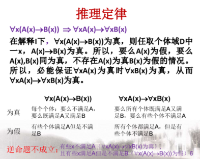
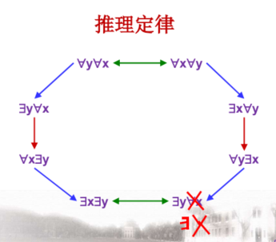
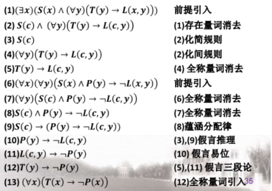

# 命题

合取  $\land$ 析取  $\lor$ 自然语言中的或：相容或 $\vee$ , 相异或 $(\overline{\vee})$

蕴含等值式：$A \rightarrow B \Leftrightarrow \neg A \vee B$

结合律：$(A \leftrightarrow B) \leftrightarrow C \Leftrightarrow A \leftrightarrow(B \leftrightarrow C)$；蕴含不具有结合律

分配律：$A \rightarrow(B \rightarrow C) \Leftrightarrow(A \rightarrow B) \rightarrow(A \rightarrow C)$  ；等价不具有分配律

假言易位：$A \rightarrow B \Leftrightarrow \neg B \rightarrow \neg A$ （逆否命题）

归谬律：$(A \rightarrow B) \wedge(A \rightarrow \neg B) \Leftrightarrow \rightarrow A$

吸收律：$A \vee(A \wedge B) \Leftrightarrow A, \quad A \wedge(A \vee B) \Leftrightarrow A$

**$A \rightarrow(B \rightarrow C) \Leftrightarrow(A \wedge B) \rightarrow C \Leftrightarrow B \rightarrow(A \rightarrow C)$**

$\begin{aligned} A \leftrightarrow B & \Leftrightarrow(A \wedge B) \vee(\neg A \wedge \neg B) \\ & \Leftrightarrow(\neg A \vee B) \wedge(A \vee \neg B) \end{aligned}$

$(A \rightarrow C) \wedge(B \rightarrow C) \Leftrightarrow(A \vee B) \rightarrow C$

若 $A \rightarrow B$ 是个永真式，则称 $A$ 永真蕴涵 $B$，记作 $A \Rightarrow B$。证明：假设前件为真，推出后件为真；或假设后件为假，推出前件为假。

主析取范式：最小项的和；主合取范式：最大项的积。

**写出某公式的主析取范式和主函数范式时如果能直接看出公示的值是0或1，则可以直接化简。**

n个命题变项的主析取范式（主合取范式）共有多少个？n个命题变项共可产生$2^{n}$个极小项（极大项），因而共可产生$\mathrm{C}_{2^{n}}^{0}+\mathrm{C}_{2^{n}}^{1}+\cdots+\mathrm{C}_{2^{n}}^{2^{n}}=2^{2 n}$个不同的主析取范式（主合取范式）。

**在要求将公式化为极小项、极大项的形式时，最后一步要按升序以m的形式排列！**

$n$ 元真值函数共有 $2^{2^{n}}$ 个。

$\{\neg, \vee, \wedge, \rightarrow\}$​ 是联结词的一个完全集。证明方法：数学归纳法。

1. 设 $f\left(x_{1}, x_{2}, \ldots, x_{n}\right)$ 是一个 $n$ 元真值函数

   定义如下两个 $n-1$ 元真值函数 $f^{\prime} 、 f^{\prime \prime}:$
   $$
   \begin{aligned}
   &\mathrm{f}^{\prime}\left(\mathrm{x}_{2}, \mathrm{x}_{3}, \ldots, \mathrm{x}_{\mathrm{n}}\right)=\mathrm{f}\left(0, \mathrm{x}_{2}, \mathrm{x}_{3}, \ldots, \mathrm{x}_{\mathrm{n}}\right) \\
   &\mathrm{f}^{\prime \prime}\left(\mathrm{x}_{2}, \mathrm{x}_{3}, \ldots, \mathrm{x}_{\mathrm{n}}\right)=\mathrm{f}\left(1, \mathrm{x}_{2}, \mathrm{x}_{3}, \ldots, \mathrm{x}_{\mathrm{n}}\right)
   \end{aligned}
   $$
   $f\left(t_{1}, \cdots, t_{n}\right)= \begin{cases}f^{\prime}\left(t_{2}, \cdots, t_{n}\right) & t_{1}=0 \\ f^{\prime \prime}\left(t_{2}, \cdots, t_{n}\right) & t_{1}=1\end{cases}$

   由归纳假设, $f^{\prime}$ 和 $f$ "都可由仅由 $\{\neg, \vee, \wedge, \rightarrow\}$ 中 联结词所构造的 $n-1$ 元命题公式 $\alpha_{1} 、 \alpha_{2}$ 表示。设 $\alpha_{1}$ 、 $\alpha_{2}$ 中所含的命题变元设为 $\mathrm{p}_{2}, \mathrm{p}_{3}, \ldots, \mathrm{p}_{n}$.

2. $\mathrm{f}$ 可由 $\left(\neg \mathrm{p}_{1} \rightarrow \alpha_{1}\right) \wedge\left(\mathrm{p}_{1} \rightarrow \alpha_{2}\right)$ 表示

在$\{\neg, \vee, \wedge, \rightarrow, \leftrightarrow\}$的子集中：5个4元素子集中只有 $\{\vee, \wedge, \rightarrow, \leftrightarrow\}$ 不是联结 词的完备集。3元素子集中, 只要含$\neg$就完备。所以10个3元素子集，4个不完备，6个完备。2元素子集中，$\{\neg, \rightarrow\} 、\{\neg, \quad \vee\}, \quad\{\neg, \wedge\}$是完备的。

与非式：$p \uparrow q$ ；或非式：$p \downarrow q$。可以证明，$\{\uparrow\}$与$\{\downarrow\}$都是联结词完备集，证明可以用$\{\neg, \vee\}$与$\{\neg, \wedge\}$完备进行转化。在实际运算中，如果要把公式化简成$\{\uparrow\}$与$\{\downarrow\}$表示的形式，一个比较难于想到的地方是要用 $q \uparrow q$来表示非q。

极小完备的联结词集合：对于一个完备的联结词集合A，从A中任意删去一个连接词后，得到一个新的联结词集合A1。若至少有一个公式不等价于仅包含A1中联结词所表示的任一公式，则称A为极小完备的联结词集合。$\{\neg, \wedge\},\{\neg, \vee\},\{\neg, \rightarrow\},\{\neg, \nrightarrow\},\{\uparrow\},\{\downarrow\}$均为极小完备的联结词集合，而实际应用中常使用$\{\neg, \wedge, \vee\}$。

# 推理

判断推理是否正确，就是判断是否会出现前提为真结论为假的情况。

推理形式有效的充要条件：推理形式 “ $\alpha_{1}, \alpha_{2}, \ldots, \alpha_{n}$ 推出 $\beta$ ” 有效的充要条件是命题形式 $\left(\alpha_{1} \wedge \alpha_{2} \wedge \ldots \wedge \alpha_{n}\right) \rightarrow \beta$ 是重言式, 或 $\left(\alpha_{1} \wedge \alpha_{2} \wedge \cdots \wedge \alpha_{n}\right) \wedge \neg \beta$ 为矛盾式。

前提: $\alpha_{1}, \alpha_{2}, \cdots, \alpha_{n}$ 结论: $\beta$ 推理正确记为 $\alpha_{1} \wedge \alpha_{2} \wedge \cdots \wedge \alpha_{n} \Rightarrow \beta$

若 $A \Rightarrow B, A \Rightarrow C$, 则 $A \Rightarrow B \wedge C$ 。

若 $A \Rightarrow C, B \Rightarrow C$, 则 $A \vee B \Rightarrow C$ 。

附加律：$A \Rightarrow(A \vee B)$

化简律：$(A \wedge B) \Rightarrow A, \quad(A \wedge B) \Rightarrow B$

假言推理：$(A \rightarrow B) \wedge A \Rightarrow B$

拒取式：$(\mathrm{A} \rightarrow \mathrm{B}) \wedge \neg \mathrm{B} \Rightarrow \neg \mathrm{A}$

析取三段论：$(A \vee B) \wedge \neg A \Rightarrow B$；$(A \vee B) \wedge \neg B \Rightarrow A$

假言三段论：$(\mathrm{A} \rightarrow \mathrm{B}) \wedge(\mathrm{B} \rightarrow \mathrm{C}) \Rightarrow(\mathrm{A} \rightarrow \mathrm{C})$

等价三段论：$(A \leftrightarrow B) \wedge(B \leftrightarrow C) \Rightarrow(A \leftrightarrow C)$

构造性两难：$(A \rightarrow B) \wedge(C \rightarrow D) \wedge(A \vee C) \Rightarrow(B \vee D)$

构造性两难（特殊形式）：$(A \rightarrow B) \wedge(\neg A \rightarrow B) \Rightarrow B$

破坏性两难：$(A \rightarrow B) \wedge(C \rightarrow D) \wedge(\neg B \vee \neg D) \Rightarrow(\neg A \vee \neg C)$

$\neg \mathrm{A} \Rightarrow(\mathrm{A} \rightarrow \mathrm{B})$, $\mathrm{B} \Rightarrow(\mathrm{A} \rightarrow \mathrm{B})$

$\neg(\mathrm{A} \rightarrow \mathrm{B}) \Rightarrow \mathrm{A}$, $\neg(A \rightarrow B) \Rightarrow \neg B$

$(\mathrm{B} \rightarrow \mathrm{C}) \Rightarrow(\mathrm{A} \rightarrow \mathrm{B}) \rightarrow(\mathrm{A} \rightarrow \mathrm{C})$

$(\mathrm{B} \rightarrow \mathrm{C}) \Rightarrow(\mathrm{A} \vee \mathrm{B}) \rightarrow(A \vee C)$

假言推理规则：A蕴含B，A为真，故B为真;附加规则：A为真，则A析取B为真;化简规则：A合取B为真，则A为真;拒取式规则：A蕴含B，B为假，则A为假;假言三段论规则：A蕴含B，B蕴含C，则A蕴含C;析取三段论规则：A析取B为真，B为假，则A为真;构造性二难推理规则：A蕴含B，C蕴含D，A析取C为真，则B析取D为真;破坏性二难推理规则：A蕴含B，C蕴含D，非B析取非D为真，则非A析取非C为真;合取引入规则：A为真，B为真，则A合取B为真

附加前提证明法：特征：结论带蕴含式或者析取式时可以利用附加前提证明法。（因为析取式可以等价地转换为蕴含式）

归谬法：欲证明：前提 $A_{1}, A_{2}, \ldots, A_{k}$ 结论：B。可以将$\neg B$加入前提，若推出矛盾，则得证推理正确。 在具体的证明中，这个“矛盾”一般是以$R \wedge \neg R$的形式出现的。

**经常要有将析取转换为蕴含的意识**

消解证明法：前提：$ A \vee B$ , $ \neg A \vee C$, 结论：$B \vee C $。

消解证明法的本质其实是一个反证法，是要证明$\left(\alpha_{1} \wedge \alpha_{2} \wedge \cdots \wedge \alpha_{n}\right) \wedge \neg \beta$ 为矛盾式。将每一个前提化成等值的合取范式，设所有合取范式的全部简单析取式为$A_{1}, A_{2}, \ldots, A_{t}$。将结论的否定化成等值的合取范式$B_{1} \wedge B_{2} \wedge \ldots \wedge B_{s}$，其中每个$B_{j}$是简单析取式。以 $A_{1}, A_{2}, \ldots, A_{t}$ 和 $B_{1}, B_{2}, \ldots, B_{s}$ 为前提，使用归结规则推出 0。

# 一阶逻辑

有限域下的公式表示法：全称量词：合取联结词的推广。

同一命题在不同个体域中符号化形式可能不同，真假值也可能不同。

任取后一定是蕴含，存在后一定是合取。$\forall x(M(x) \rightarrow F(x))$$\exists x(M(x) \wedge G(x))$

$(\forall x)(\exists y) P(x, y),(\forall x)(\exists y)$ 不可交换顺序；

$(\exists x)(\forall y) P(x, y) \Rightarrow(\forall y)(\exists x) P(x, y)$

项的作用是描述“复合个体”，相当于词组，不表达完整的判断；公式的作用是描述命题，代表完整的句子，表达判断。

若量词后有括号，则括号内的子公式就是该量词的辖域；若量词后无括号，则与量词邻接的子公式为该量词的辖域。

约束出现与自由出现：在 $\forall x$ 和 $\exists x$ 的辖域中, $x$ 的所有出现称为约束出现，A中不是约束出现的其他变元称为自由出现

设个体变元x在公式$\alpha$中出现：若x在$\alpha$中的所有出现均为约束出现，则称x为$\alpha$的约束变元；若x不是$\alpha$的约束变元，则称x为$\alpha$的自由变元。（只要在某处是自由出现就是自由变元）

约束变元的换名规则：将量词中出现的指导变元及其辖域中此变元的所有**约束出现**都用新的个体变元取代。新变元一定要有别于改名辖域中的所有其它变元。

闭式：设A是任意的公式，若A中不含自由出现的个体变元，则称A为封闭的公式，简称闭式。要将含r个自由出现的个体变元的公式变成闭式，至少需要加上r个量词。

公式的解释：非空个体域，个体常元的解释，函数符号的解释，谓词符号的解释，对自由变元的**赋值**。赋值仅仅针对自由出现的个体变元，若变元是约束出现的，则赋值不起作用。

一阶逻辑公式：永真式（逻辑有效式）：无成假解释和赋值；矛盾式（永假式）：无成真解释和赋值；可满足式：至少有一个成真解释和赋值。

在一阶逻辑公式中，公式的可满足性是不可判定的，但是，重言式的代换实例都是永真式，矛盾式的代换实例都是矛盾式。

若 $A \leftrightarrow B$ 是永真式, 则称 $A$ 与 $B$ 是等值的，记作$A \Leftrightarrow B$, 并称 $A \Leftrightarrow B$ 为等值式。

命题逻辑中基本等值式的代换。

量词否定等值式：设A(x)是含x自由出现的公式：$\neg \forall x A(x) \Leftrightarrow \exists x \neg A(x)$；$\neg \exists x A(x) \Leftrightarrow \forall x \neg A(x)$

量词辖域收缩与扩张等值式：设A(x)是含x自由出现的公式，B中不含x的出现

- $\forall x(A(x) \vee B) \Leftrightarrow \forall x A(x) \vee B$
- $\forall x(A(x) \wedge B) \Leftrightarrow \forall x A(x) \wedge B$
- $\exists x(A(x) \vee B) \Leftrightarrow \exists x A(x) \vee B$
- $\exists x(A(x) \wedge B) \Leftrightarrow \exists x A(x) \wedge B$
- $\forall x(A(x) \rightarrow B) \Leftrightarrow \exists x A(x) \rightarrow B$
- $\forall x(B \rightarrow A(x)) \Leftrightarrow B \rightarrow \forall x A(x)$
- $\exists x(A(x) \rightarrow B) \Leftrightarrow \forall x A(x) \rightarrow B$
- $\exists x(B \rightarrow A(x)) \Leftrightarrow B \rightarrow \exists x A(x)$

量词分配等值式：设A(x)、B(x)是含x自由出现的公式：$\forall x(A(x) \wedge B(x)) \Leftrightarrow \forall x A(x) \wedge \forall x B(x)$；$\exists x(A(x) \vee B(x)) \Leftrightarrow \exists x A(x) \vee \exists x B(x)$

注意 $\forall$ 对 $\vee$, $\exists$ 对 $\wedge$不具有分配律！

换名规则：将公式 $A$ 中某量词的指导变元及其在辖域内的所有约束出现改成该量词辖域内末曾出现的某个个体变项, 其余部分不变, 记所得公式为 $A^{\prime}$, 则 $A^{\prime} \Leftrightarrow A$

变元易名后的分配律：

- $\forall x \forall y(A(x) \vee B(y)) \Leftrightarrow \forall x A(x) \vee \forall x B(x)$
- $\exists x \exists y(A(x) \wedge B(y)) \Leftrightarrow \exists x A(x) \wedge \exists x B(x)$

前束范式：量词都在前面，不含量词的公式在后面，后面的公式称作原公式的母式。小心非！

一阶逻辑中的任何公式都存在与之等值的前束范式，但其前束范式并不唯一。

设G是任一公式，通过下述步骤可将其转化为与之等价的前束范式：

- 消去公式中包含的联结词 $\rightarrow, \leftrightarrow$
- 反复使用德摩根率将$\neg$内移
- 使用分配等值式将量词左移
- 使用变元易名分配等值式将变元易名

谓词逻辑的推理：在一阶逻辑中，从前提$A_{1}, A_{2}, \cdots, A_{k}$推出结论B是正确的（有效的），若$A_{1} \wedge A_{2} \wedge \cdots A_{k} \rightarrow B$为永真式，记作$A_{1} \wedge A_{2} \wedge \cdots A_{k} \Rightarrow B$，否则称推理不正确。

常用推理定律：

- $\forall x A(x) \Rightarrow \exists x A(x)$
- $\forall x A(x) \vee \forall x B(x) \Rightarrow \forall x(A(x) \vee B(x))$
- $\exists x(A(x) \wedge B(x)) \Rightarrow \exists x A(x) \wedge \exists x B(x)$
- $\forall x(A(x) \rightarrow B(x)) \Rightarrow \forall x A(x) \rightarrow \forall x B(x)$
- $\forall x(A(x) \rightarrow B(x)) \Rightarrow \exists x A(x) \rightarrow \exists x B(x)$
- $\forall x(A(x) \leftrightarrow B(x)) \Rightarrow \forall x A(x) \leftrightarrow \forall x B(x)$
- $\forall x(A(x) \leftrightarrow B(x)) \Rightarrow \exists x A(x) \leftrightarrow \exists x B(x)$

量词的消去、引入规则：设x,y为个体变元符号，c为个体常量符号，y不在A(x)中约束出现 (A中 x不出现在 $\forall y, \exists y$ 的辖域内)

- 全称量词消去规则：$(\forall x) A(x) \Rightarrow A(y),(\forall x) A(x) \Rightarrow A(c)$。

  若所有个体都有性质A，则任一个个体y必具备性质A

- 全称量词引入规则：$A(y) \Rightarrow(\forall x) A(x)$

  若任一个体y（自由变元）都有性质A，则所有个体必具备性质A

  限制：z不在A(y)中约束出现

- 存在量词消去规则：$(\exists x) A(x) \Rightarrow A(c)$。若一个个体有性质A，则必有某个个体有性质A。

  限制：$(\exists x) A(x)$中没有自由变元，且不含有c。如果含有自由变元z，则需要将c换成f（z）

- 存在量词引入规则：$A(c) \Rightarrow(\exists x) P(x)$

  若有个个体常元c具有性质A，则$(\exists x) P(x)$ 为真

  限制：x不出现在A(c)中

**如果有一个存在，一个任取，一定要先消存在，再消任取!**

注意：个体变元加量词，前面可以加全称量词；个体常元只能加存在量词。

在用全称量词消去规则和存在量词消去规则消去量词、用全称量词引入规则和存在量词引入规则添加量词时，此量词必须位于整个公式的最前端，并且它的辖域为其后的整个公式。

结论明显矛盾，且从第一步开始就错了！消去全称量词的时候要求量词处于公式最左边，然而此时最左边是$\neg$，故不能消去。

# 集合

被包含关系：$(A \subseteq B) \wedge(C \subseteq D) \Rightarrow(A \cup C) \subseteq(B \cup D)$；$(\mathbf{A} \subseteq \boldsymbol{B}) \wedge(\boldsymbol{C} \subseteq \boldsymbol{D}) \Rightarrow(\boldsymbol{A} \cap \boldsymbol{C}) \subseteq(\boldsymbol{B} \cap \boldsymbol{D})$

集合的幂集：$A$ 是集合，由 $A$ 的所有子集构成的集 合，称之为 $A$ 的幂集。记作 $P(A)$ 或 $2^A$。$P(A) = \{B | B \subseteq A\}$。设集合 $A$ 的元素个数 $|A|=n$, 则 $|P(A)|=2^{n}$

1. $A \subseteq B \Leftrightarrow P(A) \subseteq P(B)$

2. $A=B \Leftrightarrow P(A)=P(B)$

3. $\mathrm{P}(\mathrm{A}) \in \mathrm{P}(\mathrm{B}) \Rightarrow \mathrm{A} \in \mathrm{B}$

   证明：$\mathrm{P}(\mathrm{A}) \in \mathrm{P}(\mathrm{B}) \Leftrightarrow P(A) \subseteq B$

   则：$ \forall x \in P(A) \Rightarrow x \in \mathrm{B}$

   故：$ \forall x \subseteq A \Rightarrow x \in \mathrm{B}$

   故：$\mathrm{A} \in \mathrm{B}$

4. $P(A) \cap P(B)=P(A \cap B)$

5. $\mathrm{P}(\mathrm{A}) \cup \mathrm{P}(\mathrm{B}) \subseteq \mathrm{P}(\mathrm{A} \cup \mathrm{B})$

6. $\mathrm{P}(\mathrm{A}-\mathrm{B}) \subseteq(\mathrm{P}(\mathrm{A})-\mathrm{P}(\mathrm{B})) \cup\{\varnothing\}$

广义交：设集合 $A$ 中的元素都为集合且 $A$ 非空, 称由 $A$ 中全体元素的公共元素组成的集合为 $A$ 的广义交, 记作 $\cap A $。注意：当 $A=\varnothing$ 时, $\cap \varnothing$ 无意义。

$A \subseteq B \Rightarrow A \cup C \subseteq B \cup C,A \cap C \subseteq B \cap C$

$A \subseteq B \land C \subseteq D \Rightarrow A \cup C \subseteq B \cup D,A \cap C \subseteq B \cap D$

广义并：设集合A中的元素都为集合（集族），称由A中全体元素的元素组成的集合为A的广义并，记作$\cup A$ （“大并A”）

$\mathbf{A} \cap(\mathbf{B}-\mathbf{C})=(\mathbf{A} \cap \mathbf{B})-\mathbf{C}$

$A$、$B$ 是集合,由属于 $A$ 而不属于 $B$，或者属于 $B$ 而不属于 $A$ 的元素构成的集合，称之为 $A$ 与 $B$ 的对称差，记作 $A \oplus B$。

$A \oplus B = (A – B) \cup (B – A) = \{x | (x \in A \land x \not \in B) \lor (x \in B \land x \not \in A)\}$

$A \oplus B = (A \cup B) – (A \cap B)$

交换律，$A \oplus B = B \oplus A$；结合律，$(A \oplus B) \oplus C = A \oplus (B \oplus C)$；分配律：$A \cap(B \oplus C)=(A \cap B) \oplus(A \cap C)$
$$
\begin{aligned}
\left|\bigcup_{i=1}^{n} A_{i}\right|=& \sum_{i=1}^{n}\left|A_{i}\right|-\sum_{i<j}\left|A_{i} \cap A_{j}\right| \\
&+\sum_{i<j<k}\left|A_{i} \cap A_{j} \cap A_{k}\right|-\cdots+(-1)^{n-1}\left|A_{1} \cap A_{2} \cap \cdots \cap A_{n}\right|
\end{aligned}
$$
其中需要注意到的观点是集合中元素是互异的，所以需要讨论一下x是否是a。

设 $A$、$B$ 是集合，由 $A$ 的元素为第一元素，$B$ 的元素为第二元素组成序偶的集合，称为 $A$ 和 $B$ 的笛卡尔积，记作 $A \times B$，即 $A \times B=\{\langle x,y \rangle | x \in A \land y \in B\}$

1. 如果 $A$、$B$ 都是有限集，且 $|A| = m, |B| = n$， 则 $|A \times B | = mn$.

2. 非结合：$(A \times B) \times C \neq A \times(B \times C)$。

   (除非 $A=\varnothing \vee B=\varnothing \vee C=\varnothing$ )

3. 分配律：

   1. $A \times (B \cup C) = (A \times B) \cup (A \times C)$
   2. $A\times (B \cap C) = (A \times B) \cap (A \times C)$
   3. $(A \cup B) \times C = (A \times C) \cup (B \times C)$
   4. $(A \cap B) \times C = (A \times C) \cap (B \times C)$

4. 若 $C \not = \varnothing$，$A \subseteq B \Leftrightarrow (A \times C \subseteq B \times C) \Leftrightarrow (C \times A \subseteq C \times B)$

5. 设 $A$、$B$、$C$、$D$ 为非空集合，则 $A\times B \subseteq C \times D \Leftrightarrow A \subseteq C \land B\subseteq D$

   这个定理还可以这样表述：$A \subseteq C \wedge B \subseteq D \Rightarrow A \times B \subseteq C \times D$，并且当 $(A=B=\varnothing) \vee(A \neq \varnothing \wedge B \neq \varnothing)$ 时,$A \times B \subseteq C \times D \Rightarrow A \subseteq C \wedge B \subseteq D$。一个空、一个非空就推不出来。

卡氏积中常见对空集的讨论！

# 关系

设F是二元关系，则：$\langle x, y\rangle \in F \Leftrightarrow x$ 与 $y$ 具有 $F$ 关系 $\Leftrightarrow x F y$

设 $A$、$B$ 是集合，如果 $R \subseteq A \times B$，则称 $R$ 是一 个从 $A$ 到 $B$ 的二元关系。A到B的二元关系：$\mathbf{A} \times \mathbf{B}$的任意子集（含空集），R是A到B的二元关系$\Leftrightarrow \mathbf{R} \subseteq \mathbf{A} \times \mathbf{B} \Leftrightarrow \mathbf{R} \in \mathbf{P}(\mathbf{A} \times \mathbf{B})$。若$|A|=m,|B|=n$, 则 $|A \times B|=m n$, 故$|P(A \times B)|=2^{m n}$，即A到B不同的二元关系共有$2^{\mathrm{mn}}$个。

注意空集也是一个二元关系！

空关系: Ø；恒等关系: $I_{A}=\{\langle x, x\rangle \mid x \in A\}$；全域关系：$E_{A}=A \times A=\{\langle x, y\rangle \mid x \in A \wedge y \in A\}$。全域关系其实就是A与A的笛卡尔积。

**关系的域**：$\rm{fid} R = \rm{dom} R \cup \rm{ran} R$

设 $R, S$ 为集合 $A$ 到 $B$ 的两个关系, 则:

- $R \cup S=\{<x, y>\mid x R y \vee x S y\}$

- $R \cap S=\{\langle x, y\rangle \mid x R y \wedge x S y\}$

- $R-S=\{\langle x, y\rangle \mid x R y \cap x \not S y\}$

- $\sim R=A \times B-R$

  > 这里是因为$\boldsymbol{A} \times \boldsymbol{B}$ 是相对于 $\mathrm{R}$ 的全集

逆运算：对任何集合F、G，可以定义逆（inverse）：$\mathrm{F}^{-1}=\{\langle\mathrm{x}, \mathrm{y}\rangle \mid \mathrm{yFx}\}$，若F为集合A到集合B的一个关系，则 $F^{-1}$ 及$\sim \mathrm{F}$ 均为关系:

- $\sim \boldsymbol{F}=\boldsymbol{A} \times \boldsymbol{B}-\boldsymbol{F} \subseteq \boldsymbol{A} \times \boldsymbol{B}$
- $F^{-1} \subseteq B \times A$

合成（复合）运算：FoG $=\{<x, y>\mid \exists z(x F z \wedge z G y)\}$

- 顺序合成（右合成），也是课本所使用的定义：FoG $=\{<x, y>\mid \exists z(x F z \wedge z G y)\}$

也可以用关系矩阵求关系的运算：

- $M\left(R^{-1}\right)=(M(R))^{\top}$

- $M\left(R_{1} \circ R_{2}\right)=M\left(R_{1}\right) \bullet M\left(R_{2}\right)$

  注意：•表示矩阵的 “逻辑乘”，加法用 $\vee$, 乘法用 $\wedge$。逻辑乘保证了运算之后矩阵的元素还是只有0和1.

对于二元关系F和集合A，可以定义：

- 限制（restriction）：$\mathrm{F} \upharpoonright \mathrm{A}=\{\langle\mathrm{x}, \mathrm{y}\rangle \mid \mathrm{xFy} \wedge \mathrm{x} \in \mathrm{A}\} \subseteq \mathrm{F}$。是原来关系的一个子集，即把定义域缩小了。

- 像（image）：$\mathrm{F}[\mathrm{A}]=\operatorname{ran}(\mathrm{F} \upharpoonright \mathrm{A}) \subseteq \operatorname{ran} \mathrm{F}$

  $\mathrm{F}[\mathrm{A}]=\{\mathrm{y} \| \exists \mathrm{x}(\mathrm{x} \in \mathrm{A} \wedge \mathrm{xFy})\}$

$\operatorname{dom} F^{-1}=\operatorname{ran} F, \operatorname{ran} F^{-1}=\operatorname{dom} F$

$(F \circ G) \circ H=F \circ(G \circ H)$

设 $F, G$ 为任意关系, 则 (FoG) $^{-1}=G^{-1} \mathrm{oF}^{-1}$

$R \circ I_{A}=I_{A} \circ R=R$

- $F \circ(G \cup H)=F \circ G \cup F \circ H$
- $(\boldsymbol{G} \cup \boldsymbol{H}) \circ \boldsymbol{F}=\boldsymbol{G} \circ \boldsymbol{F} \cup \boldsymbol{H} \circ \boldsymbol{F}$
- $F \circ(G \cap H) \subseteq F \circ G \cap F \circ H$
- $(\boldsymbol{G} \cap \boldsymbol{H}) \circ \boldsymbol{F} \subseteq \boldsymbol{G} \circ \boldsymbol{F} \cap \boldsymbol{H} \circ \boldsymbol{F}$

设F为任意的关系，A、B为集合，则：

- $\boldsymbol{F} \upharpoonright (\boldsymbol{A} \cup \boldsymbol{B})=\boldsymbol{F} \upharpoonright \boldsymbol{A} \cup \boldsymbol{F} \upharpoonright\boldsymbol{B}$
- $\boldsymbol{F}[\boldsymbol{A} \cup \boldsymbol{B}]=\boldsymbol{F}[\boldsymbol{A}] \cup \boldsymbol{F}[\boldsymbol{B}]$
- $\boldsymbol{F} \upharpoonright(\boldsymbol{A} \cap \boldsymbol{B})=\boldsymbol{F} \upharpoonright\boldsymbol{A} \cap \boldsymbol{F} \upharpoonright \boldsymbol{B}$
- $F[A \cap B] \subseteq F[A] \cap F[B]$
- $F[A]-F[B] \subseteq F[A-B]$

设 $R$ 为 $A$ 上的关系, $n$ 为自然数, 则 $R$ 的 $n$ 次幂是：

1. $R^{0}=\{\langle x, x\rangle \mid x \in A\}=I_{A}$
2. $R^{n+1}=R^{n} \circ R$

注意：对于A上的任何关系$R_{1}$ 和 $R_{2}$ 都有 $R_{1}{ }^{0}=R_{2}{ }^{0}= I_A$，对于A上的任何关系$R$ 都有 $R^{1}=R$。对于集合表示的关系R，计算$R^{n}$ 就是 $n$ 个 $R$ 合成。

设R是A上的关系，$m, n \in \mathrm{N}$, 则

- $R^{m} \circ R^{n}=R^{m+n}$
- $\left(R^{m}\right)^{n}=R^{m n}$

设 $R$ 是 $A$ 上的关系, 若存在自然数 $s, t(s<t)$ 使得 $R^{s}=R^{t}$, 则

- 对任何 $k \in N$ 有 $R^{s+k}=R^{t+k}$
- 对任何 $k, i \in N$ 有 $R^{s+k p+i}=R^{s+i}$, 其中 $p=t-s$
- 令 $S=\left\{R^{0}, R^{1}, \ldots, R^{t-1}\right\}$, 则对于任意的 $q \in N$ 有 $R^{q} \in S$

## 关系的性质

若$\mathrm{R} \subseteq \mathrm{A} \times \mathrm{A}$，则$R$ 是自反的 $\Leftrightarrow \forall x(x \in A \rightarrow x R x) \Leftrightarrow(\forall x \in A) x R x$。$R$ 是非自反的 $\Leftrightarrow \exists x(x \in A \wedge \neg x R x)$。$\mathrm{R}$ 是自反的$\Leftrightarrow I_{A} \subseteq R$$\Leftrightarrow R^{-1}$ 是自反的$\Leftrightarrow M(R)$ 主对角线上的元素全为 1$\Leftrightarrow G(R)$ 的每个顶点处均有环。

若$\mathbf{R} \subseteq \mathbf{A} \times \mathbf{A}$，则$R$ 是反自反的 $\Leftrightarrow \forall x(x \in A \rightarrow \neg x R x) \Leftrightarrow$ $(\forall x \in A) \neg x R x$，如非空集合上的空关系，自然数集合上的小于关系，集合的幂集上的真包含关系。

$\mathrm{R}$ 是反自反的$\Leftrightarrow I_{A} \cap R=\varnothing$$\Leftrightarrow \mathrm{R}^{-1}$ 是反自反的$\Leftrightarrow M(R)$ 主对角线上的元素全为 0$\Leftrightarrow G(R)$ 的每个顶点处均无环. 

若$\mathbf{R} \subseteq \mathbf{A} \times \mathbf{A}$，则$R$ 是对称的 $\Leftrightarrow$$\forall x \forall y(x \in A \wedge y \in A \wedge x R y \rightarrow y R x)$$\Leftrightarrow(\forall x \in A)(\forall y \in A)[x R y \rightarrow y R x]$，如非空集合上的全域关系（对称、非反对称）、恒等关系。$R$ 是非对称的 $\Leftrightarrow$$\exists x \exists y(x \in A \wedge y \in A \wedge x R y \wedge \neg y R x)$

$\mathrm{R}$ 是对称的$\Leftrightarrow \mathrm{R}^{-1}=\mathrm{R}$$\Leftrightarrow \mathrm{R}^{-1}$ 是对称的$\Leftrightarrow \mathrm{M}(\mathrm{R})$ 是对称的
$\Leftrightarrow \mathrm{G}(\mathrm{R})$ 的任何两个顶点之间若有边, 则必有两条方向相反的有向边. 

若$\mathbf{R} \subseteq \mathbf{A} \times \mathbf{A}$，则$R$ 是反对称的 $\Leftrightarrow$$\forall x \forall y(x \in A \wedge y \in A \wedge x R y \wedge y R x \rightarrow x=y)$$\Leftrightarrow(\forall x \in A)(\forall y \in A)[x R y \wedge y R x \rightarrow x=y]$R是反对称的$\Leftrightarrow R^{-1} \cap R \subseteq I_{A}$$\Leftrightarrow \mathrm{R}^{-1}$ 是反对称的$\Leftrightarrow$ 在 $M(R)$ 中, $\forall i \forall j\left(i \neq j \wedge r_{i j}=1 \rightarrow r_{j j}=0\right)$$\Leftrightarrow$ 在 $G(R)$ 中, $\forall a_{i} \forall a_{j}(i \neq j)$, 若有有向边 $<a_{i}, a_{j}>$, 则 必没有 $<\mathrm{a}_{\mathrm{j}}, \mathrm{a}_{\mathrm{i}}>$. 

若$\mathbf{R} \subseteq \mathbf{A} \times \mathbf{A}$，则$\mathrm{R}$ 是传递的 $\Leftrightarrow$
$\forall x \forall y \forall z(x \in A \wedge y \in A \wedge z \in A \wedge x R y \wedge y R z \rightarrow x R z)$
$\Leftrightarrow(\forall x \in A)(\forall y \in A)(\forall z \in A)[x R y \wedge y R z \rightarrow x R z]$

若R非传递$\Leftrightarrow \exists x \exists y \exists z(x \in A \wedge y \in A \wedge z \in A \wedge x R y \wedge y R z \wedge \neg x R z)$

$\mathrm{R}$ 是传递的$\Leftrightarrow R o R \subseteq R \Leftrightarrow R^{-1}$ 是传递的$\Leftrightarrow \forall i \forall j, M(R o R)(i, j) \leq M(R)(i, j)$$\Leftrightarrow$ 在 $G(R)$ 中, $\forall a_{i} \forall a_{j} \forall a_{k}$, 若有有向边 $<a_{i}, a_{j}>$ 和 $<\mathrm{a}_{\mathrm{i}}, \mathrm{a}_{\mathrm{k}}>$, 则必有有向边 $<\mathrm{a}_{\mathrm{i}}, \mathrm{a}_{\mathrm{k}}>$.

自然数集上整除关系$D=\{<x, y>|x \in N \wedge y \in N \wedge x| y\} $反对称, 传递 ，不自反的原因是因为0整除0无定义

## 关系的闭包

关系闭包：增加**最少**元素使其具备所需性质

自反闭包r(R)：

- $R \subseteq r(R)$。即原有的关系应当继续保留
- $r(R)$ 是自反的，即要满足自反的性质
- $\forall \mathrm{S}\left(\left(R \subseteq \mathrm{S} \wedge \mathrm{S}自反\right) \rightarrow \mathrm{r}(\mathrm{R}) \subseteq \mathrm{S}\right)$

从图上看很简单，给没有环的地方加个环即可

对称闭包s(R)：

- $R \subseteq s(R)$
- $s(R)$ 是对称的
- $\forall \mathrm{S}((\mathrm{R} \subseteq \mathrm{S} \wedge \mathrm{S}$ 对称 $) \rightarrow \mathrm{s}(\mathrm{R}) \subseteq \mathrm{S})$

传递闭包t(R):

- $\mathrm{R} \subseteq t(\mathrm{R})$
- $t(R)$ 是传递的
- $\forall s((R \subseteq S \wedge S 传 递) \rightarrow t(R) \subseteq S)$

定理：设$ R\subseteq A \times A$ 且 $A \neq \varnothing$，则

- $R$ 自反 $\Leftrightarrow r(R)=R$;
- $R$ 对称 $\Leftrightarrow s(R)=R$
- $R$ 传递 $\Leftrightarrow t(R)=R$

定理：设$\mathrm{R}_{1} \subseteq \mathrm{R}_{2} \subseteq \mathrm{A} \times \mathrm{A}$ 且 $\mathrm{A} \neq \boldsymbol{\varnothing}$, 则

- $r\left(R_{1}\right) \subseteq r\left(R_{2}\right)$
- $s\left(R_{1}\right) \subseteq s\left(R_{2}\right)$
- $t\left(R_{1}\right) \subseteq t\left(R_{2}\right)$

证明：由 $R_{1} \subseteq R_{2}$ 和 $R_{2} \subseteq r\left(R_{2}\right)$, 有 $R_{1} \subseteq r\left(R_{2}\right)$ 。又$r\left(R_{2}\right)$ 是自反的, 根据定义, 必有 $r\left(R_{1}\right) \subseteq r\left(R_{2}\right)$。

定理：设$R_{1}, R_{2} \subseteq A \times A$ 且 $A \neq \varnothing$，则

- $r\left(R_{1} \cup R_{2}\right)=r\left(R_{1}\right) \cup r\left(R_{2}\right)$
- $s\left(R_{1} \cup R_{2}\right)=s\left(R_{1}\right) \cup s\left(R_{2}\right)$
- $t\left(R_{1} \cup R_{2}\right) \supseteq t\left(R_{1}\right) \cup t\left(R_{2}\right)$

闭包的求法：设 $R \subseteq A \times A$ 且 $A \neq \varnothing$, 则

- $r(R)=R \cup I_{A}$
- $s(R)=R \cup R^{-1}$
- $t(R)=R \cup R^{2} \cup R^{3} \cup...$

定理：设 $R \subseteq A \times A$ 且 $A \neq \varnothing$, 则

- $r s(R)=s r(R)$
- $r t(R)=\operatorname{tr}(R)$
- $s t(R) \subseteq \operatorname{ts}(R)$

设 $\mathrm{A} \neq \boldsymbol{\varnothing}$ 且 $\mathrm{R} \subseteq \mathrm{A} \times \mathrm{A}$，若R是自反、对称、传递的，则说R是等价关系。

定义：设R是$A \neq \varnothing$上等价关系，$\forall \mathbf{x} \in \mathbf{A}$，则x关于R的等价类是$[x]_{R}=\{y \mid y \in A \wedge x R y\}$，简称为x的等价类，简记为$[x]$。

定理：设R是$A \neq \varnothing$ 上等价关系, 则 $\forall x, y \in A$,

- $[x]_{R} \neq \varnothing$
- $x R y \Rightarrow[x]_{R}=[y]_{R}$
- $\neg x R y \Rightarrow[x]_{R} \cap[y]_{R}=\varnothing$
- $\cup\left\{[x]_{R} \mid x \in A\right\}=A$

商集：设R是$A \neq \varnothing$上等价关系，A关于R的商集（简称A的商集）是$A / R=\left\{[x]_{R} \mid x \in A\right\}$。商集是集合的集合。

空关系不是等价关系，因为它非自反。

划分：定义$A \neq \varnothing$ 的一个划分是  $\mathscr{A}\subseteq P(A)$ 满足

- $\varnothing \notin \mathscr{A}$
- $\forall x, y(x, y \in \mathscr{A} \wedge x \neq y \Rightarrow x \cap y=\varnothing)$
- $\cup \mathscr{A}=\mathrm{A}$

$\mathscr{A}$中元素称为划分块（block）。

Stirling子集数：把n个不同球放到k个相同盒子里，要求无空盒，不同放法的总和$\left\{\begin{array}{l}n \\ k\end{array}\right\}$称作Sirling子集数。

$\left\{\begin{array}{l}n \\ 0\end{array}\right\}=0,\left\{\begin{array}{l}n \\ 1\end{array}\right\}=1,\left\{\begin{array}{l}n \\ 2\end{array}\right\}=2^{n-1}-1,\left\{\begin{array}{c}n \\ n-1\end{array}\right\}=C_{n}^{2},\left\{\begin{array}{l}n \\ n\end{array}\right\}=1$

$\left\{\begin{array}{l}n \\ k\end{array}\right\}=k\left\{\begin{array}{c}n-1 \\ k\end{array}\right\}+\left\{\begin{array}{l}n-1 \\ k-1\end{array}\right\}$

偏序关系：设 $\mathrm{A} \neq \boldsymbol{\varnothing}$ 且 $\mathrm{R} \subseteq \mathrm{A} \times \mathrm{A}$，若R是自反、反对称、传递的，则称R是A上的偏序关系。常用$\preccurlyeq$表示偏序关系，读作“小于等于”。

定义：设$\preccurlyeq$是A上偏序关系，则称$<A, \preccurlyeq >$为偏序集。

设$<A, \preccurlyeq >$是偏序集，$x, y \in A$

- 若$ x \preccurlyeq y \vee y \preccurlyeq x$, 则称x与y可比
- 若x小于等于y且不相等，则说x严格小于y，即$x \leqslant y \wedge x \neq y \Leftrightarrow x<y$
- 若x严格小于y，且不存在z，使得x严格小于z、z严格小于y，则称y覆盖x，即$x<y \wedge \neg \exists z(z \in A \wedge x \prec z<y)$

> $\forall x, y \in A$, 下述几种情况发生其一且仅发生其一:$x<y, y<x, x=y, x$ 与 $y$ 不是可比的

哈斯图：设$<A, \preccurlyeq >$是偏序集，$x, y \in A$

- 用顶点表示A中元素
- 当且仅当y覆盖x时，y在x上方，在x与y之间画无向边

全序关系（线序关系）：设$<A, \preccurlyeq >$是偏序集，若A中任意元素x，y都可比，则称$ \preccurlyeq$为A上的全序关系（线性关系），称$<A, \preccurlyeq >$为全序集（线序集）

充要条件：哈斯图是一条“直线”

拟序关系：设 $A \neq \varnothing ， R \subseteq A \times A$，若R是反自反、传递的，则称R为A上的拟序关系，常用$\prec$表示拟序关系，称$\langle A, \prec\rangle$为拟序集。

> 反自反性与传递性蕴含反对称性！证明可以用$x<y \wedge y<x \Rightarrow x \prec x$推出矛盾可得。

偏序关系去掉恒等关系就是拟序关系，拟序关系并上恒等关系就是偏序关系。

**偏序关系中的特殊关系**

设$<A, \preccurlyeq >$是偏序集，$B \subseteq A, y \in B$

- y是B的最大元：$\forall x(x \in B \rightarrow x \leqslant y)$
- y是B的最小元：$\forall x(x \in B \rightarrow y \leqslant x)$

> 最大元、最小元要求可比。
>
> 最大元、最小元不一定存在，如果存在，一定唯一。

设$<A, \preccurlyeq >$是偏序集，$B \subseteq A, y \in B$

- y是B的极大元：$\forall x(x \in B \wedge y \leqslant x \rightarrow x=y)$
- y是B的极小元：$\forall x(x \in B \wedge x \leqslant y \rightarrow x=y)$

> 极大元的意思是，这个元素不比这个集合里的其它元素小。

极大元、极小元与最大元、最小元的区别是，最大元、最小元要求与所有元素都可比，而极大元、极小元没有这个限制。

有穷集B：

- 最小元不一定存在，若存在一定唯一
- 极小元一定存在，可能有多个，若唯一，则为最小元

设$<A, \preccurlyeq >$是偏序集，$B \subseteq A, y \in A$

- y是B的上界：$\forall x(x \in B \rightarrow x \leqslant y)$
- y是B的下界：$\forall x(x \in B \rightarrow y \leqslant x)$

和最大元、最小元的区别是，y不是从B里找，而是从A里找。

# 函数

偏函数（部分函数）：

- 设F是函数
- A到B的偏函数：domF $\subseteq A \wedge \operatorname{ranF} \subseteq B$
- A称作F的前域，B称作F的后域
- 从A到B的偏函数F记作$F:A \nrightarrow B $
- A到B的全体偏函数记作：$\mathrm{A} \nrightarrow \mathrm{B}=\{\mathrm{F} \mid \mathrm{F}: \mathrm{A} \nrightarrow \mathrm{B}\}$
- 显然 $A \rightarrow B \subseteq P(A \times B)$

​	

全函数：

- domF=A
- 全函数记作 $F: A \rightarrow B$
- A到B的全体全函数记为：$\mathrm{B}^{\mathrm{A}}=\mathrm{A} \rightarrow \mathrm{B}=\{\mathrm{F} \mid \mathrm{F}: \mathrm{A} \rightarrow \mathrm{B}\}$
- $\left|B^{A}\right|=|B|^{|A|}$
- 当 $A=\varnothing$ 时， $B^{A}=\{\varnothing\}$
- 当 $A \neq \varnothing \wedge B=\varnothing$ 时，$B^{A}=A \rightarrow B=\varnothing$

**在作业与考试中讨论的函数都是全函数**

设$\mathrm{F}: \mathrm{A} \rightarrow \mathrm{B}$：

- 单射：F是单根的。任取$y \in \operatorname{ran} F$，存在唯一的$x \in$ domF满足$f(x)=y$
- 满射：ranF=B
- 双射：一一对应：既是单射又是满射

单射、满射、双射个数：

- 设 $|A|=n,|B|=m$
- $n<m$ 时, $A \rightarrow B$ 中无满射、无双射、单射个数为$m(m-1) \ldots(m-n+1)$
- $n>m$ 时, $A \rightarrow B$中无单射，无双射，满射个数为$m !\left\{\begin{array}{l}n \\ m\end{array}\right\}$
- $n=m$ 时, $A \rightarrow B$中双射个数为$n !$

特征函数：$\chi_{A}: E \rightarrow\{0,1\}, \chi_{A}(x)=1 \Leftrightarrow x \in A$

当 $\varnothing \subset A \subset E$ 时， $\chi_{A}$ 是满射

自然映射：

- 设R为A上等价关系

- 自然映射，典型映射：$\mathrm{f}: \mathrm{A} \rightarrow \mathrm{A} / \mathrm{R}, \mathrm{f}(\mathrm{x})=[\mathrm{x}]_{\mathrm{R}}$

  也就是把元素映射到它的等价类上

- 自然映射是满射

- 当 $R=I_{A}$ 时, $f$ 是单射

定理：设 $\mathrm{f}: \mathrm{A} \rightarrow \mathrm{B}, \mathrm{g}: \mathrm{B} \rightarrow \mathrm{C}$ ，则f o g:A $\rightarrow$ C, f o g $(x)=g(f(x))$

> 之前我们证明了关系复合还是关系，但是这里要证明的是函数复合了仍是一个函数

证明思路：

- fog单值 (即fog是函数)
- dom fog $=\mathrm{A}$, ran fog $\subseteq \mathrm{C}$
- $f o g(x)=g(f(x))$

设 $\mathrm{f}: \mathrm{A} \rightarrow \mathrm{B}, \mathrm{g}: \mathrm{B} \rightarrow \mathrm{C}$, 则

- 若 fog 为满射, 则 $\mathrm{g}$ 是满射
- 若 $f \circ g$ 为单射, 则 $f$ 是单射
- 若 fog 为双射, 则 $f$ 是单射, $g$ 是满射

