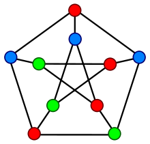
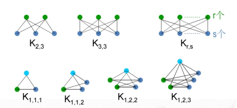
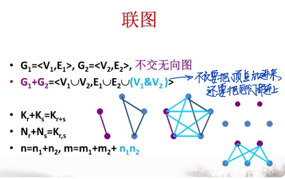
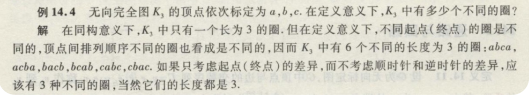
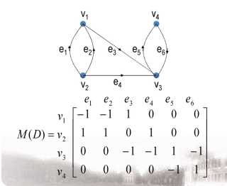
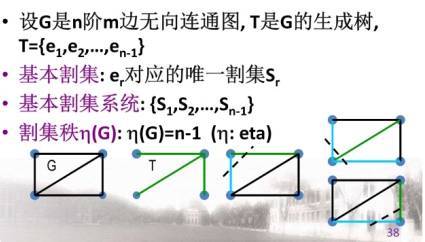
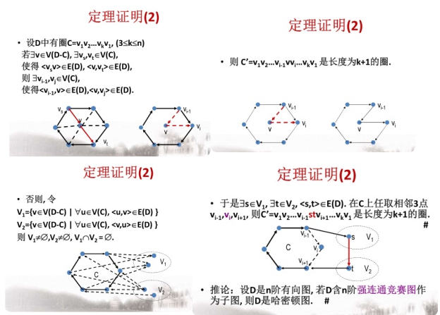

# 定义

边集中可以出现自环，也可以出现多重边。通过这样表示：$E=\{(a, a),(a, b),(a, b),(b, c),(c, d),(b, d)\}$

有向边 $\langle U, V\rangle$，其中U是起点，V是终点；起点写在前面，终点写在后面；

没有任何边的图称为**空图**，边数是零的图是零图，只有一个点的图称为**平凡图**（即一阶零图）。

图中顶点的个数称为**图的阶**，若 $|V(G)| = n$，则称 $G$ 为 $n$ 阶图；连接两个相同顶点的边的条数称为**边的重数**，这些边称为**平行边或多重边**。

有向图的平行边要求方向一致

邻域: $N_{G}(v)=\{u \in V(G) \mid(u, v) \in E(G) \wedge u \neq v\}$

闭邻域: $\overline{\mathrm{N}_{\mathrm{G}}(\mathrm{v})}=\mathrm{N}_{\mathrm{G}}(\mathrm{v}) \cup\{\mathrm{v}\}$

关联集: $\mathrm{I}_{\mathrm{G}}(\mathbf{v})=\{\mathrm{e} \mid \mathrm{e}$ 与 $\mathbf{v}$ 关联 $\}$

无向图环对度贡献为 $2$，有向图中度是出度、入度之和。

在度数列的表示中，度数列的顺序不重要

**最大度**：$\Delta(G)$，**最小度**：$\delta(G)$

简单图：既无环也无平行边的图。$0 \leq \Delta(\mathbf{G}) \leq \mathbf{n}-1$

$k$-正则图:一个无向简单图 $G$ 中，如果所有顶点的度都是k，则称 $G$ 为 $k$-正则图。

$G$ 是个简单图，如果每对不同结点之间，都有边相连，则称 $G$ 是个**无向完全图**。如果 $G$ 有 $n$ 个结点，记为 $K_n$，完全图边数为 $\dfrac{n(n – 1)}{2}$。

竞赛图：竞赛图是通过在无向完全图中为每个边缘分配方向而获得的有向图。 竞赛图的基图是完全图。（分清有向完全图与竞赛图，有向完全图要求两个方向都有）

彼得森图：彼得森图有10个顶点、15条边（5+5+5），是3-正则图。彼得森图: $\kappa=3, \lambda=3$

r部图：$\mathbf{G}=\left\langle\mathrm{V}, \mathrm{E}\rangle, \mathrm{V}=\mathrm{V}_{1} \cup \mathrm{V}_{2} \cup \ldots \cup \mathrm{V}_{\mathrm{r}}\right.$,$\mathbf{V}_{i} \cap \mathbf{V}_{\mathrm{j}}=\varnothing(\mathrm{i} \neq \mathrm{j})$,$E \subseteq_{i \neq j} \cup\left(V_{i} \& V_{j}\right)$​。即子集内没有边，所有边都在子集间。也记作 $\mathbf{G}=<\mathbf{V}_{1}, \mathbf{v}_{2}, \ldots, \mathbf{V}_{\mathrm{r}} ; \mathrm{E}>$.

完全r部图：

图的同构：设 $G = \langle V,E \rangle$ 和 $G’ = \langle V’,E’ \rangle$ 是图，如果存在双射 $f : V \to V’$ 且任何 $e = (v_i,v_j) \in E$，有 $e’ = (f(v_i),f(v_j)) \in E’$，并且边 $e$ 与 $e’$ 的重数相同。则称 $G$ 与 $G’$ 同构，记作 $G \stackrel{\backsim}{=} G’$。**有向图同构还要求方向一样。**

**判断同构可以通过度数列、判断回路等来判断，而有向图一定要注意检查边的方向！**

真子图:要么顶点少了，要么边少了;生成子图：点集完全一样。导出子图：设 $V’$ 是图 $G$ 的顶点集 $V$ 的一个非空子集，以 $V’$ 作为顶点集，以两端点均在 $V’$ 的边的全体为边集的子图，称为由 $V’$ 导出的 $G$ 的子图，记为 $G[V’]$，称其为 $G$ 的导出子图。设 $E’$ 是图 $G$ 的边集 $E$ 的一个非空子集，以 $E’$ 为边集，以 $E’$ 中边的全体端点为顶点集组成的子图称为由 $E’$ 导出的子图，记为 $G[E’]$。**注**：$G$、空图均为 $G$ 的子图，而且是非空子图，称为平凡子图。其中，$G$ 为 $G$ 的点导出子图。

补图：完全图减去G。补图不要忘记孤立点！

图的运算：删点的同时删掉所有边；删边不删点。

两图不交（顶点不交）、两图边不交。

初级通路（路径）：**没有重复顶点**、没有重复边的通路。初级回路（圈）：没有重复顶点、没有重复边的回路。简单通路：没有重复边的通路。简单回路：**没有重复边**的回路。复杂通路：有 重复边的通路。复杂回路：有重复边的回路

距离：设 $u$，$v$ 是 $G$ 中任意两点，若 $u$，$v$ 连通，则 $G$ 中最短的 $u – v$ 通路的长定义为 $u$ 和 $v$ 之间的距离，记为$d_G(u,v)$，简记 $d(u,v)$。若 $u$，$v$ 不连通，则定义 $d(u,v) = \infty$

直径：$\mathrm{d}(\mathrm{G})=\max \left\{\mathrm{d}_{\mathrm{G}}(\mathrm{u}, \mathrm{v}) \mid \mathrm{u}, \mathrm{v} \in \mathrm{V}(\mathrm{G})\right\}$

用 $p(G)$ 表示 $G$ 中**连通分支数**。

在简单有向图 $G$ 中，如果任何两个结点间相互可达，则称 $G$ 是**强连通**。

如果任何一对结点间，至少有一个结点到另一个结点可达，则称 $G$ 是**单侧连通**。

如果将 $G$ 看成无向图后（即把有向边看成无向边）是连通的，则称 $G$ 是**弱连通**。

强连通分支：极大强连通子图。单向连通分支：极大单向连通子图。弱连通分支：极大弱连通子图。**连通分支前面记得标G[]**

在有向图 $G=<V, E>$ 中, 它的每一个结点位于且仅位于一个强（弱）连通分支中。在有向图 $G=<V, E>$ 中, 它的每一个结点至少位于一个单向连通分支中。在有向图G $=<V, E> $中, 它的每一条边至多在一个强连通分支中; 至少在一个单向连 通分支中; 在且仅在一个弱连通分支中。

割集：$\mathbf{p}\left(\mathbf{G}-\mathrm{V}^{\prime}\right)>\mathbf{p}(\mathbf{G})$$\forall \mathrm{V}^{\prime \prime} \subset \mathrm{V}^{\prime}, \mathrm{p}\left(\mathrm{G}-\mathrm{V}^{\prime}\right)=\mathrm{p}(\mathrm{G})$，必须删去全部点才能增加连通分支数。

$E^{\prime}$ 为扇形割集: 边割集 $E^{\prime} \subseteq v$ 的关联集 $I_{G}(\mathbf{v})$。$\mathrm{I}_{G}(\mathbf{v})$ 不一定是边割集(不一定极小)。$\mathrm{I}_{G}(\mathbf{v})$ 是边割集 $\Leftrightarrow \mathbf{v}$ 不是割点

$\kappa (G) = \min \{|V_1| | |V_1| \text{ 是 } G \text{ 的点割集}\}$ 为 $G$ 的**点连通度**。不连通图的点连通度为 $0$。平凡图 $N_{1}$ 连通, 但 $\left.\kappa\left(N_{1}\right)=\kappa\left(K_{1}\right)=0\right)$$\lambda (G) = \min \{ |E_1| | E_1 \text{ 是 } G \text{ 的边割集}\}$ 为 $G$ 的**边连通度**。如果 $G$ 不连通，$\lambda (G) = 0$对平凡图，$\lambda (G) = 0,\lambda(K_n) = n – 1$。

如果 $\kappa(G) \ge h$，则称 $G$ 是 $h-$ 连通的；如果 $\lambda (G) \ge f$，则称 $G$ 是 $f-$ 边连通的。设图 $G$ 是 $h -$ 连通的，则 $G$ 的每个顶点的度均 $\ge h$。设图 $G$ 是 $h -$ 连通的，$v$ 是 $G$ 中的一 个顶点，则 $G – v$ 是 $(h – 1) -$ 连通的。对3-正则图G，$\kappa(\mathbf{G})=\lambda(\mathbf{G})$

邻接矩阵:从 $\mathrm{v}_{\mathrm{i}}$ 到 $\mathrm{v}_{\mathrm{j}}$ 的长度为 1 的边数/通路数.

无向图邻接矩阵：两顶点相邻就是1，不相邻就是0。是一个对称矩阵。

可达矩阵P：行列均为顶点，矩阵可到达是1，不可达就是0。主对角线元素都是1：$\forall v_{\mathrm{i}} \in \mathbf{V}$，从$v_i$可达$v_i$。$\forall \mathbf{i} \neq \mathbf{j}, \mathbf{p}_{\mathrm{ij}}=1 \Leftrightarrow \mathbf{b}^{(\mathrm{n}-1)}_{\mathrm{ij}}>0$​（之前定理：两点之间若有通路，则通路长度一定小于等于n-1；）

关联矩阵：行边列点

有向图：

- 单向连通：若$P \lor P^T$全为1，则单向连通。即：要么有i到j的通路，要么有j到i的通路
- 弱连通：$A^{\prime}=A \lor A^{\top}$. $A^{\prime}$ 即为其对应的基图，判断其连通性即可。

在无孤立结点的图 $G$ 中，如果存在一条路，它经过图中每条边一次且仅一次，称此路为**欧拉迹**。有欧拉通路的图称为半欧拉图。在无孤立结点的图 $G$ 中，若存在一条回路，它经过图中每条边一次且仅一次，称此回路为**欧拉回路**。**定义平凡图为欧拉图**。

**哈密顿路**：通过 $G$ 中每个结点恰好一次的路。（经过图中所有顶点的**初级**通路）。**哈密顿回路（H 圈）**：通过 $G$ 中每个结点恰好一次的路。

树：连通无回图。**树叶**：度数为 $1$ 的结点，称为树叶。**分支结点**：度数大于 $1$ 的结点。**森林**：一个无向图的每个连通分支都是树，把这个图叫做森林。

树定义等价命题：$T$ 是连通的且 $m = n – 1$。$T$ 无回路且 $m = n – 1$。T极大无回：$T$ 无回路但在任一对不相邻的顶点间添加一条新边 $e$，则 $T + e$ 包含唯一的圈。T极小连通：连通且所有边是桥。

在无向图G (n阶m条边)中若m $<n-1$, 则 $G$ 是不连通的若 $m>n-1$ ，则G 必含回路。

星：$\mathrm{S}_{\mathrm{n}}=\mathrm{K}_{1, \mathrm{n}-1}$。**生成树**：如果图 $G$ 的生成子图是树，则称此树为 $G$ 的生成树。**树枝**：共n-1条。**弦**：图 $G$ 中，不在其生成树里的边，称作**弦**。所有弦的集合，称为该生成树的**余树**。共m-n+1条

设G是n阶m边无向连通图, T是G的生成树,$\overline{\mathrm{T}}=\left\{\mathrm{e}_{1}^{\prime}, \mathrm{e}_{2}^{\prime}, \ldots, \mathrm{e}_{\mathrm{m}-\mathrm{n}+1}^{\prime}\right\}$基本回路：$T\cup e_r^{\prime}$中的唯一回路 $C_{r}$基本回路系统：$\left\{C_{1}, C_{2}, \ldots, C_{m-n+1}\right\}$圈秩$\xi(G): \xi(G)=m-n+1$。

# 定理

每个无向图所有结点度总和等于边数的 $2$ 倍。奇数度的结点必为偶数个。

可图化的充要条件：非负整数列 $\mathrm{d}=\left(d_{1}, \mathrm{~d}_{2}, \ldots, \mathrm{d}_{\mathrm{n}}\right)$ 可图化 $\leftrightarrow$ $\mathrm{d}_{1}+\mathrm{d}_{2}+\ldots+\mathrm{d}_{\mathrm{n}} \equiv 0(\bmod 2)$。（从右到左构造法入手证明，奇数度点两两之间连一边（偶数个奇数度结点），剩余度用环来实现）

可简单图化充要条件。若度数列满足$\begin{gathered}
\mathrm{d}_{1}+\mathrm{d}_{2}+\ldots+\mathrm{d}_{\mathrm{n}} \equiv 0(\bmod 2) \\
\mathrm{n}-1 \geq \mathrm{d}_{1} \geq \mathrm{d}_{2} \geq \ldots \geq \mathrm{d}_{\mathrm{n}}>0,
\end{gathered}$,则 $\mathbf{d}$ 可简单图化 $\Leftrightarrow$$d^{\prime}=\left(d_{2}-1, d_{3}-1, \ldots, d_{d 1+1}-1, d_{d 1+2}, \ldots, d_{n}\right)$。证明（反向）：若存在点Vi,Vj使得i＜j, (V1,Vi)不在G中，但(V1,Vj)在G中。这时，因为di≥dj，必存在k使得(Vi, Vk)在G中但(Vj,Vk)不在G中。这时我们可以令GG=G-{(Vi,Vk),(V1,Vj)}+{(Vk,Vj),(V1,Vi)}。GG的度序列仍为d，我们又回到了上一种情况。

拉姆齐定理的通俗表述：6个人中至少存在3人相互认识或者相互不认识。颜色连线，抽屉原理。

给定点数与边数，画出所有非同构的无向简单图，应该首先从度数列入手指引分配，并利用握手定理找出度数之和，并利用最大度小于等于n-1的关系进行分析。5阶4条边：共6个图；4阶2条边：共5个图。

定理：在n阶(有向或无向)图G中,若从不同顶点${v}_{\mathrm{i}}$ 到 $v_{\mathrm{j}}$ 有通路, 则从 $v_i$ 到 $v_j$ 有长度小于等于 $\mathrm{n}-1$ 的通路。证明，如果长度大于n-1，则定点数大于n，则一定有从自身到自身的回路，删掉回路即可。

在n阶图G中，若有从顶点$V_i$到自身的回路，则有从$V_i$到自身长度小于等于n的回路

设G是$n(n \geq 3)$阶无向简单图，$\delta(G) \geq 2$。证明G中有长度$\geq \delta(\mathrm{G})+1$​的圈。证明：$\forall \mathbf{v}_{0} \in \mathbf{V}(\mathbf{G}), \delta(\mathbf{G}) \geq \mathbf{2} \Rightarrow \exists \mathbf{v}_{1} \in \mathbf{N}_{\mathrm{G}}\left(\mathbf{v}_{0}\right)$，对$\Gamma_{0}=\mathrm{v}_{0} \mathrm{v}_{1}$采取扩大路径法，得到极大路径：$\Gamma=\mathbf{v}_{0} \mathbf{v}_{1} \ldots \mathbf{v}_{\mathbf{k}}$$\mathrm{d}\left(\mathbf{v}_{\mathrm{k}}\right) \geq \delta(\mathbf{G}) \Rightarrow \mathbf{k} \geq \delta(\mathbf{G})$$\mathbf{d}\left(\mathbf{v}_{0}\right) \geq \delta(\mathbf{G}) \Rightarrow \exists \mathbf{v}_{i} \in \mathbf{N}_{G}\left(\mathbf{v}_{0}\right), \delta(\mathbf{G}) \leq \mathbf{i} \leq \mathbf{k}$于是 $\mathbf{v}_{0} \mathbf{v}_{1} \ldots \mathbf{v}_{\mathrm{i}} \mathbf{v}_{0}$ 是长度 $\geq \delta$ (G)+1的圈.

$\mathbf{G}$ 是二部图 $\Leftrightarrow \mathbf{G}$ 中无奇圈。反向：设 $v \in V(G)$, 令$\mathbf{V}_{1}=\{\mathbf{u} \in \mathbf{V}(\mathbf{G}) \mid \mathbf{d}(\mathbf{u}, \mathbf{v}) \text { 为偶数 }\}$,V2是奇数，反证法：若存在 $\mathbf{e}=\left(\mathbf{v}_{\mathbf{x}}, \mathbf{v}_{\mathbf{y}}\right), \mathbf{v}_{\mathbf{x}}, \mathbf{v}_{\mathbf{y}} \in \mathbf{V}_{1}$, 设 $\Gamma_{\mathrm{vx}}$ 和 $\Gamma_{\mathrm{vy}}$ 是 $\mathbf{v}$ 到 $\mathbf{v}_{\mathbf{x}}$和$\mathbf{v}_{\mathbf{y}}$的短程线。$\left|\Gamma_{v \mathrm{x}}\right|$ 和 $\mid \Gamma_{\mathrm{v} y}$ |都是偶数。设 $\mathbf{v}_{\mathbf{z}}$ 是 $\Gamma_{v \mathbf{x}}$ 与 $\Gamma_{v y}$的最后一个公共点，若 $\mathbf{v}_{\mathbf{z}} \in \mathbf{V}_{1}$, 则 $\left|\Gamma_{\mathrm{zx}}\right|$ 和 $\left|\Gamma_{\mathrm{zy}}\right|$ 都是偶数；若 $v_{z} \in V_{2}$, 则 $\left|\Gamma_{zx}\right|$ 和 $\left|\Gamma_{zy}\right|$ 都是奇数。于是$\Gamma_{\mathbf{zx}} \cup\left(\mathbf{v}_{\mathbf{x}}, \mathbf{v}_{\mathbf{y}}\right) \cup \Gamma_{\mathbf{z y}}$ 是 $\mathbf{G}$中奇圈，矛盾！

若无向图G是连通的, 则G的边数 $m \geq n-1$，对n使用数学归纳法，对G-v的连通分支 $G_{1}, G_{2}, \ldots, G_{s}$ 使用归纳假设,设$\left|\mathrm{V}\left(\mathrm{G}_{\mathrm{i}}\right)\right|=\mathrm{n}_{\mathrm{i}},\left|\mathrm{E}\left(\mathrm{G}_{\mathrm{i}}\right)\right|=\mathrm{m}_{\mathrm{i}}$, 则：$\begin{aligned} \mathbf{m} &=\mathrm{m}_{1}+\mathrm{m}_{2}+\ldots+\mathrm{m}_{\mathrm{s}}+\mathrm{d}_{\mathrm{G}}(\mathrm{v}) \\ & \geq\left(\mathrm{n}_{1}-1\right)+\left(\mathrm{n}_{2}-1\right)+\ldots+\left(\mathrm{n}_{\mathrm{s}}-1\right)+\mathrm{s} \\ &=\mathrm{n}_{1}+\mathrm{n}_{2}+\ldots+\mathrm{n}_{\mathrm{s}}=\mathrm{n}-1 . \end{aligned}$，

**注：这个定理只是单方向的，并不是充分必要条件，反过来未必成立！**（可能有孤立点）

有向图强连通$\Leftrightarrow$D中有回路过每个顶点至少一次(不一定有简单回路)

有向图D单向连通 $\Leftrightarrow$ D中有通路过每个顶点至少一次（不一定有简单通路）。若有向图D单向连通，但不是强连通，则至少加**一**条边D就会转换为强连通

**定理：竞赛图一定有初级通路（路径）过每个顶点恰好一次（单向连通）**证明：首先找一条通路。对于不在这条已知通路外的点，由于是竞赛图，所以它和每个点都有边相连。如果所有边方向都是指向这个点的，那么就把这个点安排到这条通路的末尾；否则，至少通路上有相邻两个点，和外部那个点之间边的方向一条是指向那个点一条是那个点发出来的，这样就可以把外部点安排到相邻两个点中间。这样这条通路便可以扩充，包含整个图。

无向连通图G中顶点 $v$ 是割点
$\Leftrightarrow$ 可把 $V(G)-\{v\}$划分成$V_{1}$ 与 $V_{2}$, 使得从 $V_{1}$ 中任意顶点 u到 $V_{2}$ 中任意顶点 $w$​ 的路径都要经过v. 推论：无向连通图G中顶点v是割点$\Leftrightarrow$ 存在与v不同的顶点 $u$ 和 $w$, 使得从顶点u到w的路径 都要经过v. 

**设 $E^{\prime}$ 是边割集,则 $\mathbf{p}\left(\mathrm{G}-\mathrm{E}^{\prime}\right)=\mathbf{p}(\mathrm{G})+1$.**证：如果 $p\left(G-E^{\prime}\right)>p(G)+1$,则 $E^{\prime}$ 不是边割集, 因为不满足定义中的极小性。连通图 $G$ 的边 $e$ 是割边的充要条件是 $e$ 不在 $G$ 的任一圈上。

设E'是**非完全连通图** $G$ 的最小边割集,$\mathbf{G}-\mathbf{E}$ '的两个连通分支是 $\mathbf{G}_{1}, \mathbf{G}_{2}$，则存在 $u \in V\left(\mathbf{G}_{1}\right), \mathbf{v} \in \mathbf{V}\left(\mathbf{G}_{2}\right)$, 使得 $(\mathrm{u}, v) \notin \mathbf{E}(\mathrm{G})$.反证法：否则$\lambda(\mathrm{G})=\left|\mathrm{E}^{\prime}\right|=\left|\mathrm{V}\left(\mathrm{G}_{1}\right)\right| \times\left|\mathrm{V}\left(\mathrm{G}_{2}\right)\right|$$\geq\left|V\left(G_{1}\right)\right|+\left|V\left(G_{2}\right)\right|-1=n-1$,与G是非完全图矛盾！

**Whitney定理**：$G$ 是无向图，则 $\kappa(G) \le \lambda(G) \le \delta(G)$。推论：$k$-连通图一定是k-边连通图。证明:后边的不等号：找到最小度对应的那个特殊点。前边的不等号：对G去掉边割集后的连通分支构造出来（把对应的边删掉）

设 $G = \langle V,E \rangle$ 是简单图，令 $V=\{v_1,v_2,\cdots,v_n\}$，$G$ 的邻接矩阵 $(A(G))^k$ 中的第 $i$ 行第 $j$ 列元素${a_{ij}}^k=m$，表示在图 $G$ 中从 $v_i$ 到 $v_j$ 长度为 $k$ 的路有 $m$ 条。设$A(D)=A=\left[a_{i j}\right]_{n \times n}, A^{r}=A^{r-1} \bullet A,(r \geq 2)$，$B_{r}=A+A^{2}+\ldots+A^{r}=\left[b^{(r)}_{i j}\right]_{n \times n}$$ \mathrm{a}^{(r)}{\mathrm{ij}}=$ 从 $\mathrm{v}_{\mathrm{i}}$ 到 $v_{\mathrm{j}}$ 长度为r的通路总数,$\Sigma_{\mathrm{i}=1}^{\mathrm{n}} \Sigma_{\mathrm{j}=1}^{\mathrm{n}} \mathrm{a}^{(r)}{\mathrm{ij}}=$ 长度为 $r$ 的通路总数,$\sum_{{ }{n}=1} a^{(r)}_{i i}=$ 长度为r的回路总数,$b^{(r)}_{i j}=$ 从 $v_{i}$ 到 $v_{j}$ 长度 $\leq r$ 的通路总数。证明:数学归纳法。

无向图邻接矩阵：$\mathrm{a}^{(2)}{ }_{\mathrm{ii}}=\mathrm{d}\left(\mathrm{v}_{\mathrm{i}}\right)$

无向欧拉图的充要条件：一个非空连通图（可以是多重图）是欧拉图当且仅当它不含奇数度的点。由数学归纳法得，最小度大于2故必含圈，删圈，对剩下的欧拉图分析。

一个连通图 $G$ 有欧拉迹当且仅当 $G$ 最多有两个奇点。（无向半欧拉图的充分必要条件）。一个有向图 $D$ 具有欧拉迹，当且仅当 $D$ 是连通的，且除了两个顶点外，其余顶点的入度均等于出度。这两个特殊的顶点中一个顶点的入度比出度大 $1$，另一个顶点的入度比出度小 $1$。

求欧拉回路算法：Fleury算法。从任意一点开始，沿着没有走过的边向前走。在每个顶点，优先选择剩下的**非桥边**，除非只有唯一一条边。直到得到欧拉回路或者宣布失败。**逐步插入回路算法**：每次求出一个简单回路，然后回溯到上一个有边没有被遍历到的顶点，把新求出的回路插入到老回路，合并成一个更大的回路，直到得到欧拉回路或者宣告失败。

哈密顿图：**定理1（必要条件）**：设 $G=<V, E>$ 是无向哈密顿图, 则对 $V$ 的任意非空真子集 $V_{1}$ 有 $p\left(\mathrm{G}-\mathrm{V}_{1}\right) \leq\left|\mathrm{V}_{1}\right|$。证明：设C是G中任意哈密顿回路，当$V_1$中顶点在C中都不相邻时，$p\left(C-V_{1}\right)=\left|V_{1}\right|$ 最大。若 $\mathbf{V}_{1}$ 中顶点相邻, $p\left(\mathrm{C}-\mathrm{v}_{1}\right)<\left|\mathrm{V}_{1}\right|$ ,$ \mathrm{C}$ 是G的生成子图,所以 $p\left(\mathrm{G}-\mathbf{V}_{1}\right) \leq \mathbf{P}\left(\mathrm{C}-\mathrm{V}_{1}\right) \leq\left|\mathrm{V}_{1}\right|$。判定：删点。非充分条件反例：彼得森图。

充分条件：$G$ 是简单图，且 $n \ge 2$，若对 $G$ 中任一对不相邻点 $u,v$，都有 $d(u) + d(v) \ge n-1$ . 则 $G$ 是半哈密顿图。核心步骤：G连通、由极大路径可得圈;设极大路径 $\Gamma=\mathrm{v}_{0} \mathrm{v}_{1} \ldots \mathrm{v}_{\mathrm{k}}, \mathrm{k} \leq \mathrm{n}-\mathbf{2} .$ 若 $\left(\mathrm{v}_{0}, \mathrm{v}_{\mathrm{k}}\right) \notin \mathrm{E}$, 则$\exists i\left(1 \leq i \leq k-1 \wedge\left(v_{i}, v_{k}\right) \in E \wedge\left(v_{0}, v_{i+1}\right) \in E\right)$，否则$\mathrm{d}\left(\mathrm{v}_{0}\right)+\mathrm{d}\left(\mathrm{v}_{\mathrm{k}}\right)\leq \mathrm{d}\left(v_{0}\right)+k-1-\left(d\left(v_{0}\right)-1\right)=k \leq n-2 \mid$（矛盾）。于是得圈 $C=v_{0} \ldots v_{i} v_{k} v_{k-1} \ldots v_{i+1} v_{0}$,由圈可得更长路径。（如果是大于等于n，则是哈密顿回路）。

设D是n $(\geq 2$​ )阶竞赛图, 则D是半哈密顿图。归纳法：若存在 $v_r^{\prime}(1 \leq r \leq k)$, 有$ < v_{i}^{\prime}, v_{k+1} >\in E(D), i=1,2, \ldots, r-1, \quad.$ 而 $<v_{k+1}, v_{r}^{\prime}>\in E(D)$,则 $\Gamma=v^{\prime}{ }_{1} v_{2}^{\prime} \ldots v_{r-1}^{\prime} v_{k+1} v_{r}^{\prime} \ldots v_{k}^{\prime}$ 为 $D$中哈密顿通路。否则，$i \in\{1,2, \ldots, k\}$, 均有 $<v_{i}^{\prime}, v_{k+1}>\in E(D)$，则则 $\Gamma=\Gamma^{\prime} + <v^{\prime}, v_{k+1}>$ 为 D中哈密顿通路。

强连通的竞赛图是哈密顿图：证明：归纳法

每一非平凡树至少两片树叶。证明：设T有x个树叶，则$2 m=2(n-1)=2 n-2=\sum d(v)$$=\Sigma_{\mathbf{v} \text { 是树叶 }} \mathbf{d}(\mathbf{v})+\Sigma_{\mathbf{v} \text { 是分支点 }} \mathbf{d}(\mathbf{v})$$\geq x+2(n-x)=2 n-x$，

连通图 $G$ 至少有一棵生成树。证明：破圈法。

G是 $n$ 阶m边无向连通图 $\Rightarrow m \geq n-1$

设e为无向连通图G中一边若e在G的任何生成树中，则e是桥若e不在G的任何生成树中，则e是环

设G是连通图, T是G的生成树, $\mathrm{e}$ 是T的弦,则 $T \cup e$中存在由弦e和其他树枝组成的圈, 并且不同的弦对应不同的圈.证明：设 $\mathrm{e}=(\mathrm{u}, \mathrm{v})$, 设 $\mathrm{P}(\mathrm{u}, \mathrm{v})$ 是 $\mathrm{u}$ 与 $\mathrm{v}$ 之间在T中的唯一路径, 则 $\mathrm{P}(\mathrm{u}, \mathrm{v}) \cup \mathbf{e}$ 是由弦 $\mathrm{e}$ 和其他树枝组成的圈.设 $e_{1}, e_{2}$ 是不同的弦,对应的圈是 $C_{e 1}, C_{e 2}$，则$\mathrm{e}_{1} \in \mathrm{E}\left(\mathrm{C}_{\mathrm{e} 1}\right)-\mathrm{E}\left(\mathrm{C}_{\mathrm{e} 2}\right), \mathrm{e}_{2} \in \mathrm{E}\left(\mathrm{C}_{\mathrm{e} 2}\right)-\mathrm{E}\left(\mathrm{C}_{\mathrm{e} 1}\right)$, 所以 $\mathrm{C}_{\mathrm{e} 1} \neq$
$\mathrm{C}_{\mathrm{e} 2}$