## 概述

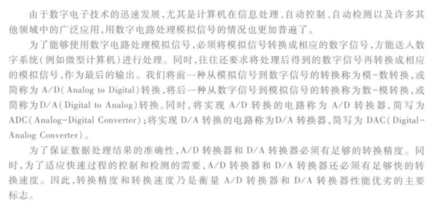

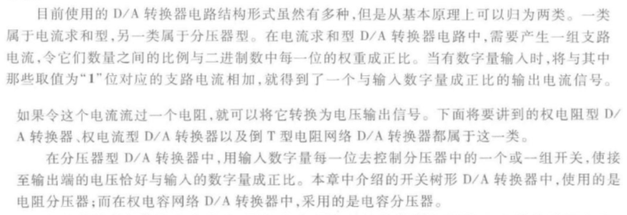

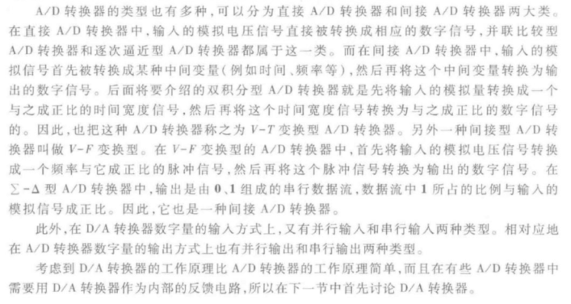

## D/A转换器的电路结构和工作原理

### 权电阻网络D/A转换器

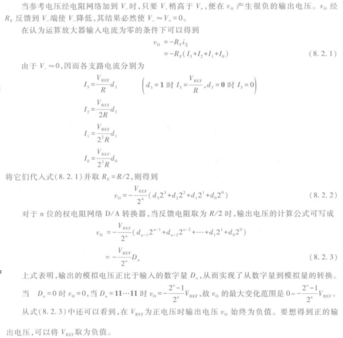

### 倒T型电阻网络DA转换器

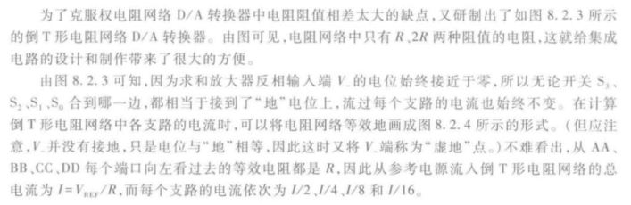

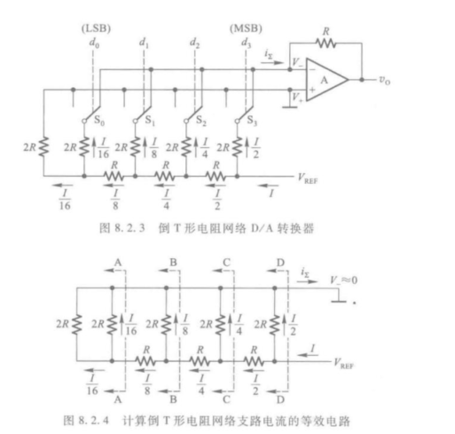

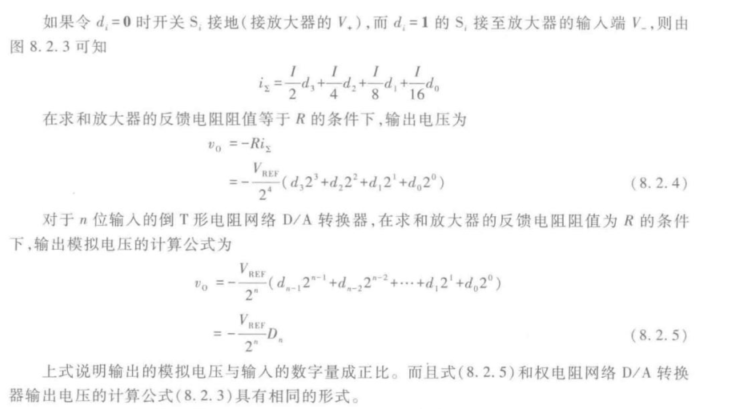

### 具有双极性输出的D/A转换器

因为在二进制算术运算中通常都将带符号的数值表示为补码的形式，所以希望D/A转换器能够将以补码形式输入的正、负数分别转换成正、负极性的模拟电压。

我们可以从相应数字量和模拟量之间的对应关系发现规律：

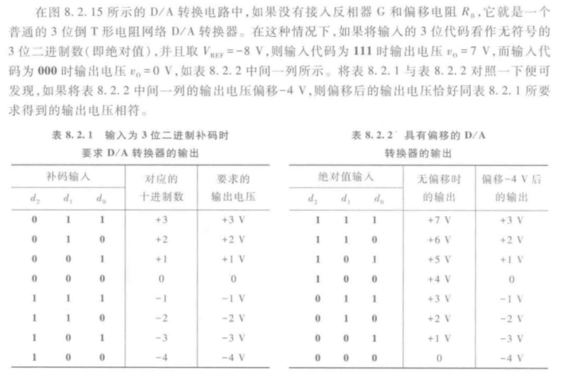

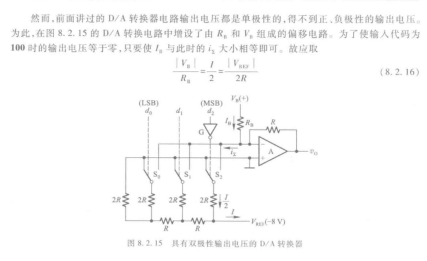

从上面的例子不难总结出构成双极性输出D/A转换器的一般方法：只要在求和放大器的输入端接入一个偏移电流，使输入最高位为1而其他各位输入为0时的输出$v_{0}=0$，同时将输入的符号位反相后接到一般的D/A转换器的输入，就得到了双极性输出的D/A转换器。

### DAC的转换精度与速度

造成D/A转换器转换误差的原因主要有参考电压$V_{\text {REF }}$的波动、运算放大器的零点漂移、模拟开关的导通内阻和导通压降、电阻网络中电阻阻值的偏差以及三极管特性的不一致等。

由不同因素所导致的转换误差各有不同的特点，现以倒T型网络D/A转换器为例，分别讨论这些因素引起转换误差的情况。

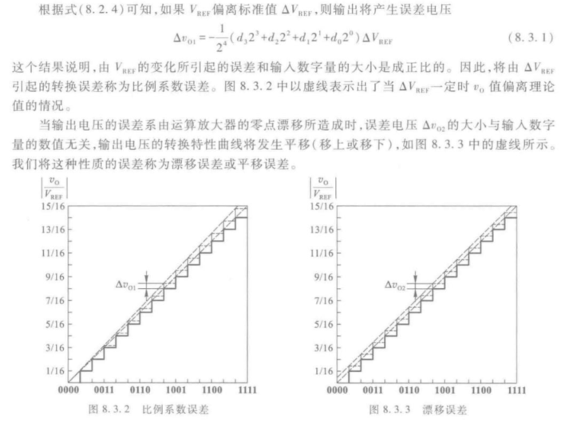

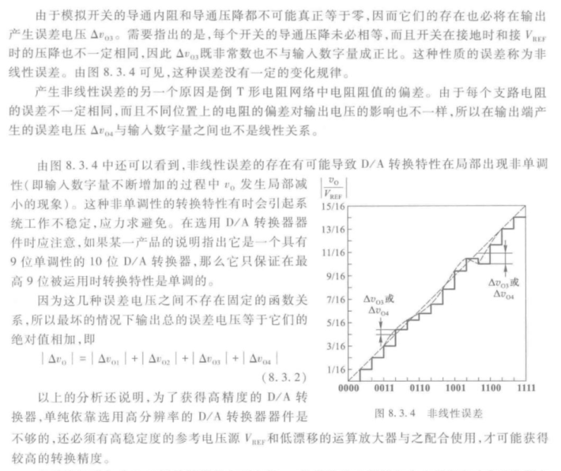

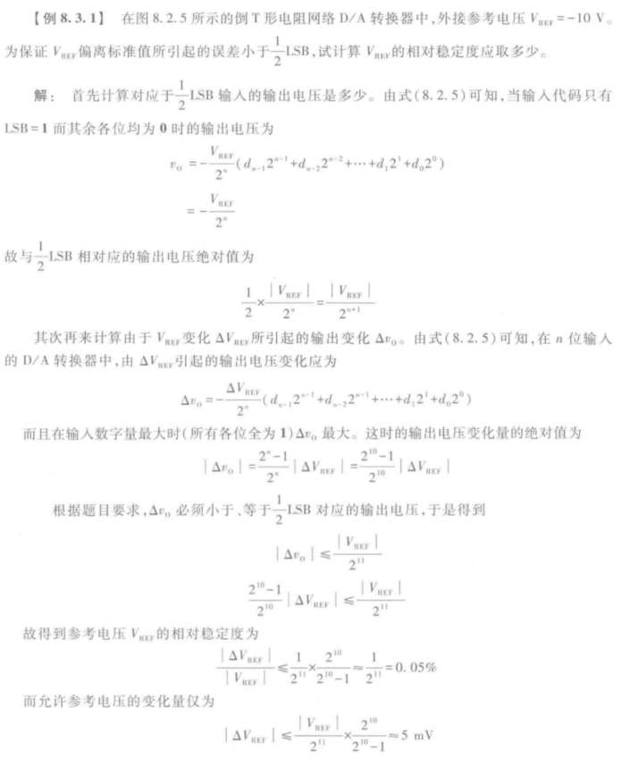

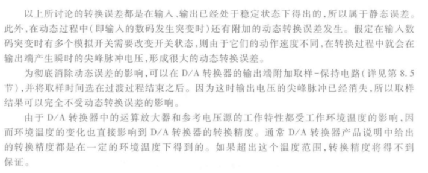

## AD转换的基本原理

在A/D转换器中，由于输入的模拟信号在时间上是连续的而输出的数字信号是离散的，所以转换只能在一系列选定的瞬间对输入的模拟信号取样，然后再将这些取样值转换成输出的数字量。

因此，A/D转换的过程是首先对输入的模拟电压信号取样，取样结束后进入保持时间，在这段时间内将取样的电压量化为数字量，并按一定的编码形式给出转换结果，然后再进行下一次取样。

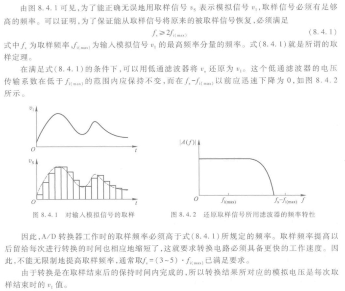

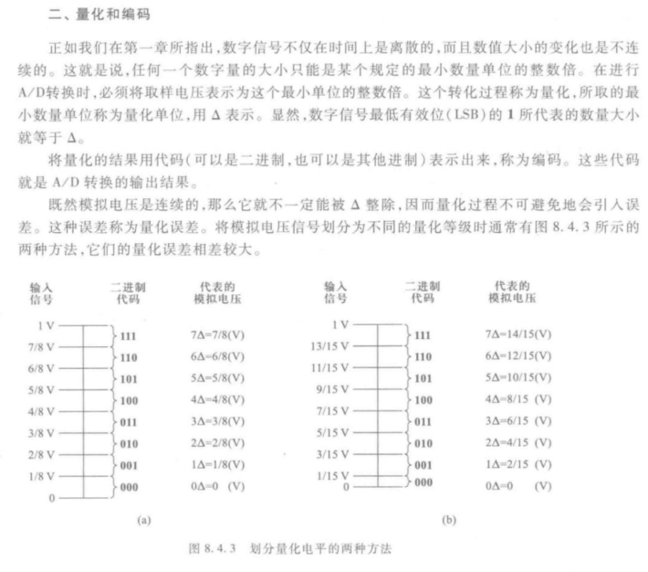

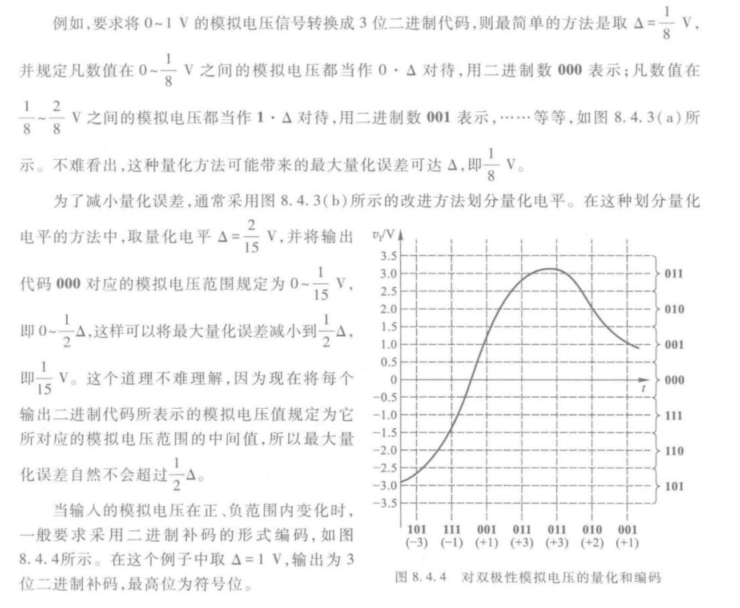

### 采样保持电路

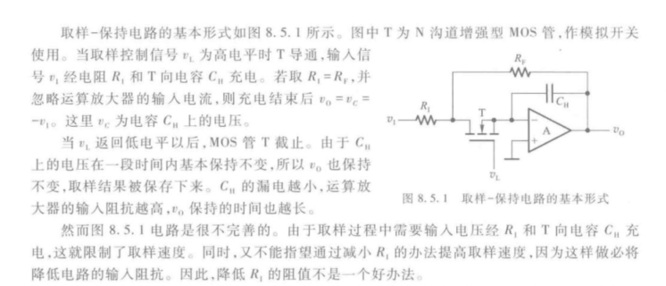

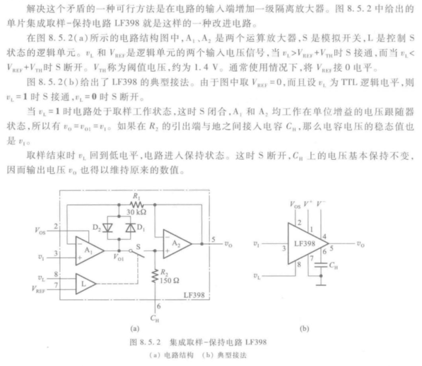

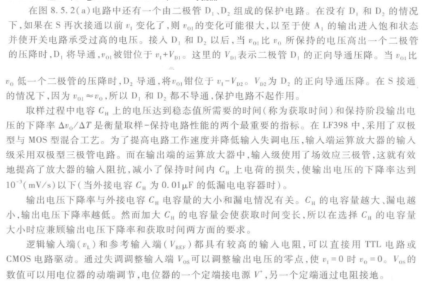

### 并联比较型A/D转换器

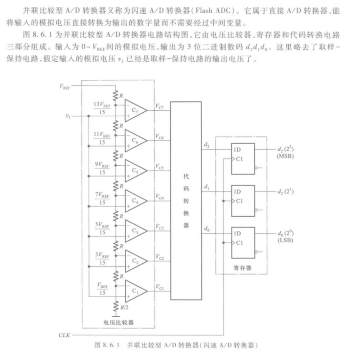

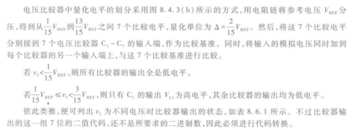

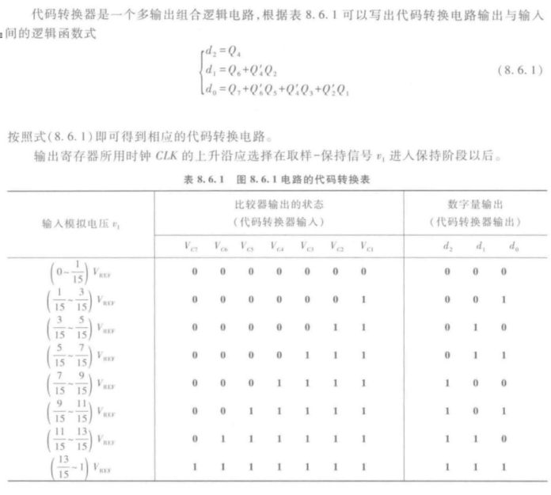

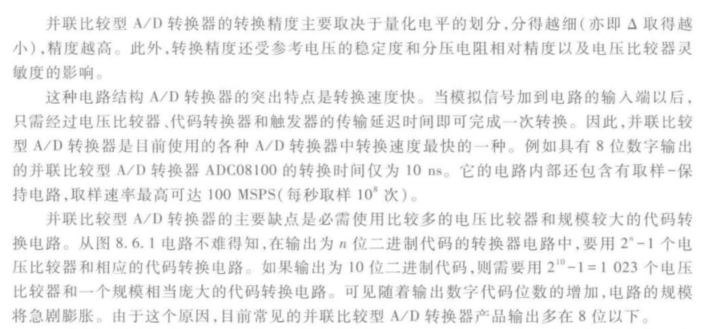

### 反馈比较型A/D转换器

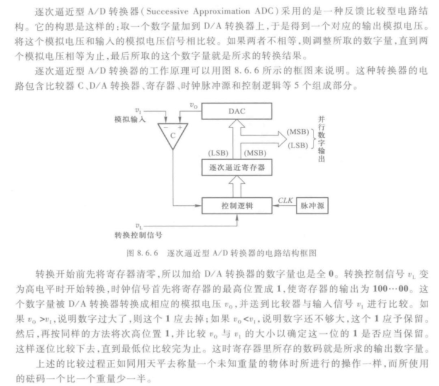

### 双积分型ADC

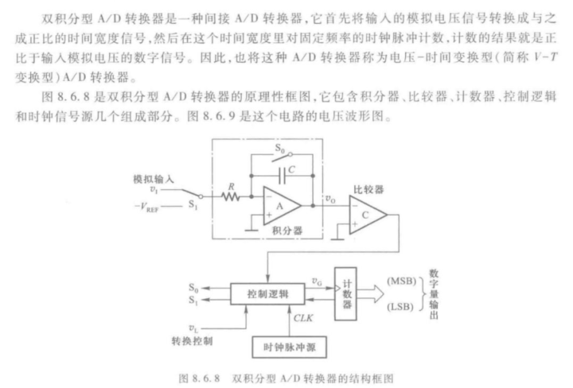

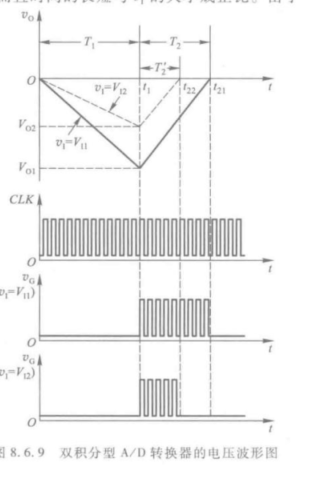

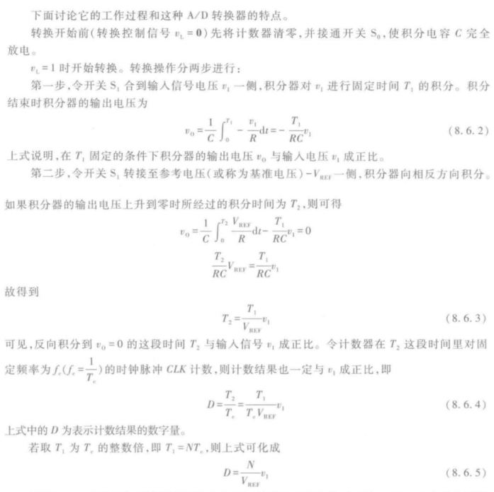

