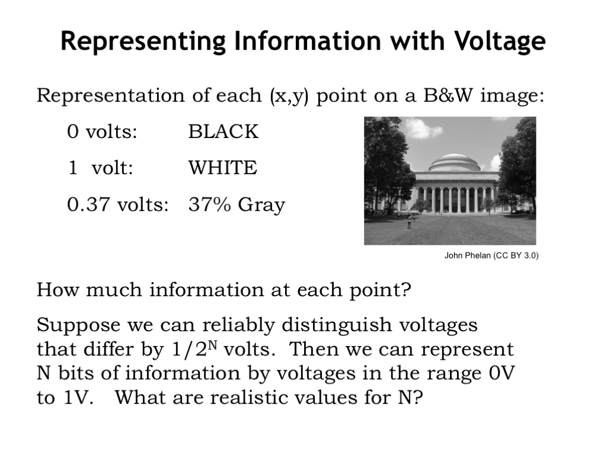
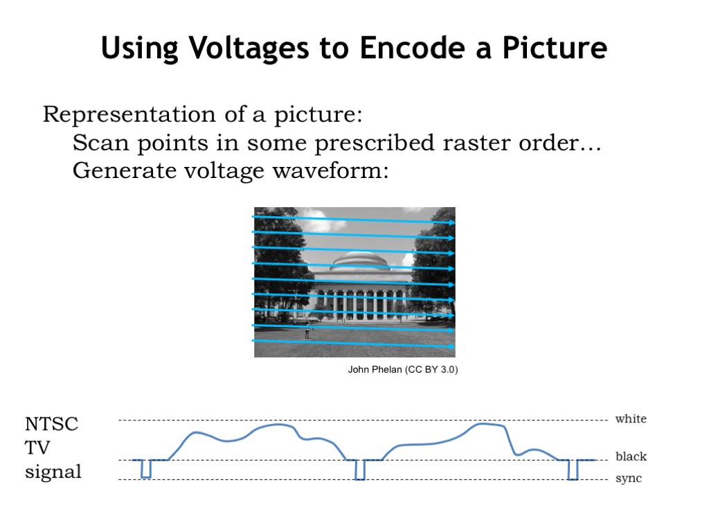

In this course, we’ll use voltages to represent bits. For example, we might choose 0V to represent a 0-bit and 1V to represent a 1-bit. To represent sequences of bits we can use multiple voltage measurements, either from many different wires, or as a sequence of voltages over time on a single wire.

The best choice depends on the intended application.

- Voltage pros:
  - easy generation,detection;
  - potentially zero power in steady state(相较用电流来表示信息，用电压来表示信息可以做到在有电压无电流时没有功耗)
- Voltage cons: 
  - easily affected by environment;
  -  DC connectivity required:If I want to transmit voltage-encoded information to you, we need to be connected by a wire. 
  - R & C effects slow things down ： In modern integrated circuits, these RC time constants are small, but sadly not zero.暂态过程减缓电路工作速度。

The ability to encode information using voltages will clearly be constrained by our ability to reliably and quickly distinguish the voltage at particular time.

Scan the image in some prescribed raster order — left-to-right, top-to-bottom — converting intensities to voltages as we go. In this way, we can convert the image into a time-varying sequence of voltages. 

Those of us who are mathematically minded might complain that “reality is imperfect.” That’s going a bit far though. Reality is what it is and, as engineers, we need to build our systems to operate reliably in the real world. **So perhaps the real problem lies in how we chose to engineer the system.**

Keep in mind that the world is not digital, we would simply like to engineer it to behave that way. Furthermore, we must use **real physical phenomena** to implement digital designs! However, there are physical phenomenon that are naturally digital, like the spin of an electron.We’re just now starting to research how to apply quantum physics to computation and there’s interesting progress to report on building quantum computers. 

A particular system can interpret a voltage in the forbidden as either a 0 or a 1, and is not even required to be consistent in its interpretation. In fact the system is not required to produce any interpretation at all for voltages in this range.

- A combinational device has a timing specification that tells us how long it takes for the output of the device to reflect changes in its input values. At a minimum, there must a specification of the propagation delay, called $t_{\mathrm{PD}}$, that is an upper bound on the time from when the inputs reach stable and valid digital values, to when the output is guaranteed to have a stable and valid output value.

### Noise Margin

The noise margins tell us how much noise can be added to a valid 0 or a valid 1 output signal and still have the result interpreted correctly at the inputs to which it is connected. The smaller of the two noise margins is called the *noise immunity* of the signaling specification. 

> 注意这里是从级联的角度入手分析的！前一级发出的信号经过传输到后一级的输入。

### VTC of a buffer: Voltage transfer characteristic

> 注意到中间部分曲线的变化大于1， In electrical terms, we would say the device as a gain greater than 1 or less than -1, where we define gain as the change in output voltage for a given change in input voltage.而特性曲线的斜率必须变化（不能一直是某个常数）。 Devices that exhibit a change in gain across their operating range are called nonlinear devices.
>
> Together these observations tell us that we cannot use only linear devices such as resistors, capacitors and inductors, to build combinational devices.

### Combinational Timing

Note that our timing diagram abstracts away details of the output signal behavior during the propagation delay: the crosshatched regions of the output waveform indicate, symbolically, that the output voltage is unspecified during these intervals. It may assume the valid output value earlier than required; it may oscillate between valid 00 and 11 during this period; or it may assume an invalid level in the forbidden zone. In the real-world circuits we build, we will typically see an exponential decay to the valid output value, but our abstraction leaves this detail completely unspecified.

The instantaneous transitions on the input waveform mask another important contractual detail in our combinational timing model: the output guarantee applies a propagation delay after all inputs become *valid*. If the input transition takes finite time (which, realistically, is always the case) we must allow time for a valid logic value to be reached before starting the $t_{PD}$ clock.

**Contamination Delay**：

One can argue for recognition of another, symmetric physical reality: given a device with valid inputs and outputs, it takes finite time for the fact that an input has become *invalid* to propagate to an output and contaminate its validity. Our model makes the pessimistic assumption that any invalid input *immediately* contaminates all outputs: all output guarantees are instantly voided by any invalid input. This pessimism is, again, conservative: systems can fail due to *invalidity* of logic levels, not due to undocumented *validity* for a brief period after an input change.

It is occasionally useful, however, to rely on an output remaining valid for a brief interval after an input becomes invalid. To support these infrequent needs, we introduce a new, optional specification that can augment a combinational device:

**contamination delay $t_{C D}:$** a specified lower bound on the time a valid output will persist following an input becoming invalid.

### Lenient combinational device

A **lenient combinational device** is a combinational device whose output is guaranteed valid whenever any combination of inputs sufficient to determine the output value has been valid for at least $t_{P D}$.

即使某些输入是invalid，也可以产生valid output.

Combinational OR:

Lenient OR:

