<h2  align = "center" >仿真作业1 实验报告</h2>

<h6 align = "center">自96 曲世远 2019011455</h6>

[TOC]

### 1.实验目的

掌握基本元件电路的分析方法。

- 熟悉仿真软件环境；
- 掌握仿真软件的基本测量手段（用万用表的交流和直流档测量电压和电流量、用示波器测量和观察信号、用IV分析仪测量半导体器件的特性曲线）；
- 熟悉仿真软件的基本分析方法（直流扫描分析方法）。

### 2.仿真内容

#### 2.1仿真题1-1：

**(1)**电路图如下[图1.1](#img1-1.1)所示，本次仿真实验使用了小功率二极管1N3064。仿真结果如下[图1.2](#img1-1.2)所示。如图可以看出，特性曲线符合二极管的电压电流特性。在二极管上加正向电压时，二极管会先处于电流较小的截至区，之后当外加电压大于正向开启电压之后，二极管会正向导通，电流迅速增加；在二极管上加反向电压时，在一定的电压范围内，二极管只有很小的反向电流。当外加的反向电压大于反向击穿电压后，二极管会被反向击穿，电流迅速增加，同时会造成二极管的损坏。

从下图中，我们可以读出在$U_{pn} = 0.7V$时，通过二极管的电流$I_{pn} = 10.754mA$。反向击穿电压约为$U_{br} = 100.453V$。

通过查阅National Semiconductor公司的[1N3064型二极管的数据手册](#img1-1.3)可以知道，$V_{Fmax} = 0.710V$时，$I_F = 2.0mA$；$V_{Fmax} = 1.0V$时，$I_F = 10.0mA$。虽然在$V_F = 0.7V$时，测量数据与数据手册上的数据不完全相同，但由于数据手册中给出的$U_F, I_F$均为最大值，因此该测量值也在允许范围内，具体的差别是由multisim设置参数带来的影响。综上，仿真实验的结果在正确范围内。

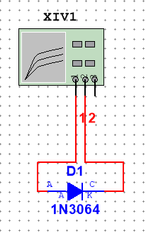  图1.1 1N3064仿真电路图

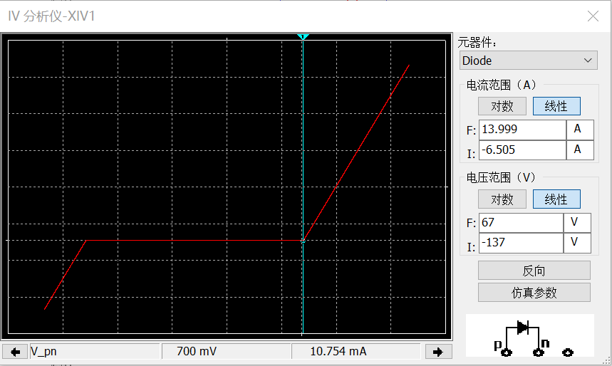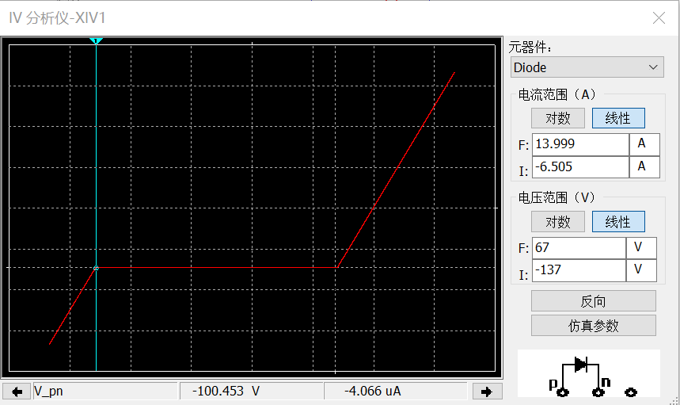 图1.2 1N3064 仿真结果图

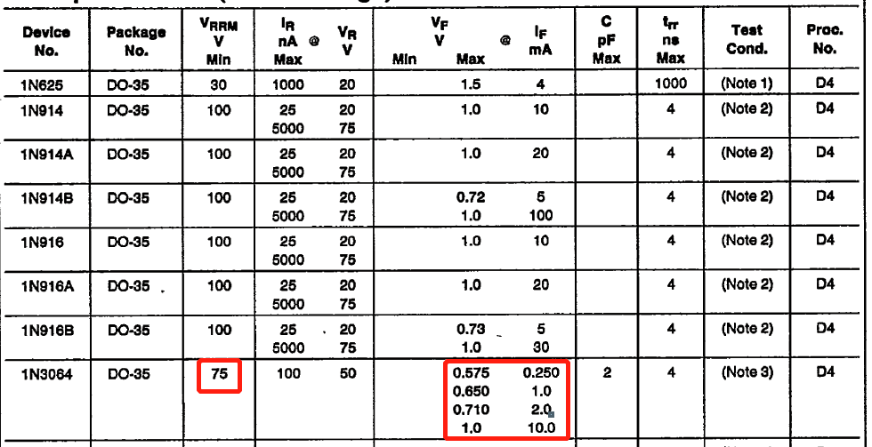 图1.3 1N3064数据手册

**(2)**测量电路图如[图1.4](#img1-1.4)所示，用分析仪测出的输出特性曲线如[图1.5](#img1-1.5)[图1.6](#img1-1.6)所示。通过在图中读出集电极电流$I_C$，并结合基极电流$I_B$计算$\beta$值。利用公式：
$$
\beta = \frac{I_C}{I_B}
$$
可以计算晶体管的放大倍数$\beta$。

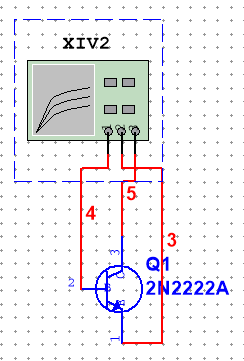 图1.4 2N2222A仿真电路图

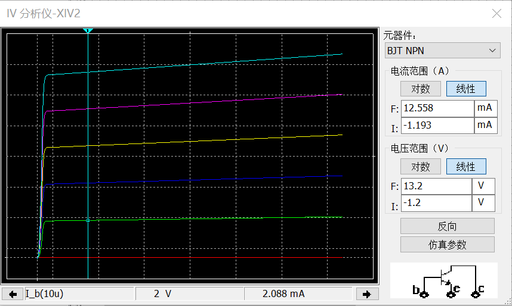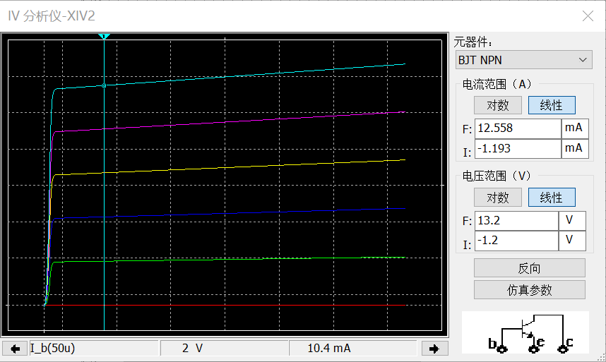 图1.5 Uce = 2V

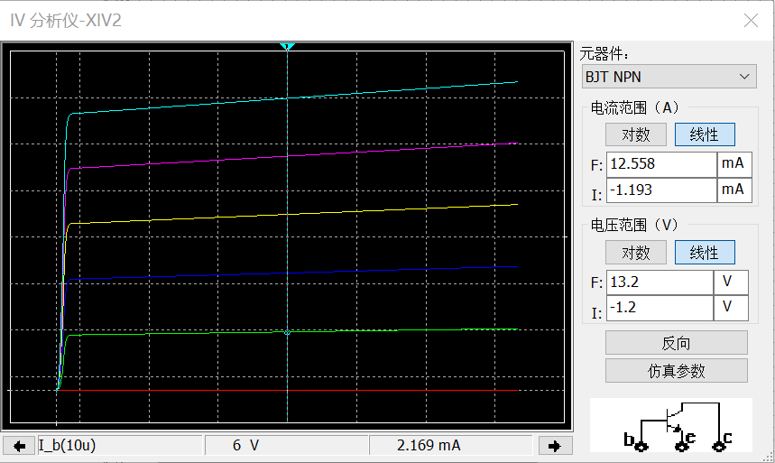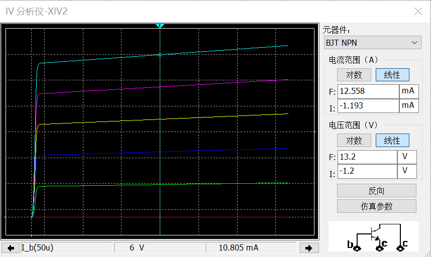 图1.6 Uce = 6V

根据上图数据不难求得$U_{CE} = 2V$时，$I_B = 10{\mu}A$时，$\beta = 208.8$；$U_{CE} = 2V$时，$I_B = 50{\mu}A$时，$\beta = 208$；$U_{CE} = 6V$时，$I_B = 10{\mu}A$时，$\beta = 216.9$；$U_{CE} = 6V$时，$I_B = 50{\mu}A$时，$\beta = 216.1$；

从上述数据可以得出结论，放大倍数$\beta$随着$I_B$的增大略有减小，但几乎可以忽略不计；$\beta$随着$U_{CE}$的增大而增大，体现了Early效应，为了更精准的计算Early电压$V_A$，可以在曲线上多测几个点，并做线性回归进行计算。

| $U_{CE}/V$ |   1   |   2   |   3   |   4   |   5   |   6   |   7   |   8   |
| ---------- | :---: | :---: | :---: | :---: | :---: | :---: | :---: | :---: |
| $I_C/mA$   | 2.068 | 2.088 | 2.108 | 2.129 | 2.149 | 2.169 | 2.189 | 2.221 |

上表为$I_B = 10{\mu}A$时测得的$U_{CE}$与$I_C$数据，进行回归计算得到$U_A = 96.55V$；

| $U_{CE}/V$ |   1    |  2   |   3    |   4    |   5    |   6    |   7    |  8   |
| ---------- | :----: | :--: | :----: | :----: | :----: | :----: | :----: | :--: |
| $I_C/mA$   | 10.299 | 10.4 | 10.501 | 10.603 | 10.704 | 10.805 | 10.906 |  11  |

上表为$I_B = 50{\mu}A$时测得的$U_{CE}$与$I_C$数据，进行回归计算得到$U_A = 101.39V$；

综上可见Early电压在$100V$左右，变化不大。

**（3）**测量电路图如[图1.7](#img1-1.7)所示，测量结果如[图1.8](#img1-1.8)所示。对于跨导$g_m$可以通过公式：
$$
g_m = \frac{{\Delta}i_D}{{\Delta}u_{GS}}
$$
计算得出。如需计算$u_{GS} = 4V$时的跨导，可以通过读出$u_{GS} = 4.5V, u_{GS} = 3.5V$时的$i_D$来进行计算，由于MOS管在恒流区工作时，$u_{DS}$的值对于$i_D$无影响，故任取$u_{DS}$使得MOS管工作在恒流区即可。

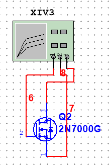 图1.7 2N7000G仿真电路图

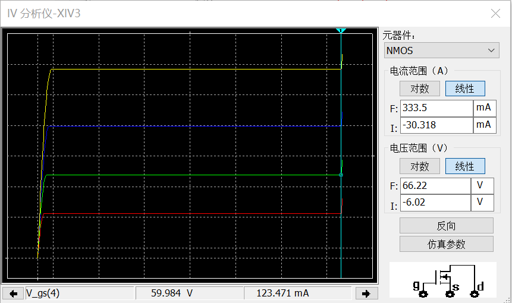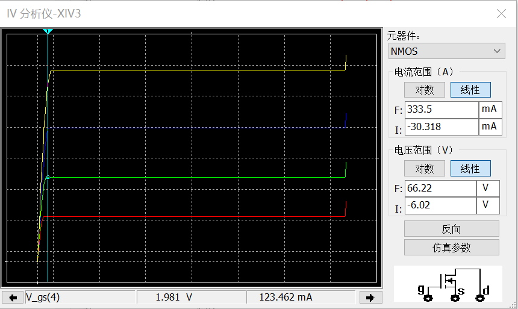 图1.8 2N7000G仿真结果图

由上图可知，当2N7000G工作在恒流区时，且$u_{GS} = 4V$时，恒流区的$i_D$为$123.462mA$。测量跨导时测得的数据如下表所示：

| $i_D(u_{GS} = 3.5V)/mA$ | $i_D(u_{GS} = 4.5V)/mA$ | ${\Delta}u_{GS}/V$ | ${\Delta}i_D/mA$ | $g_m/S$ |
| :---------------------: | :---------------------: | :----------------: | :--------------: | :-----: |
|         66.107          |         195.481         |         1          |     129.374      |  0.129  |

$$
\therefore g_m = 0.129S
$$

#### 2.2仿真题1-2：

仿真电路图如[图2.1](#img1-2.1)所示。利用Multisim的此参数扫描功能，可以得到电阻$R_1$变化时，二极管直流电压变化的曲线，得到的曲线图如[图2.2](#img1-2.2)所示。由图可知，随着$R_1$阻值的增大，二极管的直流电压随之减小。

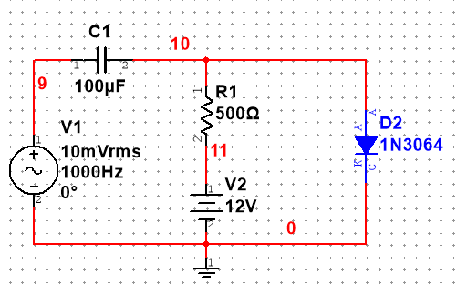 图2.1 仿真电路图

 图2.2 二极管直流电压与电阻变化关系图

然而，Multisim无法通过参数扫描直接得到二极管的交流电流大小，因此我采用了改变$R_1$电阻值测量多组数据并作图的方式得到曲线[图2.3](#img1-2.3)。（数据表格见下）

| $R_1/k{\Omega}$ | 0.1  | 0.2  | 0.3  | 0.4  | 0.5  | 0.6  | 0.7  | 0.8  | 0.9  | 1.0  |
| --------------- | ---- | ---- | ---- | ---- | ---- | ---- | ---- | ---- | ---- | ---- |
| $i_D/mA$        | 2.2  | 2.1  | 2.0  | 1.9  | 1.85 | 1.78 | 1.71 | 1.65 | 1.59 | 1.54 |
| $R_1/k{\Omega}$ | 1.1  | 1.2  | 1.3  | 1.4  | 1.5  | 1.6  | 1.7  | 1.8  | 1.9  | 2.0  |
| $i_D/mA$        | 1.49 | 1.44 | 1.39 | 1.35 | 1.31 | 1.27 | 1.24 | 1.2  | 1.17 | 1.14 |

<a name = "img1-2.3">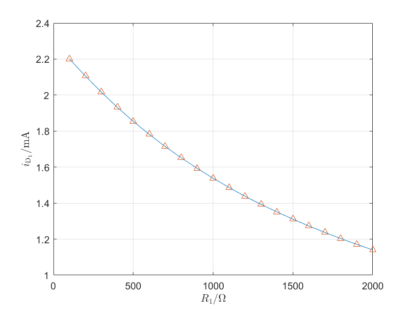 图2.3 二极管交流电流与电阻变化关系图

#### 2.3仿真题1-3：

分析题意可知，需要电路的输出电压在输入电压$u_I = 1V, 2V$时存在突变。结合晶体管的输出特性曲线上饱和区、放大区与截止区的转折点即可设计出满足题意的电路图。

在设计电路的计算过程中，可以结合理想晶体管的特性方程：
$$
I_B = \frac{V_B - u_{BE}}{R_1}\\
I_C = {\beta}I_B\\
V_c = V_{CC} - I_C \cdot R_2\\
$$
计算使得晶体管工作状态改变的电阻值应当为多少。得到如下[图3.1](#img1-3.1)所示的电路图，进行仿真后得到如下[图3.2](#img1-3.2)所示的输出特性曲线。

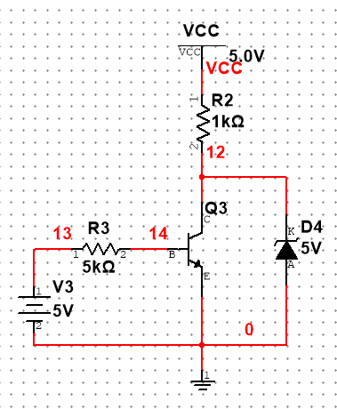 图3.1 设计电路图

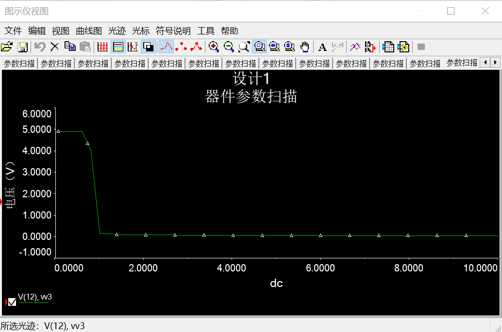 图3.2 仿真输出特性曲线

### 3.仿真中遇到的问题

- 在使用分析仪时，我最开始没掌握将光标对准需要的x坐标的方法，每次都是手动调节却总是不能准确对齐，有较大的误差。后来在同学们的讨论中，我了解到可以通过右键点击后直接设置x坐标大小，使得我的测量准确了很多。
- 在仿真作业第二题中，需要测量交流电流的变化曲线，我经过很长时间的尝试之后都没能成功得到特性曲线，最后通过老师的提醒知道Multisiim可能不具有这个功能，选择了通过测量多个数据点并做图的方式完成本题。

### 4.收获和体会

- 熟悉了Multisim对于电路图绘制以及仿真模拟的功能。之前曾经做过的直流扫描、参数扫描等功能由于长时间不使用已经印象不深，本次实验使我重新熟悉了利用Multisim仿真的能力。
- 对于二极管，晶体管，MOS管的性质理解更加深入。通过仿真实验，绘制仿真实验电路图的各种特性曲线使我更加深刻的理解了老师讲授的几种管子的不同特性。在设计实验中，我也通过自己对于集中管子的理解以及详实的计算计算出了合适的电路图，感觉收获颇丰。

