<h2  align = "center" >仿真作业2 实验报告</h2>

<h6 align = "center">自96 曲世远 2019011455</h6>

[TOC]

### 1.实验目的

掌握基本元件电路的分析方法。

- 理解晶体管和场效应管放大电路以及集成运放的基本组成原则；
- 理解放大电路性能参数的调试和测试方法、静态工作点对动态参数的影响；
- 理解放大电路产生失真的原因和消除方法；
- 熟悉仿真软件的基本分析和测量方法。

### 2.仿真内容

#### 2.1仿真题2-1：

利用晶体管 2N2222A（请选择 Zetex 厂商的，模型参数中的 BF 即 β，RB 即 rbb’）或者 MOS 管 2N7000G，设计一个单电源供电的单管共集、共基或者共源、共栅放大电路，电源电压为 VCC = +15V。具体要求如下： 

1. 设计并调整电路参数，使电路具有合适的静态工作点。
2. 调整电路参数，改善某一性能指标（如增大 Au、或增大 Ri、或减小Ro）。要求先进行理论分析，然后再实验验证。
3. 调整电路参数或输入信号大小，使输出波形产生失真，分析是何种失真，可采取哪些措施消除并进行实验验证。（通常，当失真度较大时，能够观察到波形顶部或底部变平或者曲率变小，而当失真度较小时，则需要借助失真度仪（Distortion Analyzer）来测量。）

**(1)设计并调整电路参数，使电路具有合适的静态工作点。**

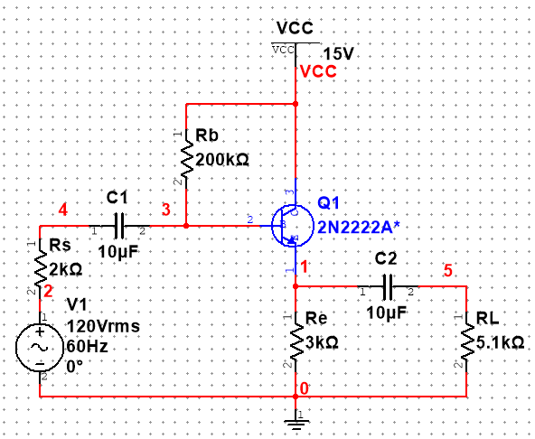

设计的放大电路图如上图所示。首先进行理论估算，计算共集电路的静态工作点，其中$\beta = 220, r_{bb}' = 700\Omega$。
$$
U_{BQ} = VCC  -I_B \times R_b \\
U_{BQ} = U_{BEQ} + (1 + \beta)I_B\times R_e \\
\therefore I_B = 1.66 \times 10^{-5}A \\
U_{BQ} = 11.68V, U_{CEQ} = 4.02V, I_{CQ} = 3.67mA\\
$$
由上述理论计算可知，本共集放大电路的静态工作点基本合适，晶体管正常工作在放大区，下面进行仿真模拟。

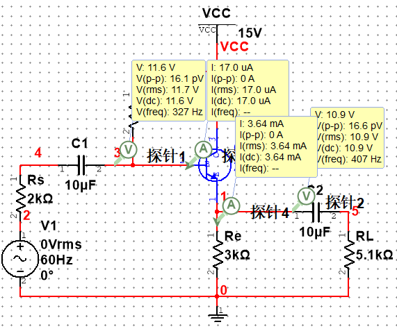

由上图可知，放大电路的静态工作点的仿真结果为：
$$
U_{BEQ} = 0.7V\\
U_{BQ} = 11.6V\\
U_{CEQ} = 4.1V\\
I_B = 17\mu A\\
I_C = 3.64mA\\
$$
仿真结果与理论计算结果基本吻合，电路的静态工作点合适。

**(2)调整电路参数，改善某一性能指标**

- 首先计算该模型的动态参数，放大倍数$\dot{A_u}$，输入电阻${R_i}$，输出电阻${R_o}$。

$$
\dot{A_u} = \frac{U_o}{U_i} = \frac{(\beta+1)(R_e // R_L)}{(\beta+1)(R_e // R_L) + r_{be}}\\
r_{be} = r_{bb}' + \beta\frac{U_T}{I_{CQ}}\\
R_i = R_b // (r_{be} + (\beta+1)(R_e // R_L))\\
R_o = R_e // \frac{R_s + r_{be}}{1 + \beta}
$$

由上述公式可得，$r_{be} = 2.23k\Omega, R_o = 0.02k\Omega, R_i = 135.4k\Omega, \dot{A_u} = 0.995$

- 下面进行仿真模拟动态参数的测量

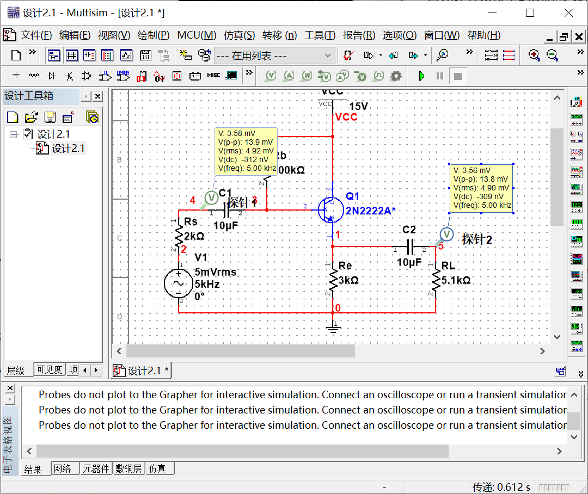  仿真电路图 测量放大倍数

  仿真电路图 测量输入电阻

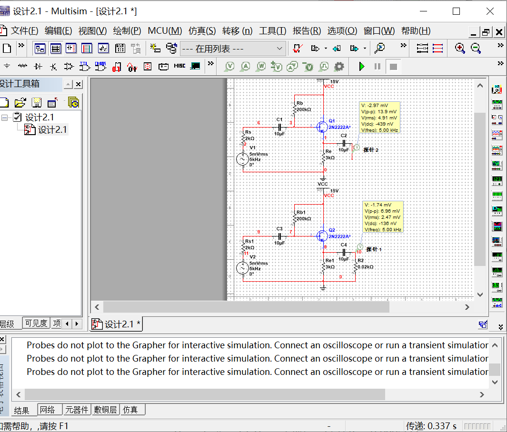  仿真电路图 测量输出电阻

由上述仿真电路图可知，$\dot{A_u} = 0.996, R_i = 131.1k\Omega, R_o = 0.020k\Omega$。与理论计算分析的结果接近。

- 下面针对输入电阻进行参数调整。由理论计算部分的公式可得，$R_i$与$R_b$有关，因此，在一定范围内调大$R_b$可以增大$R_i$。

假设将$R_b$由$200k\Omega$增大至$220k\Omega$，由上述计算公式可以得到$R_i = 144.3k\Omega$, 确实增大了$R_i$

- 下面进行模拟仿真$R_i$

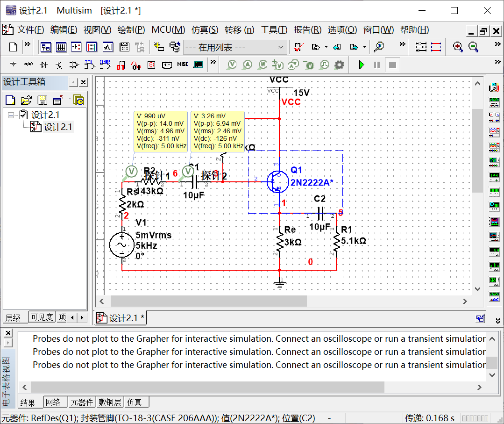  仿真电路图 测量输入电阻

由上图可知，更改了$R_b$后，的确增大了输入电阻，由图中测得数据可以计算得到$R_i = 140.7k\Omega$，相比于之前的测量有一定的增加。

**(3)调整电路参数或输入信号大小，使输出波形产生失真，分析是何种失真，可采取哪些措施消除并进行实验验证。**

首先对原电路进行失真分析

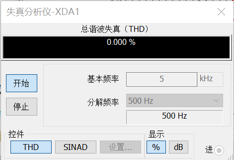

由失真分析仪的示数可知，原电路放大效果良好，输出波形无失真现象。

我们将输入信号调整为500mV之后再利用失真分析仪分析输出波形，由于此时波形失真量很小，我们利用失真分析仪可以得到失真量。

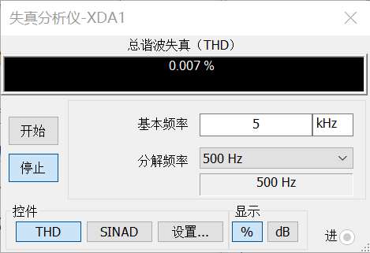

分析失真原因可知，当输入信号增大时，输出信号增大，三极管管压降$U_{CEQ}$减小，此时，三极管靠近饱和区出现饱和失真。由于是由于管压降小而出现的饱和失真，所以此时可以通过减小输入信号，或者减小$R_e, R_L$来增大管压降以消除失真。

在适当调小了$R_e$之后，即可得到如上图所示的消除失真后的失真分析仪示数。

#### 2.2仿真题2-2：

利用晶体管和 MOS 管设计一个集成运放。晶体管可选用 2N2222A 和 2N3702。MOS 管可选用 2N7000 和 BST100。电源电压可选+/-15V。具体要求如下：

1. 要求为三级放大电路，第一级采用 MOS 管差分放大电路，第二级和第三级采用晶体管设计。采用电流源作为集成运放的偏置电路和有源负载，电流源可以用电流源元件代替，即可用教材第 155 页图 3.4.1(b)中的那种电流源元件。要求所用电流源元件不能超过三个。
2. 设计并调整电路参数，使电路具有合适的静态工作点，测量静态工作点。（测量每级放大电路的每个放大管的 IBQ、ICQ、UCEQ 或 IDQ、UDSQ、 UDSQ，其它管子的也可以测）
3. 测量动态参数 Au、fbw、UIO、SR。
4. 在上述电路中将某一个电流源不用电流源元件代替，而用管子（MOS管或者晶体管）和电阻搭接电路，调整电路参数，使电路具有合适的静态工作点，并能够正常放大输入信号。

**(1)电路设计**

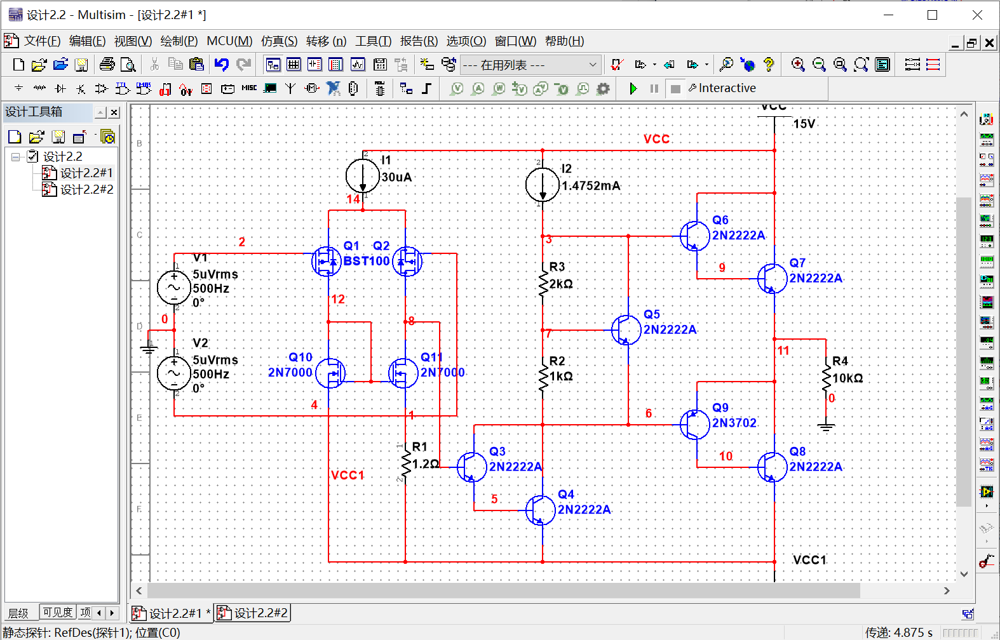  仿真电路图

由上图可知，本集成运放采用了三级放大电路，第一级采用了有源负载差分放大电路，为了在抑制零点漂移，共模放大的同时获得较高的放大倍数；第二级电路采用了共射电路以获得较大的放大倍数；第三级电路准互补输出级电路，带负载能力强，且最大不失真输出电压幅度大。

**(2)静态工作点**

通过逐级调整静态工作点，并同时考虑多级级联后的相互影响，调节电路的静态工作点如下：

|                     |    Q1    |    Q2    |   Q3   |   Q4   |   Q5   |   Q6   |   Q7   |   Q8   |   Q9    |
| :-----------------: | :------: | :------: | :----: | :----: | :----: | :----: | :----: | :----: | :-----: |
| $I_{BQ} / U_{GSQ} $ |  -2.42V  |  -2.42V  | 31.2nA | 6.30uA | 4.1uA  | 213nA  | 46.8uA | 46.8uA | -390nA  |
|   $I_{CQ}/I_{DQ}$   | -0.015mA | -0.015mA | 6.27uA | 1.47mA | 8.48uA | 46.7uA |  11mA  |  11mA  | -46.8uA |
|  $U_{CEQ}/U_{DSQ}$  | -15.42V  | -15.42V  | 13.75V | 14.35V | 1.88V  | 14.32V |  15V   |  15V   | -14.3V  |

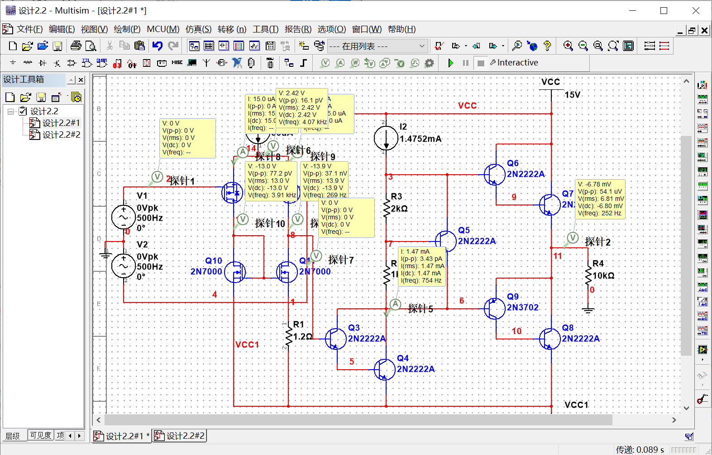 Q1 Q2静态工作点测量图

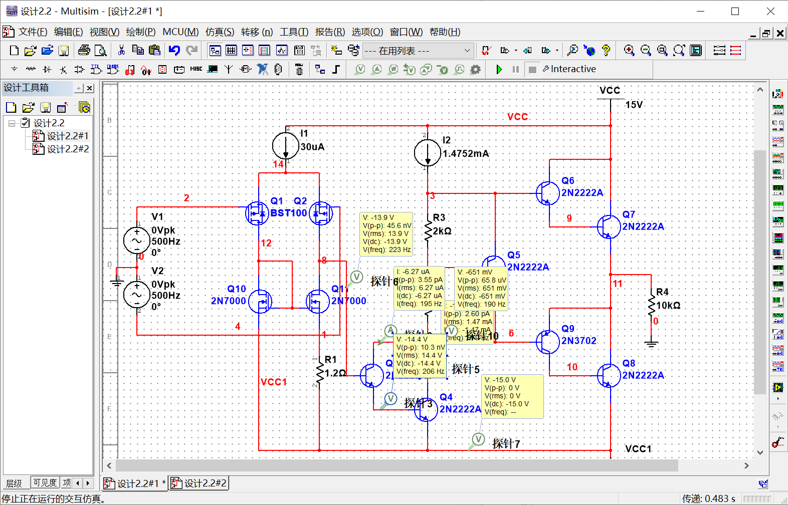 Q3 Q4静态工作点测量图

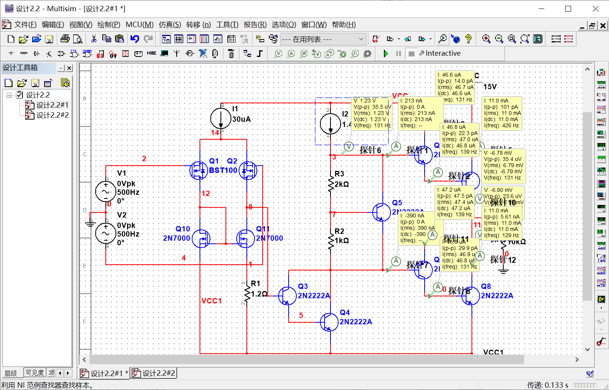 Q5~Q9静态工作点测量图

由上述测量结果可知差分放大电路，共射放大电路，准互补输出级电路均工作正常，MOS管与晶体管均工作在恒流源区与放大区。

同时可以测出静态输出电压为$6.79mV$满足静态输出电压小于$10mV$的要求。

**(3)动态参数测量**

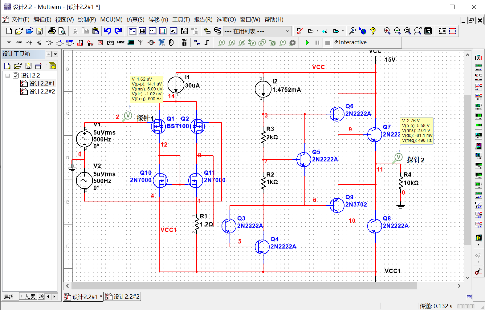 放大倍数测量电路

在接入$10k\Omega$电阻作为负载时，本集成运放的放大倍数为：
$$
|\dot{A_u}| = \frac{u_o}{u_{i1} - u_{i2}} = \frac{1.97}{10\times10^{-6}} = 1.97\times10^{5}\\
$$
通过波特测试仪测出集成运放的$f_{bw}$：

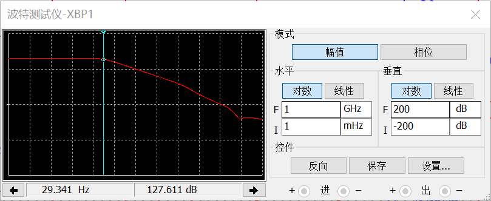 波特测试仪结果

由图中可以得到，放大倍数(dB)随着频率增高一直显著下降。因为本电路没有耦合电容与旁路电容，因此在低频区间放大倍数为最大，因此通频带较窄。由上图可知：
$$
f_{bw} = f_H - f_L = 29.341Hz - 0Hz = 29.3Hz\\
$$

 开环差模增益测量电路

由开环差模增益与输入电压为0时的输出电压，可得失调电压为：
$$
U_{IO} = -\frac{U_o}{A_{od}} = \frac{6.97\times10^{-3}}{3.96\times10^{5}} = 1.76\times10^{-8}V\\
$$
可知，本集成运放的输入失调电压极小，表明电路的对称性参数好，静态负载功耗基本为0.

在测量转换速率SR时，将输入信号调整为足够大的方波信号，并在输出电压变化曲线上，截取斜率最大的一小段，计算该段的斜率即为转换速率：

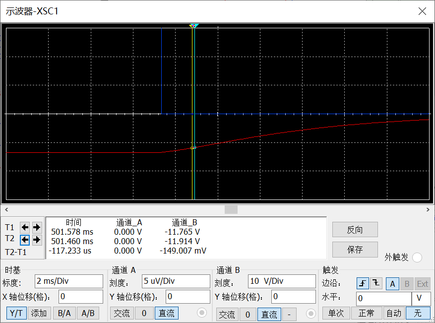
$$
SR = |\frac{du_o}{dt}| = |\frac{-149.007\times10^{-3}}{117.233\times10^{-6}}| = 1271V/s\\
$$
有上述数据可知，本电路的放大倍数大，通频带较窄，失调电压很小，转换速率比较大。

**(4)电流源电路替代电流源**

将原电路图中的$I2$替换为镜像电流源，由参数扫描的结果可知，为使失调电压接近0，$I2$的电流应选取1.4752mA，由此可知$R_6 = \frac{VCC + VCC - U_{BE}}{I_2} = 19.86k\Omega$，再利用参数扫描进一步精确电阻值，参数扫描的结果为：

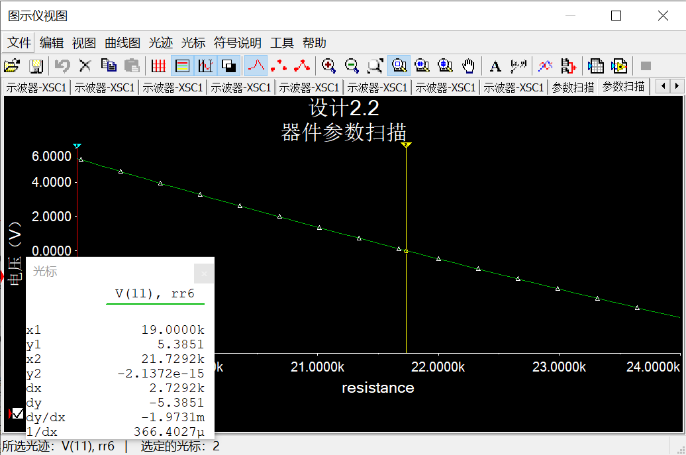

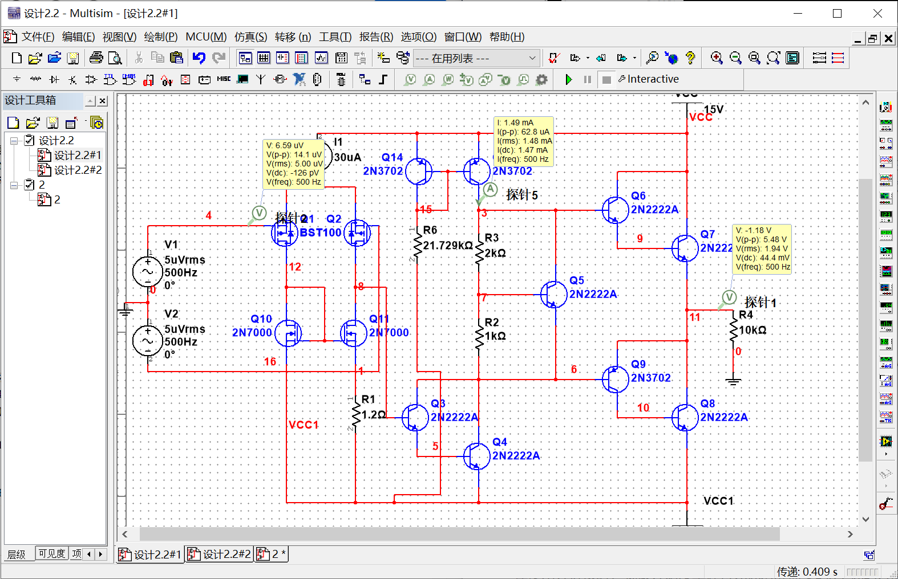

由上图仿真可知，集成运放能够正常工作并放大输入信号，
$$
|\dot{A_u}| = \frac{1.937}{10\times10^{-6}} = 1.94\times10^5\\
$$
与之前利用电流源的集成运放电路相比，放大倍数基本没有变化，由此可知，更换电路后集成运放仍能够正常工作并放大信号。

#### 2.3仿真题2-3：

设计一个电路将幅值为 10mV 左右、频率为 20Hz至 20kHz、内阻为 1kΩ 的语音信号放大 50 倍，作用在负载扬声器(32Ω，用电阻代替)上。要求采用晶体管或场效应管、电阻、电容、二极管等元件设计，电路尽可能简单，负载上静态功耗约为零。 

如下图所示，由于本题的题目要求，本题设计的电路并不能采用集成运放以保证输出频带满足题目要求。因为同时需要满足输出电阻小的要求，因此我采用了互补输出级的设计，同时为了保证放大倍数，采用了一个共射连接的晶体管即可满足题目要求。

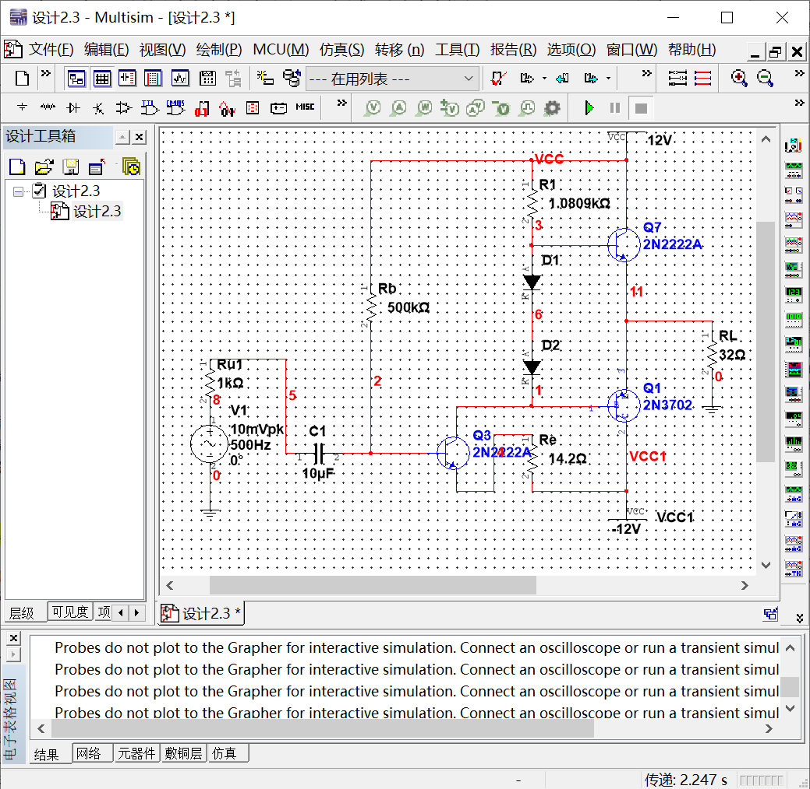

下面先计算共射放大电路的静态参数：
$$
R_b \times I_{BQ} + U_{BEQ} = 2\times VCC\\
U_{DQ} + U_{CEQ} + I_e\times R_e = VCC\\
\because R_e \approx 10\Omega\\
\therefore I_{BQ} = 4.66\times 10^{-5}A, I_{CQ} = 10.25mA, U_{CEQ} = 11.3V\\
$$
所以共射电路工作在放大区，下面考虑放大电路的动态参数：

由于共射电路的输出端连接到了互补输出级晶体管的集电极，因此共射电路的负载电阻可视为无穷大。所以只需计算输入电阻与放大倍数
$$
R_i = R_b // (r_{be} + (1 + \beta)R_e)\\
r_{be} = r_{bb}' + \frac{U_T}{I_B}\\
\dot{A_u} = \frac{(1 + \beta)R_c}{(r_{be} + (1 + \beta)R_e)//R_s}\\
\because r_{d1}\approx r_{d2} \approx 2\Omega, \therefore R_c \approx1k\Omega, 再令\dot{A_u} \approx 50\\
\therefore r_{be} = 558\Omega, R_e = 10\Omega, R_i = 4.4k\Omega\\
$$
如上述计算连接电路。之后通过参数扫描进一步确定$R_1$的阻值以确保输出无静态功耗：

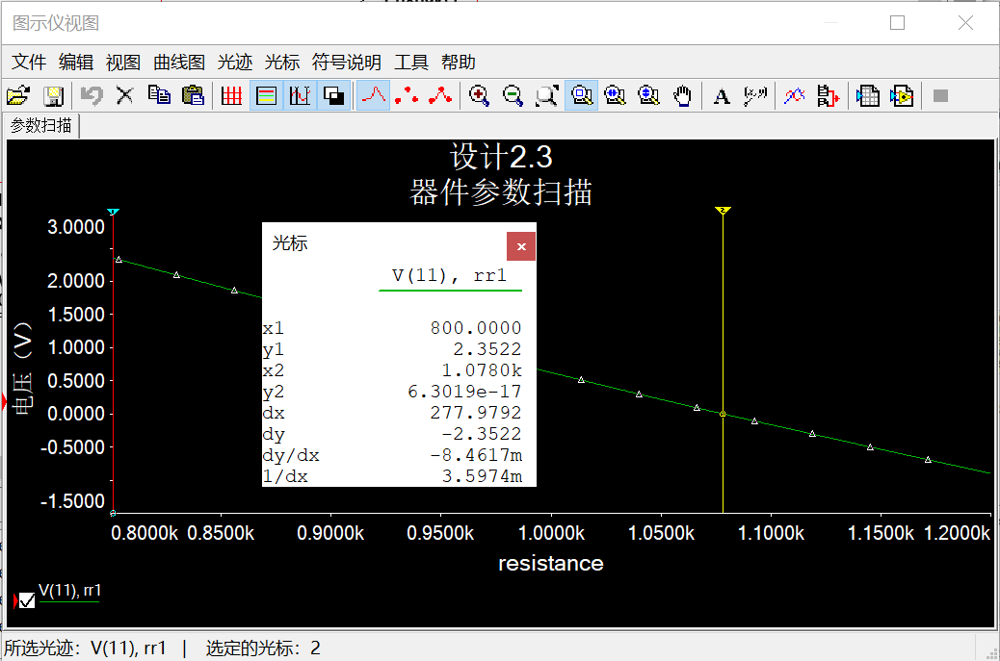

得到无静态功耗的电路如下：

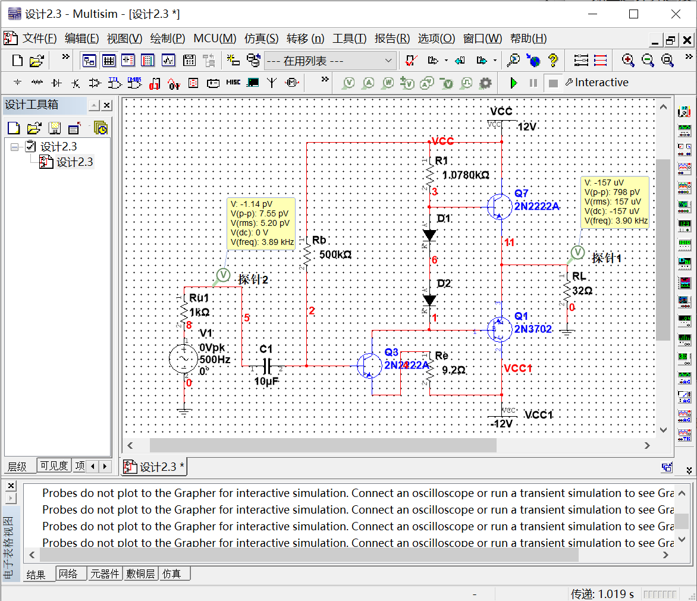

但是观察输入输出发现此时的电路放大倍数仅有$\dot{A_u}$不等于50，猜测可能的原因是由于互补输出的共集连接并不能很好的做到射级电压跟随，同时也需要考虑信号源内阻对于放大倍数的影响，因此考虑调小$R_e$以增大放大倍数。经过调整之后的电路参数如下所示：

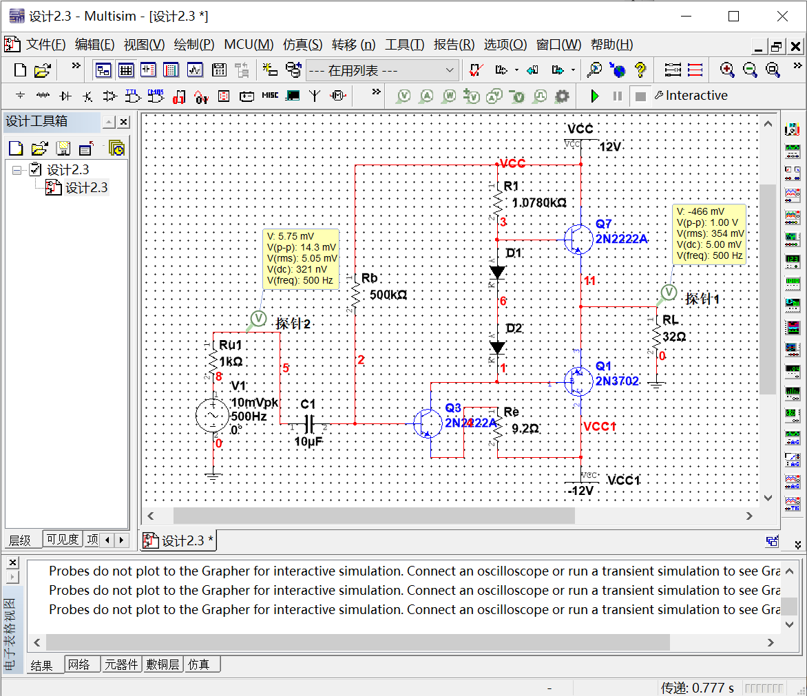

由图中测量的数据可得$\dot{A_u} = 50.0$，静态输出电压为$157\mu V$, 静态功耗为$P = \frac{U^2}{R} = 7.7\times10^{-10}W$，因此，电路的放大倍数满足题目要求，静态功耗极小，设计上仅有两级电路三个晶体管，满足题目要求的尽可能简单。下面检验该电路是否满足频谱要求，使用波特仪进行分析：

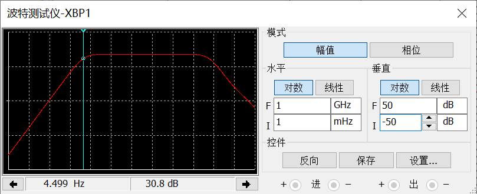

由上图分析可知，$f_L = 4.499Hz, f_H = 5.621MHz$，通频带范围覆盖了题目要求的$20-20kHz$，频带设计上满足要求。

综上，该电路的放大倍数，频谱范围，设计复杂度，静态功耗均满足题目要求。

本题应当注意的是因为信号源据有内阻，因此题目中要求的50倍的放大倍数是针对信号源而非共射电路的输入电压。因此，针对本题而言，需要的输出信号为$V_{PP} = 1V$，本电路在设计时考虑了信号源内阻的影响，输出信号的放大倍数很好的满足了题目的要求。

### 3.仿真中遇到的问题与收获体会

- 放大电路的静态工作点实在是太难于调节。尤其是第二个实验中三级放大电路不仅需要考虑每一级的静态工作点需要使得电路能够正常工作，还需要在相互级联时能够互相保证正常工作。由于电路之间的相互影响，这部分的工作是十分煎熬的。我经过了一整天的尝试，在这期间与同学们的交流和对于书本知识的反复复习极大的帮助了我完成本实验。

- 在设计第三题的电路中，我在共射电路的电阻调节上遇到了一些问题，由于需要同时考虑到静态输出电压与放大倍数两个硬性条件，因此电阻的阻值需要调整的就恰到好处。因此在处理这两个电阻$R_e, R_1$的调节时，我才用了二分逼近的思想，先将一个电阻调整至一个参数满足题意，再调节另外一个电阻使得两个参数都满足条件，反复几次之后即可得到十分理想的电路参数。

- 熟悉了Multisim对于电路图绘制以及仿真模拟的功能。在本次实验中我更多的学习使用了波特仪参数扫描等仪器与功能，进一步提升了我的仿真设计能力。

- 在设计第三题的过程中，我最开始忽略了信号源内阻的影响，在检查的过程中忽然想到放大倍数应当是针对信号源的幅值来说的50倍，因而从理论计算部分重新推导，从头重新的设计了该题。这一惨痛的经历告诉我在设计开始之前应当充分的理解设计的要求，确保准确分析需求之后在开始设计流程。

  

