<h2  align = "center" >仿真作业3 实验报告</h2>

<h6 align = "center">自96 曲世远 2019011455</h6>

[TOC]

### 1.实验目的

- 熟悉负反馈放大电路的应用；
- 理解运算电路的设计方法；
- 理解VCVS二阶滤波电路的特性和稳定工作条件；
- 理解信号发生及转换电路的应用及分析。

### 2.仿真内容

#### 2.1仿真题3-1：

利用运放设计一个中心频率为1kHz的VCVS（压控电压源）二阶带通滤波器，并完成以下任务： 

1. 测量滤波器的幅频和相频特性，观察不同Q值对幅频特性的影响；
2. 测量输入信号为1kHz方波时滤波器的输出信号波形；
3. 分析滤波器稳定工作的条件，并观察不稳定工作的现象（当电路满足不稳定工作条件时，在输入端加入频率为1kHz、幅值为1mV的正弦激励信号，观察电路的不稳定现象）。

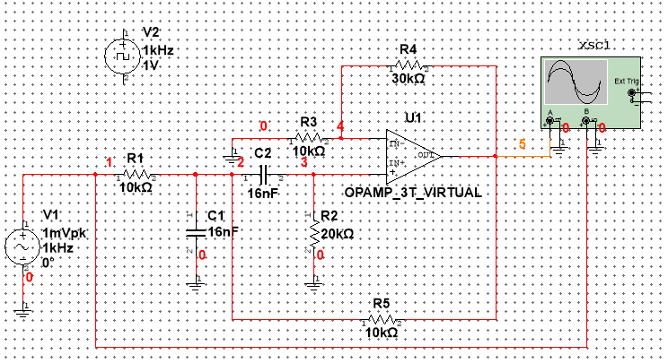

设计的VCVS二阶带通滤波器电路图如上图所示。

**(1)测量滤波器的幅频和相频特性，观察不同Q值对幅频特性的影响。**

对设计的电路使用交流分析，可以得到幅频与相频特性曲线。如下图，由光标可以得到在$f = 1kHz$处，放大倍数约为2，最大；相移约为0。上述测量数据符合VCVS二阶带通滤波器的理论值。

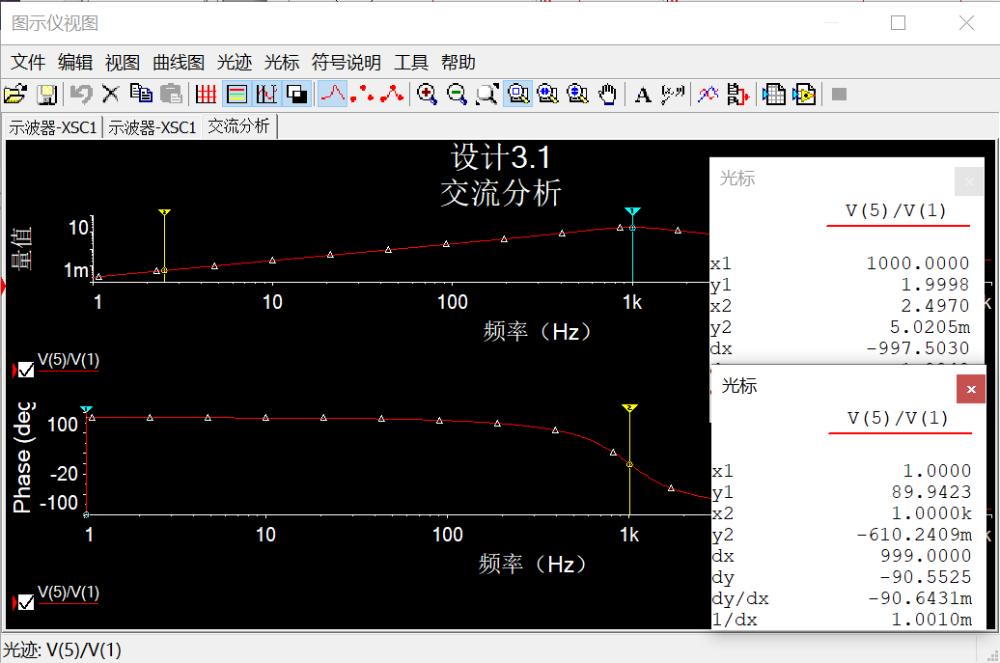  滤波器幅频特性与相频特性曲线

通过参数扫描-交流分析可以得到对于不同$R_4$的电路幅频-相频特性曲线。由此可以分析不同Q值下的幅频和相频特性曲线。由图可知，当$R_4$越大，则Q越大，幅频特性曲线在$f = 1kHz$处越尖锐，表明在该处的放大倍数大，选频特性好；而$R_4$越大，相频特性曲线在$f = 1kHz$处斜率绝对值越大，变化的越剧烈。

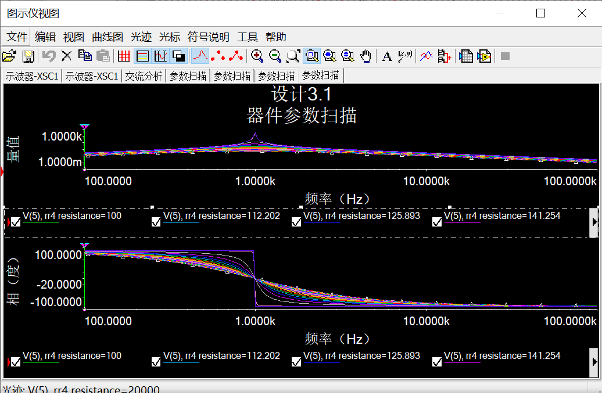  不同Q值下的幅频特性与相频特性曲线

**(2)测量输入信号为1kHz方波时滤波器的输出信号波形。**

将输入信号接为$f = 1kHz$的方波，用示波器观察得到下图所示的信号波形。

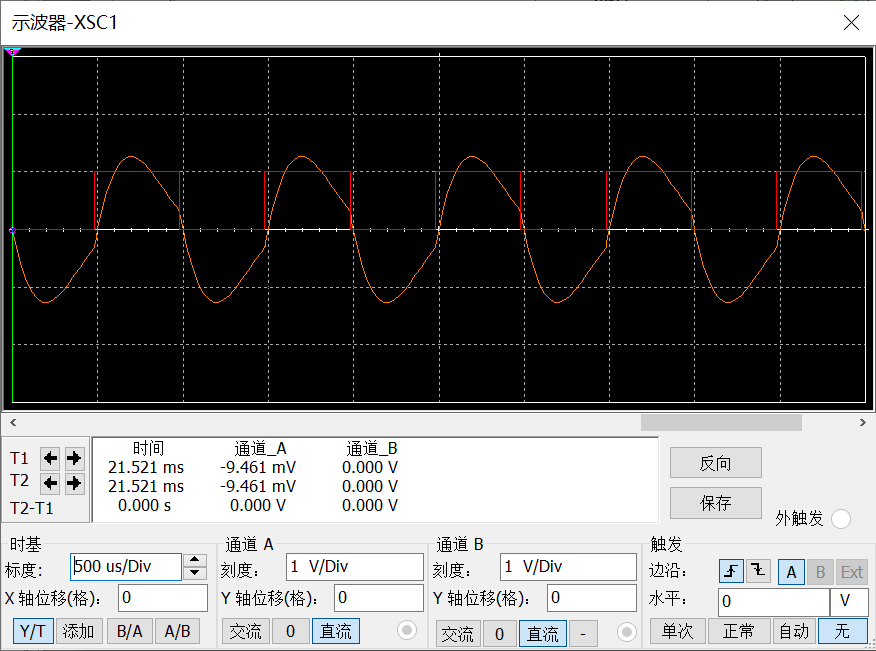  仿真电路图 测量放大倍数

从图中可以看到输出大致为一个$f = 1kHz$的正弦波，但仍有部分失真出现。分析原因是由于带通滤波器在$f = 1kHz$时对波形的增益最大，所以基频分量被最大程度的保留，但是由于电路$Q$值并不足够大(此处取$Q = 1, R_4 = 10kHz$)，因此高频部分的增益相对接近频率的增益并不十分明显，同时仍有少量频率接近的分量泄露，导致波形为近似正弦波，与标准正弦波仍有一定差别。

**(3)分析滤波器稳定工作的条件，并观察不稳定工作的现象（当电路满足不稳定工作条件时，在输入端加入频率为1kHz、幅值为1mV的正弦激励信号，观察电路的不稳定现象）。**

首先理论分析该电路稳定工作的条件：
$$
\dot{A_{uf}} = \frac{\dot{U}_o}{\dot{U}_p} = 1 + \frac{R_4}{R_1} = 2\\
Q = \frac{\dot{A}_{up}}{\dot{A}_{uf}} = \frac{1}{|3 - \dot{A}_{uf}|} = 1\\
f_0 = \frac{1}{2\pi R_3C} = 1kHz\\
\dot{A}_u = \frac{\dot{A}_{uf}}{3 - \dot{A}_{uf}} = \frac{1}{1 + j\frac{1}{3 - \dot{A}_uf}(\frac{f}{f_0} - \frac{f_0}{f})}\\
\therefore \dot{A}_{up} < 3
$$
分别测量$R_4$为不同取值时对应的电路波形输出，同时计算$Q$值与$\dot{A}_{up}$值：

- $R_4 = 10k\Omega, Q = 1$，由下图可以看出输出波形幅值为输入波形幅值的两倍，且无相移。

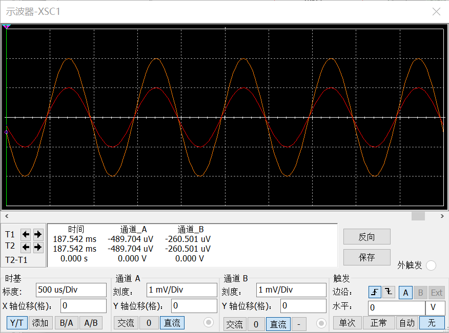  Q = 1时二阶带通滤波器波形

- $R_4 = 19k\Omega, Q = 10$,可以看到此时输出波形的幅值已经远大于输入信号，且信号已经出现相移。

  
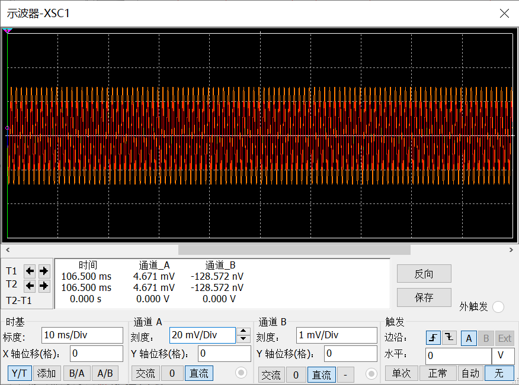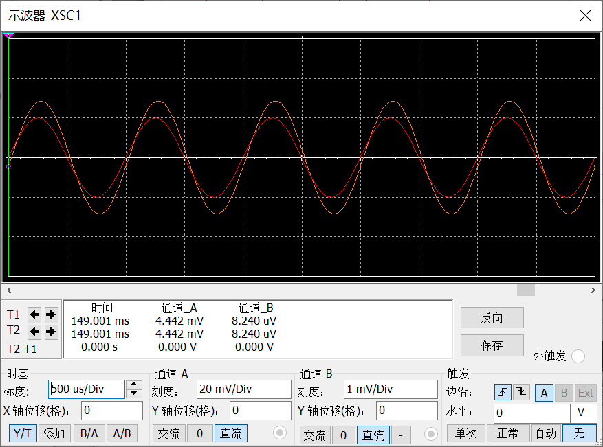  Q = 10二阶带通滤波电路波形

- $R_4 = 20k\Omega, Q = \infty, \dot{A}_{up} = 3$,可以看到此时输出波形已经出现了类似调幅信号的波形，进一步放大比例可以得到相移现象更加明显地表现出来。

 
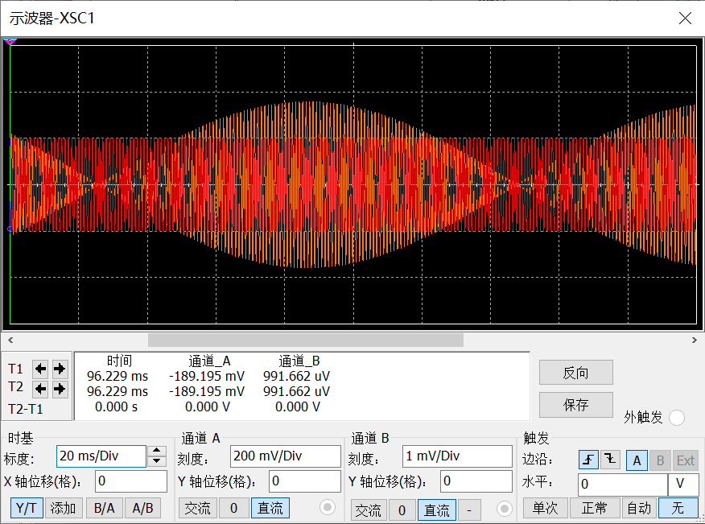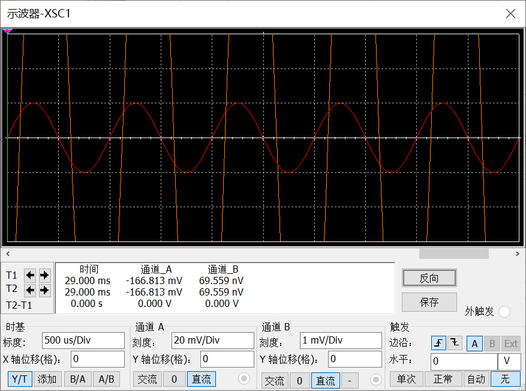  Aup = 3二阶带通滤波电路波形

- $R_4 = 30k\Omega, \dot{A}_{up} = 4 > 3$，我们可以得到下图所示的输出波形图，可以看到此时输出信号的幅值已经达到运放的输出最大最小值，因此出现了顶部失真的正弦波。

  
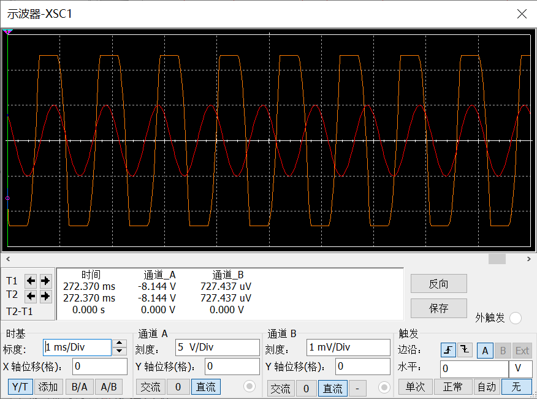  Aup = 4时输出信号波形

  由上述仿真结果可知，当$\dot{A}_{up} < 3$时，输出波形较为稳定；$\dot{A}_{up} = 3$时，输出波形的幅值呈现反复振荡的趋势；当$\dot{A}_{up} > 3$时，输出波形会由于引入正反馈达到最大输出电压的限制，从而出现顶部失真的波形。

  

#### 2.2仿真题2-2：

设计一个电路，将电容的容值转换为与其成正比的直流电压值，并实际测量多个电容值进行验证。

本电路可以通过微分电路-正弦波求有效值串联得到。设计思路为通过输入一个已知幅值与频率的正弦波，通过精确设置参数得到期望的输出与合适的比例关系。

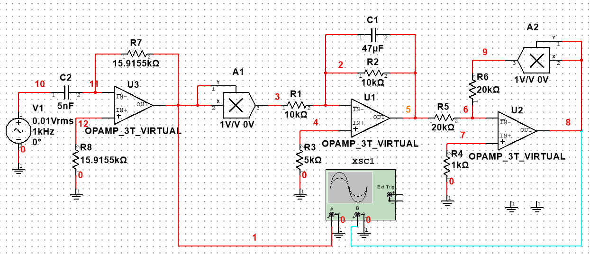

选择的输入正弦波信号：$10sin6283t$，微分电路电路参数：$R = 15.9155k\Omega, C = 1nF$。

$C_2$为待测电容，容值可调。
$$
u_o = 10^6 C\\
$$
下表所示为对不同电容值测得的输出直流电压大小，后配图为实测示波器波形：

|     电容值/nF     |  1   |   5   |  10   |  25   |  100  |  200   |  500   | 1000 |
| :---------------: | :--: | :---: | :---: | :---: | :---: | :----: | :----: | :--: |
| 输出直流电压值/mV |  1   | 5.011 | 10.05 | 25.08 | 100.5 | 201.05 | 501.83 | 1004 |
|    相对误差/%     |  0   | 0.22  |  0.5  | 0.32  |  0.5  |  0.53  |  0.37  | 0.4  |

由上述结果可知，电路能够很好的实现设计的功能，并且控制误差均小于0.5%左右。

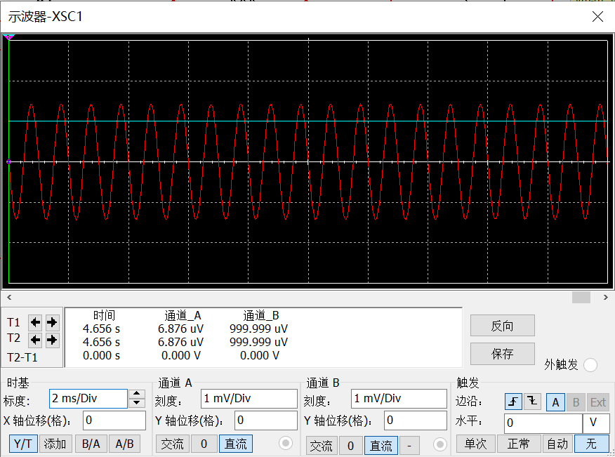

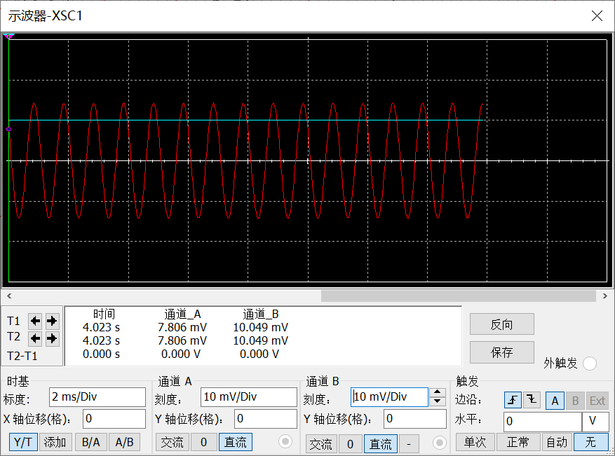

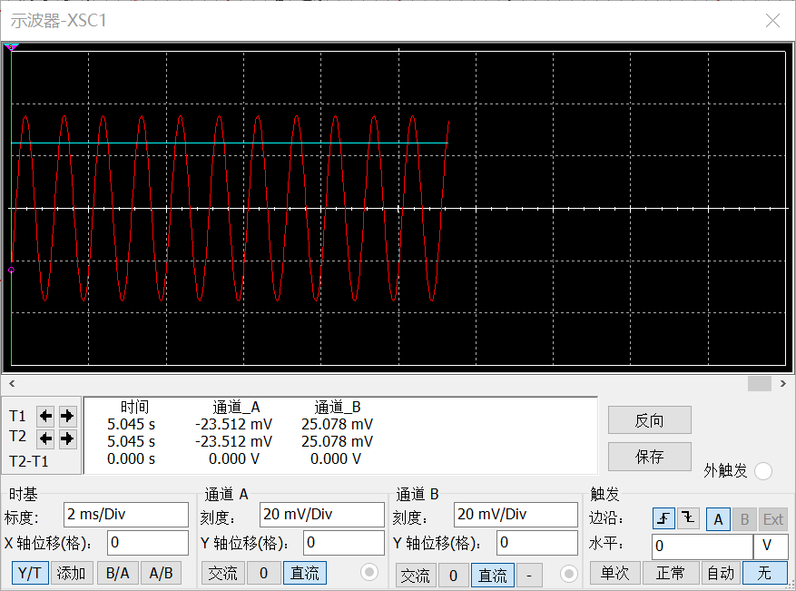

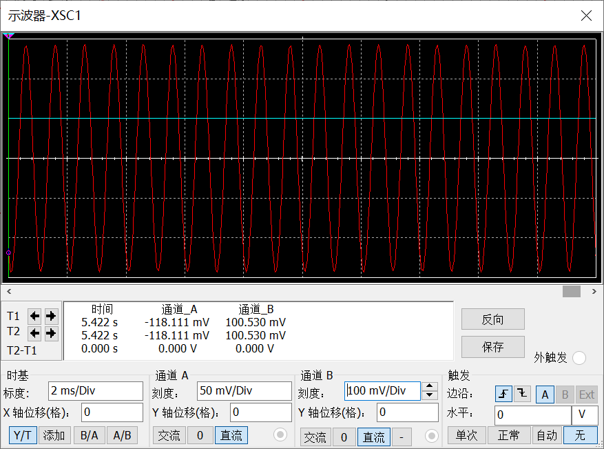

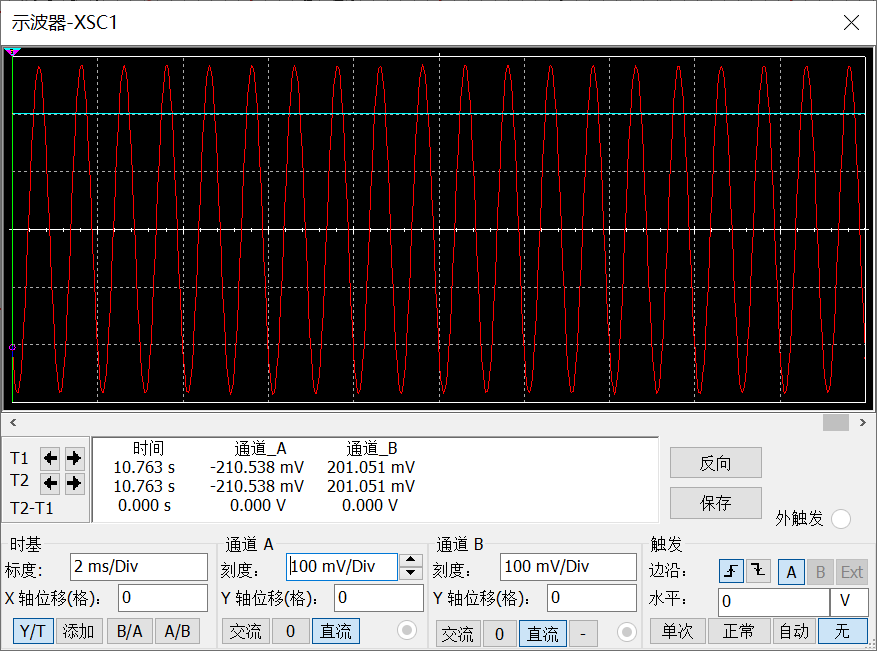

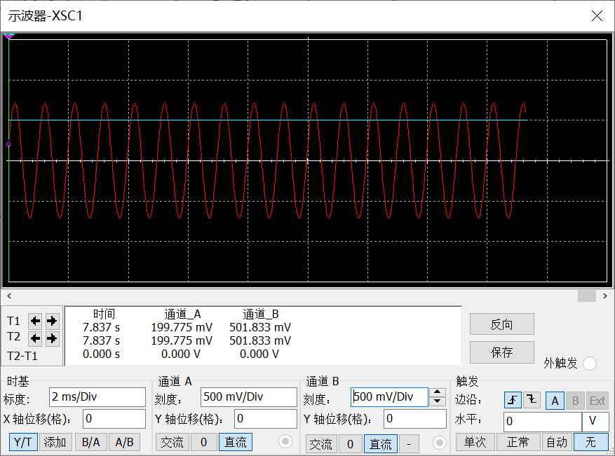

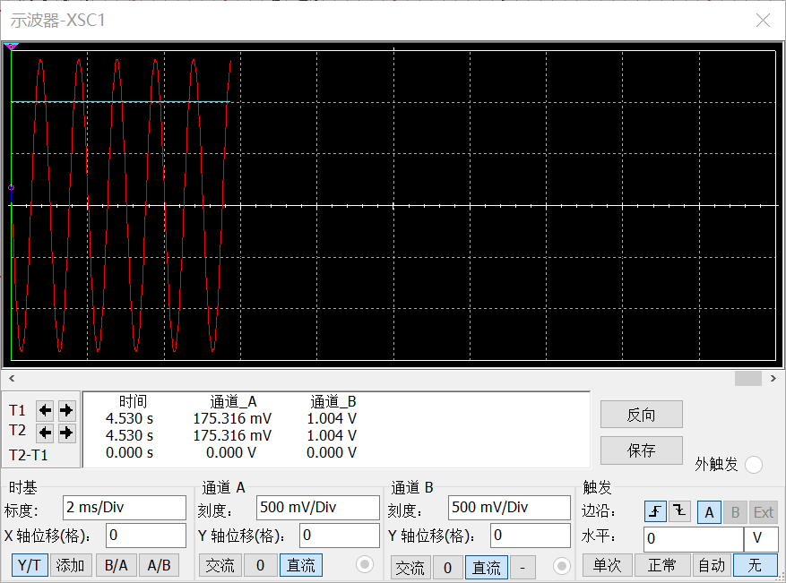

#### 2.3仿真题3-3：

利用运放和模拟乘法器设计一个正弦波有效值测量电路。

本题的设计可以利用三角函数的公式及性质得到有效值，下面先进行理论推导：

设正弦波的有效值为$A$，频率为$\omega$，有：
$$
x(t) = \sqrt{2}Asin\omega t\\
使用乘法器得到输入信号的平方信号：\\
y_1(t) = (x(t))^2 = 2A^2sin^2\omega t = A^2(1 - cos(2\omega t))\\
使用低通滤波器滤除掉高频部分，得到：
y_2(t) = A^2\\
使用乘法器与运算放大器搭建开方电路：
y_3 = A
$$
下图为三通道示波器显示结果，通道A（红线）为输入信号，通道B（橙线）为平方后结果，通道C（紫线）为开方后结果，及最终输出结果。

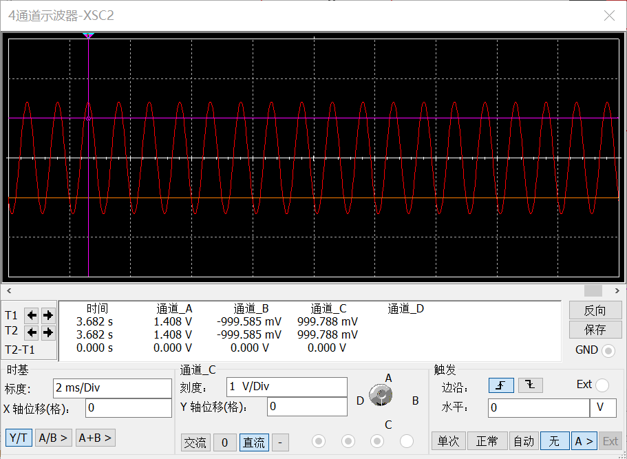

下图为仿真电路图：

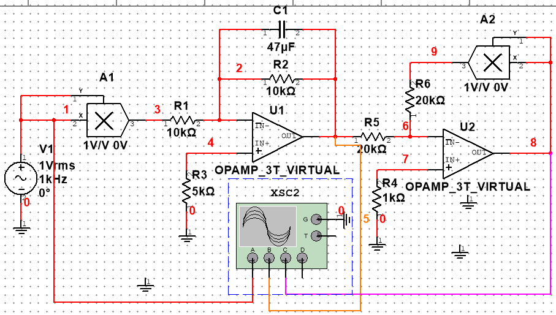

由示波器结果可知，输出电压为999.788mV，与输入信号几乎完全一致。

### 3.仿真中遇到的问题与收获体会

- 本次仿真作业整体并不复杂，只不过在设计上有一定难度，需要整体灵活利用之前学到的模拟电路知识。综合利用多种电路，熟悉各种电路的性质及特点才能很好的完成实验任务。

- 本次的仿真第二题设计之初我考虑到了去年数电实验期末考试的题目，但我认为采用压频转换的方式过于复杂且不直观，在完成了仿真第三题后我受到了启发，可以利用正弦波的积分不变性，利用积分电路的传输特性关系进行电路设计。于是我成功利用这一思路完成了第二题。

  

