

## 
LQR二次最优控制 实验报告

2021013444 自11 孙捷芊 实验时间：2023.12.13

#### 一、实验目的
&emsp;&emsp; 1、掌握线性二次最优控制LQR控制的原理和控制器设计方法。
&emsp;&emsp; 2、通过LQR控制实现倒立摆的稳摆平衡控制。
&emsp;&emsp; 3、 研究参数矩阵R和Q的变化对倒立摆平衡控制的影响。

#### 二、实验步骤
&emsp;&emsp; 1、在MATLAB中新建脚本，输入系统矩阵A、B、C、D，完成模型参数初始化，并初始化加权矩阵Q和R，通过lqr函数求解控制增益矩阵K。脚本代码如下：

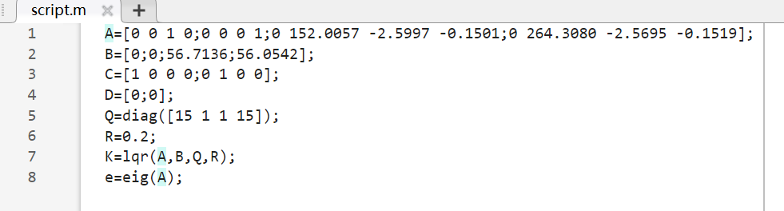

&emsp;&emsp; 2、在simulink中搭建旋转摆系统，输出所测的转角和摆角度数，注意要转到$-\pi$到$\pi$的区间内；此外还需增加积分和滤波器模块，以输出转角和摆角的角速度。搭建的系统应如下：

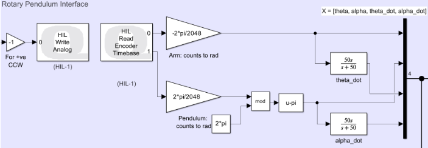

&emsp;&emsp; 3、增加Signal Generator模块，作为旋转臂的参考信号，设置为幅值为1，频率0.125hz的方波信号，增益设为20，即期望转角为$-20^\circ$到$20^\circ$，并将角度转为幅度。

&emsp;&emsp; 4、为生成参考状态信号，需要将增益模块[1 0 0 0]加入，以保证有状态反馈控制$u(t)=K(x_{ref}(t)-x(t))$。生成参考信号部分框图如下：

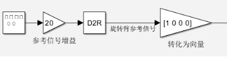

&emsp;&emsp; 5、为保证摆角在限制角度内才施加控制，施加了选择判断模块，当摆角小于$10^\circ$时，判断器给出1，系统施加控制量；反之判断器给出0，系统不施加控制。判断部分框图如下：

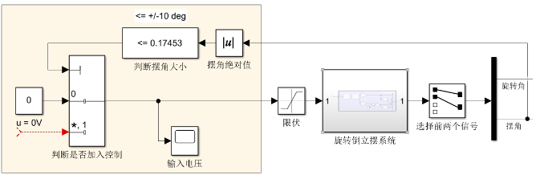

&emsp;&emsp; 6、为保证安全对电压进行了10V的限位，编译运行，通过示波器观察结果。总框图如下：

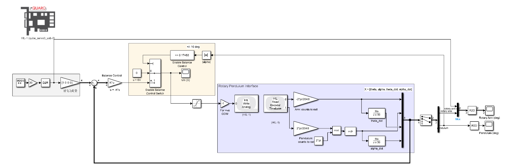

&emsp;&emsp; 7、改变加权矩阵Q和R，观察转角和摆角的变化。

#### 三、实验结果分析
1、不同Q情况下的对比分析
&emsp;&emsp; 以下两图为Q=[1 1 1 1],R=1时的结果：

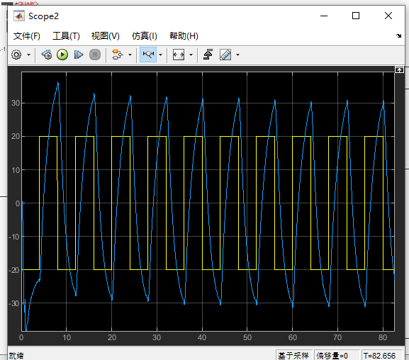
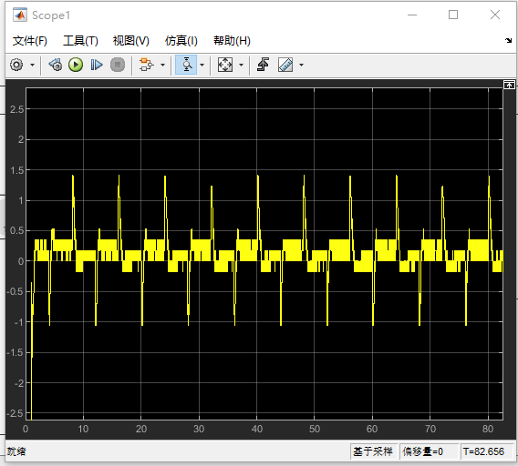

&emsp;&emsp; 以下两图为Q=[5 1 1 1],R=1时的结果：

&emsp;&emsp; 以下两图为Q=[5 1 1 20],R=1时的结果：

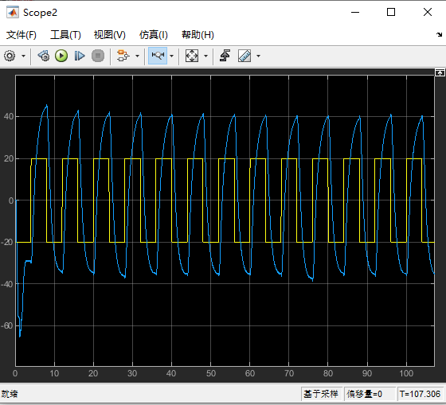
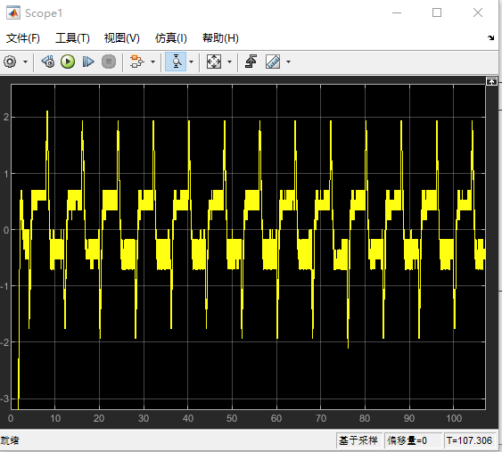

&emsp;&emsp; 观察实验结果可知，旋转臂转角的变化不大，但是旋转摆摆角的幅度的变化是比较明显的。
&emsp;&emsp; 可以看出，在对角矩阵Q的第一个对角元素增大时，旋转摆摆角的摆动幅度增大，分析原因可能是因为该对角元素对应的权重的增加使得系统更注重了倒立摆的位置，而忽略了控制输入的贡献，导致了控制器在尝试保持倒立的同时，无法有效地抑制摆动，导致了摆角的增加。
&emsp;&emsp; 同样可以看出，在对角矩阵Q的第四个对角元素增大时，旋转摆摆角的摆动幅度减小了一点，分析原因可能是因为该对角元素对应的权重的增加使得系统更注重维持对倒立摆稳定性的控制，强调了控制输入的贡献，使得对旋转摆摆动的抑制增加，导致了摆角幅度减小。
&emsp;&emsp; 实际上，在LQR中，Q矩阵用于权衡系统状态的重要性。对角线上的元素对应于系统状态的不同分量。而增加对角矩阵Q上的某一个元素，相当于增加了对系统状态的某个方向的惩罚，会对系统产生不同维度，不同程度上的影响。

2、不同R情况下的对比分析
&emsp;&emsp; 以下两图为Q=[15 1 1 15],R=1时的结果：

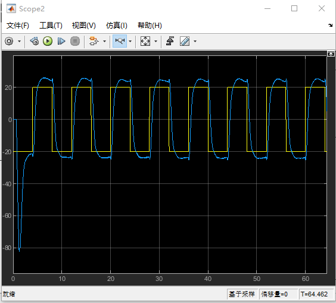
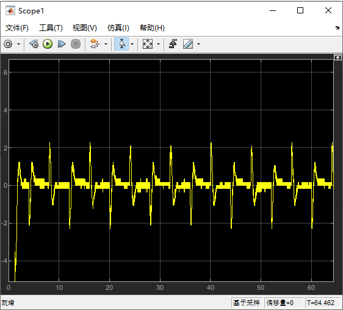

&emsp;&emsp; 以下两图为Q=[15 1 1 15],R=5时的结果：

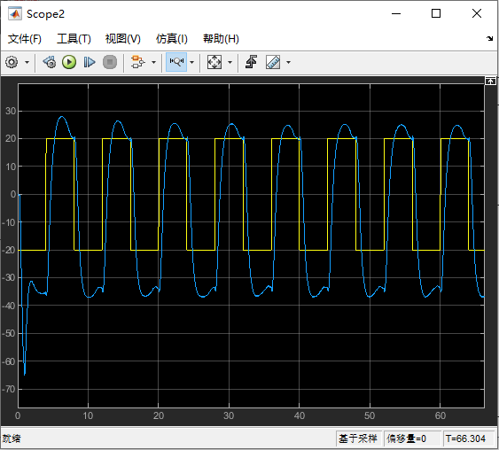
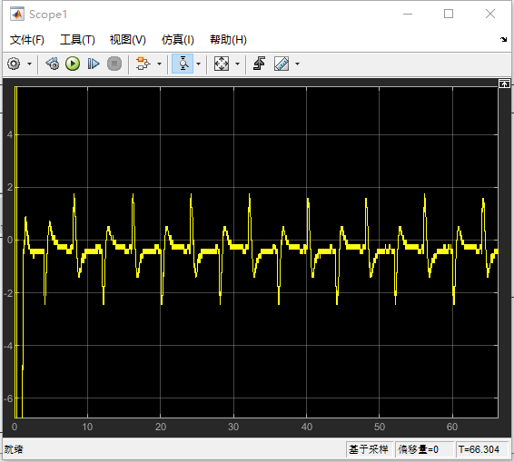

&emsp;&emsp; 以下两图为Q=[15 1 1 15],R=0.2时的结果：

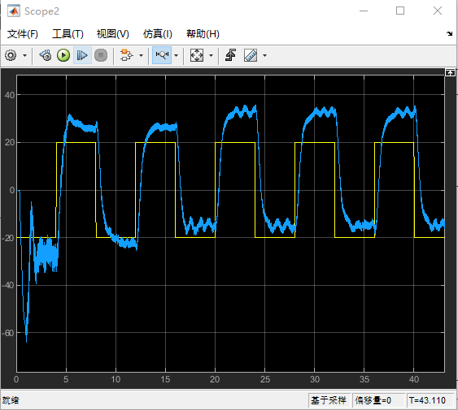

&emsp;&emsp; 观察可知，R的变化对于旋转摆摆角的摆动幅度以及稳定性都有影响。
&emsp;&emsp; 可以看出，在R增大时，旋转摆摆角的摆动幅度略减小，同时响应曲线更为平滑，分析原因是在R增大时控制器更倾向于减小控制输入的幅度，这可能导致系统响应的速度减缓。
&emsp;&emsp; 同样可以看出，在R减小时旋转摆摆角的摆动幅度增大很多，同时响应曲线波动非常大，显然是因为在R减小时系统的响应速度增加，控制器效果降低。

&emsp;&emsp; 综上所述，在总体设计中，需要平衡Q和R矩阵的选择，以满足性能和稳定性的需求。增大Q中与转角和摆角相关的元素，以及增大或减小R，都会在设计中影响控制器对系统状态的重视程度和控制输入的幅度。

