引例: A Scheduling Problem

A hospital wants to make a weekly night shift (12 pm-8 am) schedule for its nurses. The demand for nurses for the night shift on day $j$ is an integer $d_j, j=1, \ldots, 7$. Every nurse works 5 days *in a row* on the night shift. The problem is to find the minimal number of nurses the hospital needs to hire.

One could try using a decision variable $y_j$ equal to the number of nurses that work on day $j$. With this definition, however, we would not be able to capture the constraint that every nurse works 5 days in a row. For this reason, we choose the decision variables differently, and define $x_j$ as the number of nurses starting their week on day $j$. (For example, a nurse whose week starts on day 5 will work days $5,6,7,1,2$.) We then have the following problem formulation:

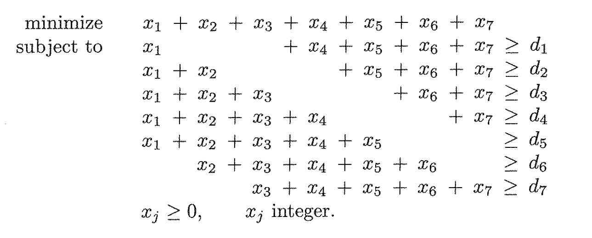

This would be a linear programming problem, except for the constraint that each $x_j$ must be an integer, and we actually have a linear *integer programming* problem. One way of dealing with this issue is to ignore ("relax") the integrality constraints and obtain the so-called *linear programming relaxation* of the original problem. Because the linear programming problem has fewer constraints, and therefore more options, the optimal cost will be less than or equal to the optimal cost of the original problem. If the optimal solution to the linear programming relaxation happens to be integer, then it is also an optimal solution to the original problem. If it is not integer, we can round each $x_j$ upwards, thus obtaining a feasible, but not necessarily optimal, solution to the original problem. It turns out that for this particular problem, an optimal solution can be found without too much effort. However, this is the exception rather than the rule: finding optimal solutions to general integer programming problems is typically difficult; some methods will be discussed in Chapter 11 .

# 线性规划问题的形式

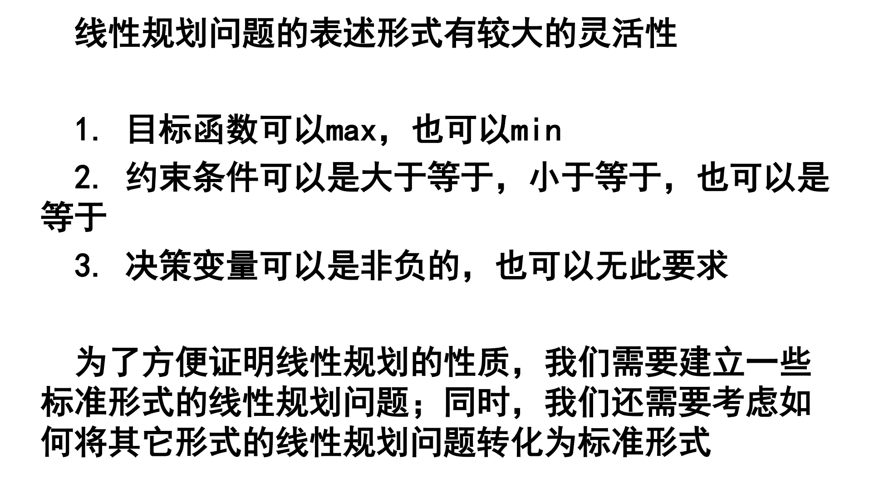

## Genral Form 一般形式

The following is a linear programming problem:

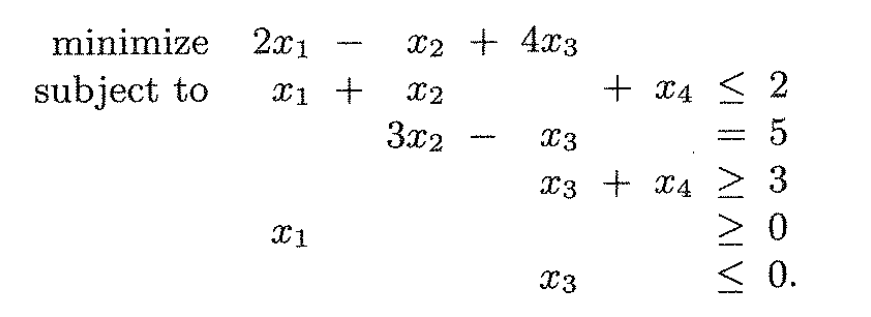

Here $x_1, x_2, x_3$, and $x_4$ are variables whose values are to be chosen to minimize the linear cost function $2 x_1-x_2+4 x_3$, subject to a set of linear equality and inequality constraints. Some of these constraints, such as $x_1 \geq 0$ and $x_3 \leq 0$, amount to simple restrictions on the sign of certain variables. The remaining constraints are of the form $\mathbf{a}^{\prime} \mathbf{x} \leq b, \mathbf{a}^{\prime} \mathbf{x}=b$, or $\mathbf{a}^{\prime} \mathbf{x} \geq b$, where $\mathbf{a}=\left(a_1, a_2, a_3, a_4\right)$ is a given vector $\mathbf{x}=\left(x_1, x_2, x_3, x_4\right)$ is the vector of decision variables, $\mathbf{a}^{\prime} \mathbf{x}$ is their inner product $\sum_{i=1}^4 a_i x_i$, and $b$ is a given scalar. For example, in the first constraint, we have $\mathbf{a}=(1,1,0,1)$ and $b=2$.

We now generalize. In a *general* linear programming problem, we are given a cost vector $\mathbf{c}=\left(c_1, \ldots, c_n\right)$ and we seek to minimize a linear cost function $\mathbf{c}^{\prime} \mathbf{x}=\sum_{i=1}^n c_i x_i$ over all $n$ -dimensional vectors $\mathbf{x}=\left(x_1, \ldots, x_n\right)$, subject to a set of linear equality and inequality constraints. In particular, let $M_1, M_2, M_3$ be some finite index sets, and suppose that for every $i$ in any one of these sets, we are given an $n$ -dimensional vector $\mathbf{a}_i$ and a scalar $b_i$, that will be used to form the $i$ th constraint. Let also $N_1$ and $N_2$ be subsets of $\{1, \ldots, n\}$ that indicate which variables $x_j$ are constrained to be nonnegative or nonpositive, respectively. We then consider the problem

$$
\begin{array}{rll}
\operatorname{minimize} & \mathbf{c}^{\prime} \mathbf{x} & \\
\text { subject to } & \mathbf{a}_i^{\prime} \mathbf{x} \geq b_i, & i \in M_1, \\
& \mathbf{a}_i^{\prime} \mathbf{x} \leq b_i, & i \in M_2, \\
& \mathbf{a}_i^{\prime} \mathbf{x}=b_i, & i \in M_3, \\
& x_j \geq 0, & j \in N_1, \\
& x_j \leq 0, & j \in N_2 .
\end{array}
$$

The variables $x_1, \ldots, x_n$ are called **decision variables**, and a vector $\mathbf{x}$ satisfying all of the constraints is called a **feasible solution** or **feasible vector**. The set of all feasible solutions is called the **feasible set** or **feasible region**. If $j$ is in neither $N_1$ nor $N_2$, there are no restrictions on the sign of $x_j$, in which case we say that $x_j$ is a **free** or **unrestricted** variable. The function $\mathbf{c}^{\prime} \mathbf{x}$ is called the **objective** function or cost function. A feasible solution $\mathbf{x}^*$ that minimizes the objective function (that is, $\mathbf{c}^{\prime} \mathbf{x}^* \leq \mathbf{c}^{\prime} \mathbf{x}$, for all feasible $\mathbf{x}$ ) is called an **optimal feasible solution** or, simply, an **optimal solution**. The value of $\mathbf{c}^{\prime} \mathbf{x}^*$ is then called the **optimal cost**. On the other hand, if for every real number $K$ we can find a feasible solution $\mathrm{x}$ whose cost is less than $K$, we say that the optimal cost is $-\infty$ or that the cost is **unbounded below**. (Sometimes, we will abuse terminology and say that the problem is **unbounded**.) We finally note that there is no need to study maximization problems separately, because maximizing $\mathbf{c}^{\prime} \mathbf{x}$ is equivalent to minimizing the linear cost function $-\mathbf{c}^{\prime} \mathbf{x}$.

An equality constraint $\mathbf{a}_i^{\prime} \mathbf{x}=b_i$ is equivalent to the two constraints $\mathbf{a}_i^{\prime} \mathbf{x} \leq b_i$ and $\mathbf{a}_i^{\prime} \mathbf{x} \geq b_i$. In addition, any constraint of the form $\mathbf{a}_i^{\prime} \mathbf{x} \leq b_i$ can be rewritten as $\left(-\mathbf{a}_i\right)^{\prime} \mathbf{x} \geq-b_i$. Finally, constraints of the form $x_j \geq 0$ or $x_j \leq 0$ are special cases of constraints of the form $\mathbf{a}_i^{\prime} \mathbf{x} \geq b_i$, where $\mathbf{a}_i$ is a unit vector and $b_i=0$. We conclude that the feasible set in a general linear programming problem can be expressed exclusively in terms of inequality constraints of the form $\mathbf{a}_i^{\prime} \mathbf{x} \geq b_i$. Suppose that there is a total of $m$ such constraints, indexed by $i=1, \ldots, m$, let $\mathbf{b}=\left(b_1, \ldots, b_m\right)$, and let $\mathbf{A}$ be the $m \times n$ matrix whose rows are the row vectors $\mathbf{a}_1^{\prime}, \ldots, \mathbf{a}_m^{\prime}$, that is,

$$
\mathbf{A}=\left[\begin{array}{ccc}
- & \mathbf{a}_1^{\prime} & - \\
& \vdots & \\
- & \mathbf{a}_m^{\prime} & -
\end{array}\right]
$$

Then, the constraints $\mathbf{a}_i^{\prime} \mathbf{x} \geq b_i, i=1, \ldots, m$, can be expressed compactly in the form $\mathbf{A x} \geq \mathbf{b}$, and the linear programming problem can be written as

$$
\begin{aligned}
\operatorname{minimize} \quad & \mathbf{c}^{\prime} \mathbf{x} \\
\text { subject to } \quad & \mathbf{A} \mathbf{x} \geq \mathbf{b}
\end{aligned}
$$

Inequalities such as $\mathbf{A x} \geq \mathbf{b}$ will always be interpreted componentwise; that is, for every $i$, the $i$ th component of the vector $\mathbf{A x}$, which is $\mathbf{a}_i^{\prime} \mathbf{x}$, is greater than or equal to the $i$ th component $b_i$ of the vector $\mathbf{b}$.

----

例:

The linear programming problem

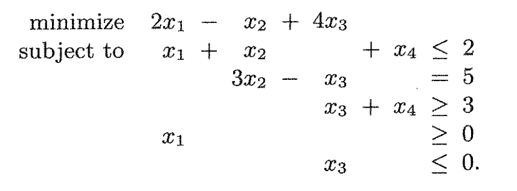

can be rewritten as

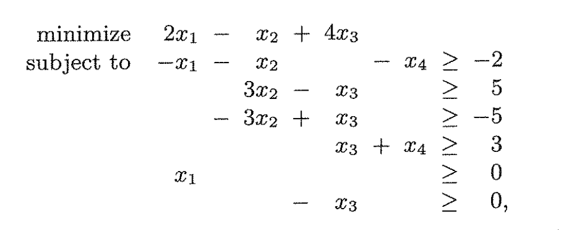

>注意等号那里是被拆成了两个不等式. An equality constraint $\mathbf{a}_i^{\prime} \mathbf{x}=b_i$ is equivalent to the two constraints $\mathbf{a}_i^{\prime} \mathbf{x} \leq b_i$ and $\mathbf{a}_i^{\prime} \mathbf{x} \geq b_i$.

带入上边描述的形式, 我们有

$$
c=(2,-1,4,0)
$$

$$
\mathbf{A}=\left[\begin{array}{rrrr}
-1 & -1 & 0 & -1 \\
0 & 3 & -1 & 0 \\
0 & -3 & 1 & 0 \\
0 & 0 & 1 & 1 \\
1 & 0 & 0 & 0 \\
0 & 0 & -1 & 0
\end{array}\right]
$$

## Standard Form 标准形式

A linear programming problem of the form

$$
\begin{aligned}
\operatorname{minimize} \quad & \mathbf{c}^{\prime} \mathbf{x} \\
\text { subject to } \quad & \mathbf{A} \mathbf{x}=\mathbf{b} \\
& \mathbf{x} \geq \mathbf{0}
\end{aligned}
$$

is said to be in **standard form**. 

We provide an interpretation of problems in standard form. Suppose that $\mathbf{x}$ has dimension $n$ and let $\mathbf{A}_1, \ldots, \mathbf{A}_n$ be the columns of $\mathbf{A}$. Then, the constraint $\mathbf{A} \mathbf{x}=\mathbf{b}$ can be written in the form

$$
\sum_{i=1}^n \mathbf{A}_i x_i=\mathbf{b}
$$

Intuitively, there are $n$ available resource vectors $\mathbf{A}_1, \ldots, \mathbf{A}_n$, and a target vector b. We wish to "synthesize" the target vector b by using a nonnegative amount $x_i$ of each resource vector $\mathbf{A}_i$, while minimizing the cost $\sum_{i=1}^n c_i x_i$, where $c_i$ is the unit cost of the $i$ th resource.

---

In the sequel, we will often use the general form $\mathbf{A x} \geq \mathbf{b}$ to develop the theory of linear programming. However, when it comes to algorithms, and especially the simplex and interior point methods, we will be focusing on the standard form $\mathbf{A x}=\mathbf{b}, \mathbf{x} \geq \mathbf{0}$, which is computationally more convenient.

----

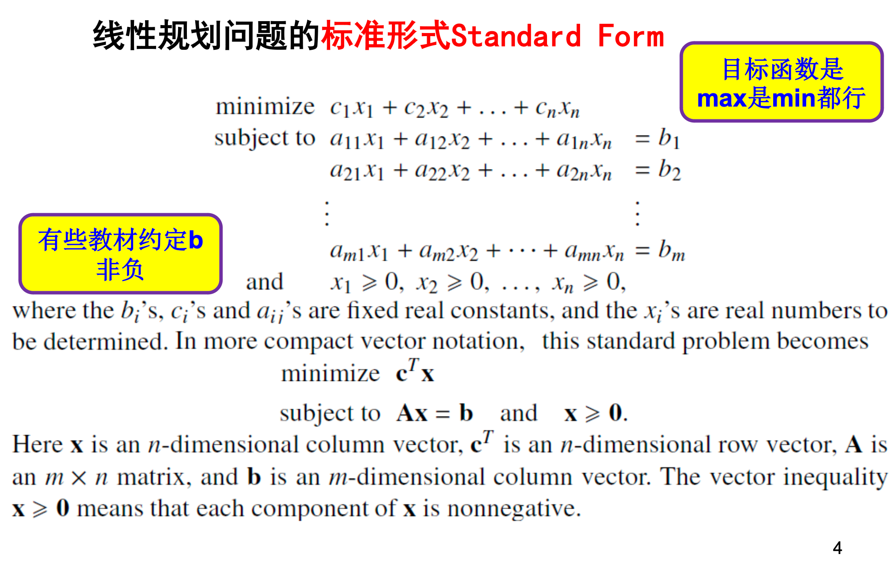

### Reduction to Standard Form

As argued earlier, any linear programming problem, including the standard form problem, is a special case of the general form. We now argue that the converse is also true and that a general linear programming problem can be transformed into an equivalent problem in standard form. 

Here, when we say that the two problems are equivalent, we mean that given a feasible solution to one problem, we can construct a feasible solution to the other, with the same cost. In particular, the two problems have the same optimal cost and given an optimal solution to one problem, we can construct an optimal solution to the other. 

The problem transformation we have in mind involves two steps:

**Step 1: Elimination of free variables:**

Given an unrestricted variable $x_j$ in a problem in general form, we replace it by $x_j^{+}-x_j^{-}$, where $x_j^{+}$ and $x_j^{-}$ are new variables on which we impose the sign constraints $x_j^{+} \geq 0$ and $x_j^{-} \geq 0$. The underlying idea is that any real number can be written as the difference of two nonnegative numbers.

**Step 2: Elimination of inequality constraints:** 

Given an inequality constraint of the form

$$
\sum_{j=1}^n a_{i j} x_j \leq b_i
$$

we introduce a new variable $s_i$ and the standard form constraints

$$
\begin{array}{r}
\sum_{j=1}^n a_{i j} x_j+s_i=b_i \\
s_i \geq 0
\end{array}
$$

Such a variable $s_i$ is called a **slack** variable.

Similarly, an inequality constraint

$$
\sum_{j=1}^n a_{i j} x_j \geq b_i
$$

can be put in standard form by introducing a **surplus** variable $s_i$ and the constraints

$$
\begin{array}{r}
\sum_{j=1}^n a_{i j} x_j-s_i=b_i \\
s_i \geq 0
\end{array}
$$

We conclude that a general problem can be brought into standard form and, therefore, we only need to develop methods that are capable of solving standard form problems.

-----

例:

The problem

$$
\begin{array}{rrl}
\operatorname{minimize} & 2 x_1+4 x_2 & \\
\text { subject to } & x_1+x_2 & \geq 3 \\
& 3 x_1+2 x_2 & =14 \\
& x_1 & \geq 0,
\end{array}
$$

is equivalent to the standard form problem

$$
\begin{array}{rll}
\operatorname{minimize} & 2 x_1+4 x_2^{+}-4 x_2^{-} \\
\text {subject to } & x_1+x_2^{+}-x_2^{-}-x_3&=3 \\
& 3 x_1+2 x_2^{+}-2 x_2^{-}  &=14 \\
& x_1, x_2^{+}, x_2^{-}, x_3 &\geq 0
\end{array}
$$

For example, given the feasible solution $\left(x_1, x_2\right)=(6,-2)$ to the original problem, we obtain the feasible solution $\left(x_1, x_2^{+}, x_2^{-}, x_3\right)=(6,0,2,1)$ to the standard form problem, which has the same cost. Conversely, given the feasible solution $\left(x_1, x_2^{+}, x_2^{-}, x_3\right)=(8,1,6,0)$ to the standard form problem, we obtain the feasible solution $\left(x_1, x_2\right)=(8,-5)$ to the original problem with the same cost.

----

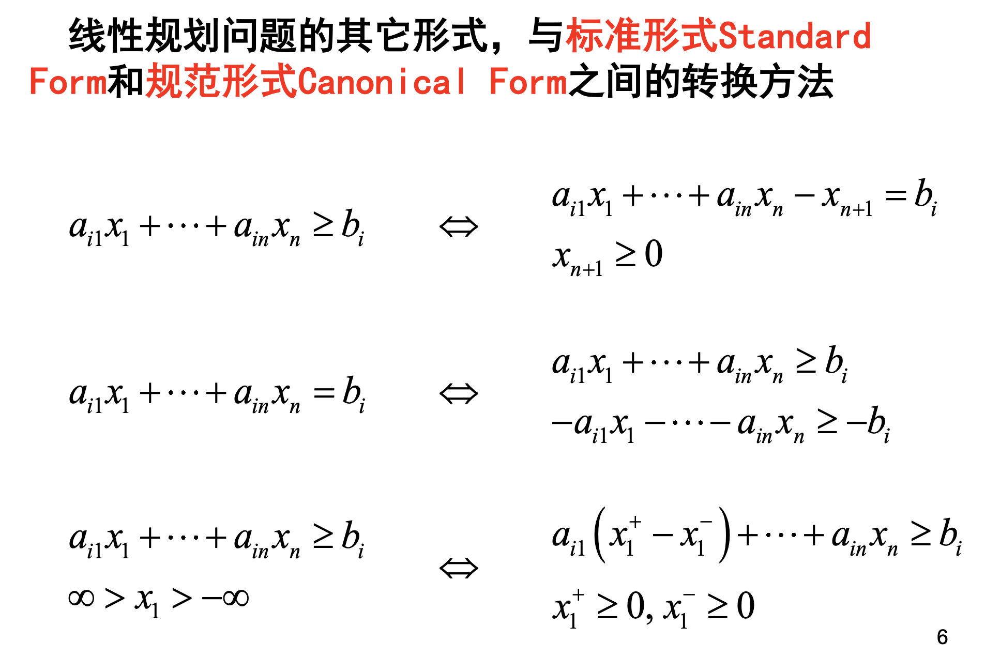

### 对线性规划标准型的基本假定

假定 1:

系数矩阵 $A$ 的**行向量** $\vec{a}_1^T, \vec{a}_2^T, \cdots, \vec{a}_m^T$ 线性无关

如果该假定不满足, 某个行向量, 比如 $\vec{a}_m^T$, 可以表示为 $\vec{a}_1^T, \vec{a}_2^T, \cdots, \vec{a}_{m-1}^T$ 的线性组合, 即

$$
\vec{a}_m^T=\lambda_1 \vec{a}_1^T+\lambda_2 \vec{a}_2^T+\cdots+\lambda_{m-1} \vec{a}_{m-1}^T
$$

则对任何满足前 $m-1$ 个约束的 $X$ 都成立:

$$
\vec{a}_m^T X=\lambda_1 \vec{a}_1^T X+\cdots+\lambda_{m-1} \vec{a}_{m-1}^T X=\lambda_1 b_1+\cdots+\lambda_{m-1} b_{m-1}
$$

当 $b_m=\lambda_1 b_1+\cdots+\lambda_{m-1} b_{m-1}$ 时, 第 $m$ 个约束不起作用, 故可以删除. 而若上述等式不满足, 原问题无可行解.

假定 2:

系数矩阵 $A$ 的列数大于其行数, 即 $n>m$.

如果 $n<m$, 由于 $\vec{a}_1, \cdots, \vec{a}_m$ 是 $m$ 个 $n$ 维的向量, 不可能线性无关.

如果 $n=m, A$ 是行向量线性无关的方阵, 因此有逆, 满足 $A X=\vec{b}$ 的只有一个向量 $\hat{X}=A^{-1} \vec{b}$ ，不需要优化!

## 特殊情况

### Piecewise linear convex objective functions

All of the examples in the preceding section involved a linear objective function. However, there is an important class of optimization problems with a nonlinear objective function that can be cast as linear programming problems; these are examined next.

在 凸分析基础中, 我们介绍了 “Piecewise Linear Convex Function”. We now consider a generalization of linear programming, where the objective function is piecewise linear and convex rather than linear:

$$
\begin{aligned}
\operatorname{minimize} & \max _{i=1, \ldots, m}\left(\mathbf{c}_i^{\prime} \mathbf{x}+d_i\right) \\
\text { subject to } & \mathbf{A x} \geq \mathbf{b}
\end{aligned}
$$

Note that $\max _{i=1, \ldots, m}\left(\mathbf{c}_i^{\prime} \mathbf{x}+d_i\right)$ is equal to the smallest number $z$ that satisfies $z \geq \mathbf{c}_i^{\prime} \mathbf{x}+d_i$ for all $i$. 

For this reason, the optimization problem under consideration is equivalent to the linear programming problem

$$
\begin{aligned}
\text { minimize } \quad &z \\
\text { subject to } \quad z &\geq \mathbf{c}_i^{\prime} \mathbf{x}+d_i, \quad i=1, \ldots, m \text {, } \\
\mathbf{A x} &\geq \mathbf{b} \\
&
\end{aligned}
$$

where the decision variables are $z$ and $\mathbf{x}$..

To summarize, linear programming can be used to solve problems with piecewise linear convex cost functions, and the latter class of functions can be used as an approximation of more general convex cost functions. On the other hand, such a piecewise linear approximation is not always a good idea because it can turn a smooth function into a nonsmooth one (piecewise linear functions have discontinuous derivatives).

We finally note that if we are given a constraint of the form $f(\mathbf{x}) \leq h$, where $f$ is the piecewise linear convex function 

$$
f(\mathbf{x})=\max _{i=1, \ldots, m}\left(\mathbf{f}_i^{\prime} \mathbf{x}+g_i\right)
$$

such a constraint can be rewritten as

$$
\mathbf{f}_i^{\prime} \mathbf{x}+g_i \leq h, \quad i=1, \ldots, m
$$

and linear programming is again applicable.

#### Problems involving absolute values

Consider a problem of the form

$$
\begin{aligned}
\operatorname{minimize} \quad & \sum_{i=1}^n c_i\left|x_i\right| \\
\text { subject to } \quad & \mathbf{A x} \geq \mathbf{b}
\end{aligned}
$$

where $\mathbf{x}=\left(x_1, \ldots, x_n\right)$, and where the cost coefficients $c_i$ are assumed to be nonnegative. The cost criterion, being the sum of the piecewise linear convex functions $c_i\left|x_i\right|$ is easily shown to be piecewise linear and convex. 

>Note that the cost coefficients $c_i$ is crucial because, otherwise, the cost criterion is nonconvex.

However, expressing this cost criterion in the form $\max _j\left(\mathbf{c}_j^{\prime} \mathbf{x}+d_j\right)$ is a bit involved, and a more direct route is preferable. We observe that $\left|x_i\right|$ is the smallest number $z_i$ that satisfies $x_i \leq z_i$ and $-x_i \leq z_i$, and we obtain the linear programming formulation

$$
\begin{aligned}
\operatorname{minimize} \quad &\sum_{i=1}^n c_i z_i \\
\text { subject to } \quad\mathbf{A x} &\geq \mathbf{b} \\
x_i &\leq z_i, \quad i=1, \ldots, n \text {, } \\
-x_i &\leq z_i, \quad i=1, \ldots, n \text {. } \\
\end{aligned}
$$

An alternative method for dealing with absolute values is to introduce new variables $x_i^{+}, x_i^{-}$, constrained to be nonnegative, and let $x_i=x_i^{+}-x_i^{-}$. (Our intention is to have $x_i=x_i^{+}$ or $x_i=-x_i^{-}$, depending on whether $x_i$ is positive or negative.) We then replace every occurrence of $\left|x_i\right|$ with $x_i^{+}+x_i^{-}$ and obtain the alternative formulation

$$
\begin{aligned}
\operatorname{minimize} \quad & \sum_{i=1}^n c_i\left(x_i^{+}+x_i^{-}\right) \\
\text {subject to } \quad & \mathbf{A x ^ { + }}-\mathbf{A} \mathbf{x}^{-} \geq \mathbf{b} \\
& \mathbf{x}^{+}, \mathbf{x}^{-} \geq \mathbf{0},
\end{aligned}
$$
where $\mathbf{x}^{+}=\left(x_1^{+}, \ldots, x_n^{+}\right)$ and $\mathbf{x}^{-}=\left(x_1^{-}, \ldots, x_n^{-}\right)$.

The relations $x_i=x_i^{+}-x_i^{-}, x_i^{+} \geq 0, x_i^{-} \geq 0$, are not enough to guarantee that $\left|x_i\right|=x_i^{+}+x_i^{-}$, and the validity of this reformulation may not be entirely obvious. Let us assume for simplicity that $c_i>0$ for all $i$. At an optimal solution to the reformulated problem, and for each $i$, we must have either $x_i^{+}=0$ or $x_i^{-}=0$, because otherwise we could reduce both $x_i^{+}$ and $x_i^{-}$ by the same amount and preserve feasibility, while reducing the cost, in contradiction of optimality. Having guaranteed that either $x_i^{+}=0$ or $x_i^{-}=0$, the desired relation $\left|x_i\right|=x_i^{+}+x_i^{-}$ now follows.

----

例: Consider the problem

$$
\begin{aligned}
\operatorname{minimize} \quad & 2\left|x_1\right|+x_2 \\
\text { subject to } \quad & x_1+x_2 \geq 4
\end{aligned}
$$
Our first reformulation yields

$$
\begin{aligned}
\text { minimize } \quad 2 z_1+x_2 \\
\text { subject to } \quad x_1+x_2 &\geq 4 \\
x_1 &\leq z_1 \\
-x_1 &\leq z_1 \\
\end{aligned}
$$

while the second yields

$$
\begin{aligned}
\operatorname{minimize} \quad 2 x_1^{+}+2 x_1^{-}+x_2 \\
\text { subject to } x_1^{+}-x_1^{-}+x_2 &\geq 4 \\
x_1^{+} &\geq 0 \\
x_1^{-} &\geq 0 \\
\end{aligned}
$$

# 凸分析

## Motivation

为什么要在 Linear Programming 这一部分介绍凸分析?

- 大前提: 线性规划问题的约束条件为若干个线性等式或者不等式，而这些集合都是凸集
- 小前提: 凸集的交集也是凸集
- 结论: 作为这些凸集交集的线性规划问题定义域也是凸集 (我们一般约定空集为凸集)

## 基本定义

### Polyhedra 多面体

>Polyhedron 的中文是多面体.

A **polyhedron** is a set that can be described in the form

$$
\left\{\mathbf{x} \in \Re^n \mid \mathbf{A x} \geq \mathbf{b}\right\}
$$

where $\mathbf{A}$ is an $m \times n$ matrix and $\mathbf{b}$ is a vector in $\Re^m$.

As discussed in Section 1.1, the feasible set of any linear programming problem can be described by inequality constraints of the form $\mathbf{A x} \geq \mathbf{b}$, and is therefore a polyhedron. 

In particular, a set of the form 

$$
\left\{\mathrm{x} \in \Re^n \mid\mathbf{A} \mathbf{x}=\mathbf{b}, \mathbf{x} \geq \mathbf{0}\right\}
$$

is also a polyhedron, in a **standard form representation**.

----

$A$ set $S \subset \Re^n$ is **bounded** if there exists a constant $K$ such that the absolute value of every component of every element of $S$ is less than or equal to $K$.

### Hyperplane and Halfspace

The next definition deals with polyhedra determined by a single linear constraint.

Let a be a nonzero vector in $\Re^{n}$ and let $b$ be a scalar:
1. The set $\left\{\mathbf{x} \in \Re^n \mid \mathbf{a}^{\prime} \mathbf{x}=b\right\}$ is called a **hyperplane**.
2. The set $\left\{\mathbf{x} \in \Re^n \mid \mathbf{a}^{\prime} \mathbf{x} \geq b\right\}$ is called a **halfspace**.

---

Note that a hyperplane is the boundary of $\mathbf{a}$ corresponding halfspace. In addition, the vector $\mathbf{a}$ in the definition of the hyperplane is perpendicular to the hyperplane itself. 

证明:

Nnote that if $\mathrm{x}$ and $\mathrm{y}$ belong to the same hyperplane, then $\mathbf{a}^{\prime} \mathbf{x}=\mathbf{a}^{\prime} \mathbf{y}$. Hence, $\mathbf{a}^{\prime}(\mathbf{x}-\mathbf{y})=0$ and therefore $\mathbf{a}$ is orthogonal to any direction vector confined to the hyperplane.

---

Finally, note that a polyhedron is equal to the intersection of a finite number of halfspaces; see Figure $2.1$.

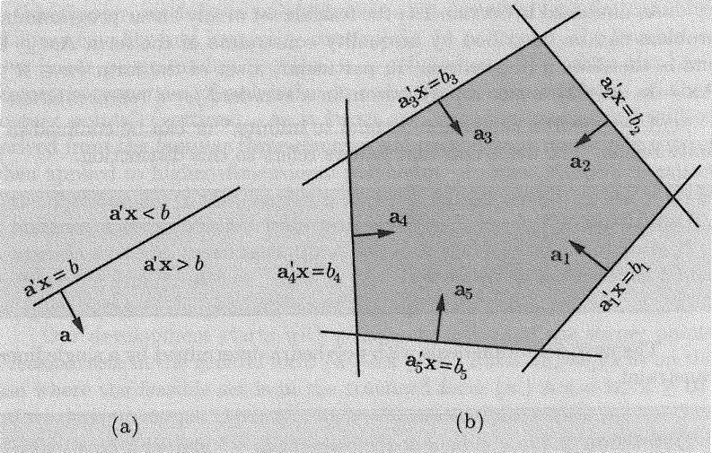

>Figure 2.1: (a) A hyperplane and two halfspaces. (b) The polyhedron $\left\{\mathbf{x} \mid \mathbf{a}_{i}^{\prime} \mathbf{x} \geq b_{i}, i=1, \ldots, 5\right\}$ is the intersection of five halfspaces. Note that each vector $\mathbf{a}_{i}$ is perpendicular to the hyperplane $\left\{\mathrm{x} \mid \mathrm{a}_{i}^{\prime} \mathrm{x}=b_{i}\right\}$

-----

### Open Ball and Closed Ball

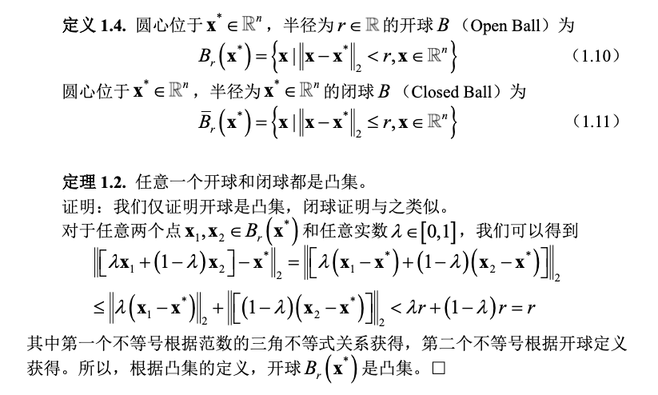

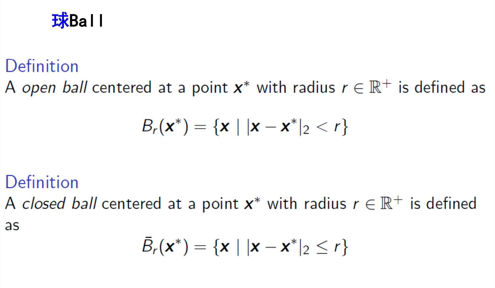

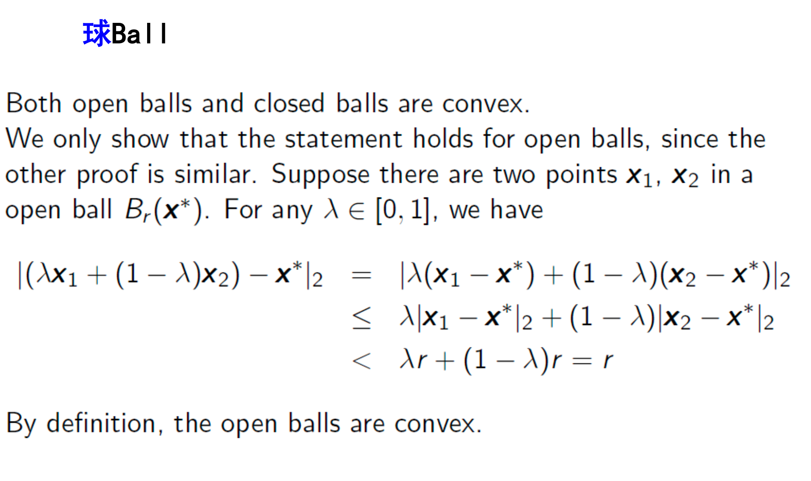

### Convex Sets

#### 定义

$A$ set $S \subset \Re^{n}$ is **convex** if for any $x, y \in S$, and any $\lambda \in[0,1]$, we have 

$$
\lambda x+(1-\lambda) y \in S
$$

Note that if $\lambda \in[0,1]$, then $\lambda \mathbf{x}+(1-\lambda) \mathbf{y}$ is a weighted average of the vectors $\mathbf{x}, \mathrm{y}$, and therefore belongs to the line segment joining $\mathrm{x}$ and $y$. Thus, a set is convex if the segment joining any two of its elements is contained in the set; see Figure $2.2$.

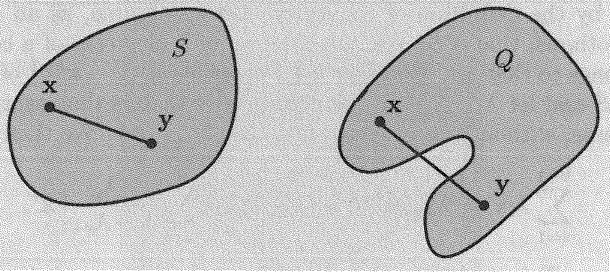

>Figure 2.2: The set $S$ is convex, but the set $Q$ is not, because the segment joining $\mathbf{x}$ and $\mathbf{y}$ is not contained in $Q$.

-----

Let $\mathrm{x}^{1}, \ldots, \mathrm{x}^{k}$ be vectors in $\Re^{n}$ and let $\lambda_{1}, \ldots, \lambda_{k}$ be nonnegative scalars whose sum is unity.
1. The vector $\sum_{i=1}^k \lambda_i \mathbf{x}^i$  is said to be a **convex combination** of the vectors $\mathrm{x}^{1}, \ldots, \mathrm{x}^{k}$.
2. The **convex hull** of the vectors $x^{1}, \ldots, x^{k}$ is the set of all convex combinations of these vectors.

>注意 **sum is unity**这个条件

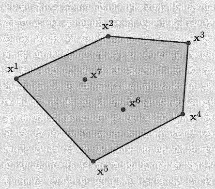

>Figure 2.3: The convex hull of seven points in $\Re^{2}$.

**凸包 (Convex Hull)** 是一组点的最小凸集合，它包含所有这些点。换句话说，凸包是包围所有给定点的最小凸多边形或多面体。

对于 $N$ 个点 $p_1, \ldots, p_N$, 其凸包 $C$ 可以表示为：

$$
C \cong\left\{\sum_{j=1}^N \lambda_j p_j: \lambda_j \geq 0 \text { 对于所有 } j \text { 且 } \sum_{j=1}^N \lambda_j=1\right\}
$$

在计算几何中，凸包是一个基本问题，有多种算法可以计算二维或三维空间中点集的凸包，例如 Graham 扫描法和 Jarvis 步进法等。

#### 性质

The intersection of convex sets is convex.

Proof:

Let $S_{i}, i \in I$, be convex sets where $I$ is some index set, and suppose that $\mathbf{x}$ and $\mathbf{y}$ belong to the intersection $\cap_{i \in I} S_{i}$. Let $\lambda \in[0,1]$. Since each $S_{i}$ is convex and contains $\mathbf{x}, \mathbf{y}$, we have $\lambda \mathbf{x}+(1-\lambda) \mathbf{y} \in S_{i}$, which proves that $\lambda \mathbf{x}+(1-\lambda) \mathbf{y}$ also belongs to the intersection of the sets $S_{i}$. Therefore, $\cap_{i \in I} S_{i}$ is convex.

-----

定理: 有限个凸集的交集是凸集。

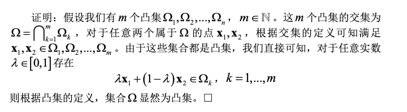

----

Every polyhedron is a convex set.

Proof:

Let $\mathbf{a}$ be a vector and let $b$ a scalar. Suppose that $\mathrm{x}$ and $\mathbf{y}$ satisfy $\mathbf{a}^{\prime} \mathbf{x} \geq b$ and $\mathbf{a}^{\prime} \mathbf{y} \geq b$, respectively, and therefore belong to the same halfspace. Let $\lambda \in[0,1]$. Then,

$$
\mathbf{a}^{\prime}(\lambda \mathbf{x}+(1-\lambda) \mathbf{y}) \geq \lambda b+(1-\lambda) b=b
$$

which proves that $\lambda \mathbf{x}+(1-\lambda) \mathbf{y}$ also belongs to the same halfspace. Therefore a halfspace is convex. Since a polyhedron is the intersection of a finite number of halfspaces, the result follows from 上一条结论.

----

A convex combination of a finite number of elements of a convex set also belongs to that set.

Proof: 使用数学归纳法来证明.

A convex combination of two elements of a convex set lies in that set, by the definition of convexity. 

Let us assume, as an induction hypothesis, that a convex combination of $k$ elements of a convex set belongs to that set. Consider $k+1$ elements $\mathbf{x}^{1}, \ldots, \mathbf{x}^{k+1}$ of a convex set $S$ and let $\lambda_{1}, \ldots, \lambda_{k+1}$ be nonnegative scalars that sum to 1 . We assume, without loss of generality, that $\lambda_{k+1} \neq 1$. We then have

$$
\sum_{i=1}^{k+1} \lambda_i \mathbf{x}^i=\lambda_{k+1} \mathbf{x}^{k+1}+\left(1-\lambda_{k+1}\right) \sum_{i=1}^k \frac{\lambda_i}{1-\lambda_{k+1}} \mathbf{x}^i
$$

The coefficients $\lambda_{i} /\left(1-\lambda_{k+1}\right), i=1, \ldots, k$, are nonnegative and sum to unity; using the induction hypothesis, $\sum_{i=1}^{k} \lambda_{i} \mathrm{x}^{i} /\left(1-\lambda_{k+1}\right) \in S$. Then, the fact that $S$ is convex and Eq. (2.1) imply that $\sum_{i=1}^{k+1} \lambda_{i} \mathrm{x}^{i} \in$ $S$, and the induction step is complete.

----

The convex hull of a finite number of vectors is a convex set. 

Proof:

Let $S$ be the convex hull of the vectors $\mathrm{x}^{1}, \ldots, \mathrm{x}^{k}$ and let $\mathrm{y}=$ $\sum_{i=1}^{k} \zeta_{i} \mathbf{x}^{i}, \mathbf{z}=\sum_{i=1}^{k} \theta_{i} \mathrm{x}^{i}$ be two elements of $S$, where $\zeta_{i} \geq 0, \theta_{i} \geq 0$, and $\sum_{i=1}^{k} \zeta_{i}=\sum_{i=1}^{k} \theta_{i}=1$. Let $\lambda \in[0,1]$. Then,

$$
\lambda \mathbf{y}+(1-\lambda) \mathbf{z}=\lambda \sum_{i=1}^k \zeta_i \mathbf{x}^i+(1-\lambda) \sum_{i=1}^k \theta_i \mathbf{x}^i=\sum_{i=1}^k\left(\lambda \zeta_i+(1-\lambda) \theta_i\right) \mathbf{x}^i
$$

We note that the coefficients $\lambda \zeta_{i}+(1-\lambda) \theta_{i}, i=1, \ldots, k$, are nonnegative and sum to unity. This shows that $\lambda \mathbf{y}+(1-\lambda) \mathrm{z}$ is a convex combination of $\mathbf{x}^{1}, \ldots, \mathrm{x}^{k}$ and, therefore, belongs to $S$. This establishes the convexity of $S$.

----

**凸集分隔定理**

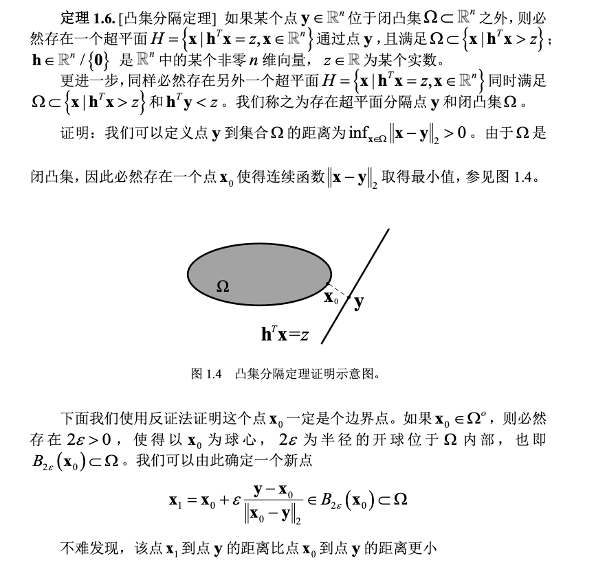

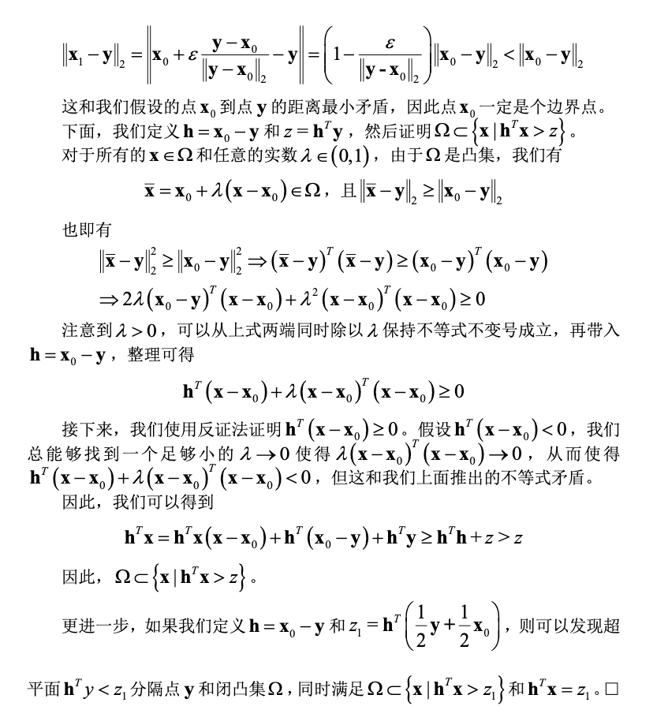

## Representation of Bounded Polyhedra

So far, we have been representing polyhedra in terms of their defining inequalities. In this section, we provide an alternative, by showing that a bounded polyhedron can also be represented as the convex hull of its extreme points. The proof that we give here is elementary and constructive, and its main idea is summarized in Figure 2.16. 

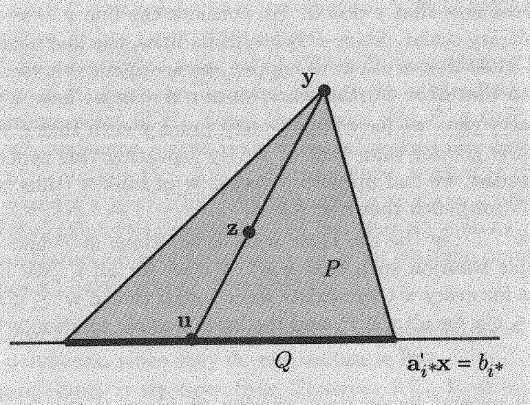

>Figure 2.16: Given the vector $z$, we express it as a convex combination of $\mathbf{y}$ and $\mathbf{u}$. The vector $\mathbf{u}$ belongs to the polyhedron $Q$ whose dimension is lower than that of $P$. Using induction on dimension, we can express the vector $u$ as a convex combination of extreme points of $Q$. These are also extreme points of $P$.

There is a similar representation of unbounded polyhedra involving extreme points and "extreme rays" (edges that extend to infinity). This representation can be developed using the tools that we already have, at the expense of a more complicated proof. A more elegant argument, based on duality theory, will be presented in Section $4.9$ and will also result in an alternative proof of Theorem $2.9$ below. 

----

**Theorem:**

A nonempty and bounded polyhedron is the convex hull of its extreme points.

Proof:

Every convex combination of extreme points is an element of the polyhedron, since polyhedra are convex sets. Thus, we only need to prove the converse result and show that every element of a bounded polyhedron can be represented as a convex combination of extreme points.

We define the **dimension** of a polyhedron $P \subset \Re^{n}$ as the smallest integer $k$ such that $P$ is contained in some $k$ -dimensional affine subspace of $\Re^{n}$. (Recall from Section $1.5$, that a $k$ -dimensional affine subspace is a translation of a $k$ -dimensional subspace.) Our proof proceeds by induction on the dimension of the polyhedron $P$. If $P$ is zero-dimensional, it consists of a single point. This point is an extreme point of $P$ and the result is true.

Let us assume that the result is true for all polyhedra of dimension less than $k$. Let $P=\left\{\mathrm{x} \in \Re^{n} \mid \mathrm{a}_{i}^{\prime} \mathrm{x} \geq b_{i}, i=1, \ldots, m\right\}$ be a nonempty bounded $k$ -dimensional polyhedron. Then, $P$ is contained in a $k$ -dimensional affine subspace $S$ of $\Re^{n}$, which can be assumed to be of the form

$$
S=\left\{x^{0}+\lambda_{1} x^{1}+\cdots+\lambda_{k} x^{k} \mid \lambda_{1}, \ldots, \lambda_{k} \in \Re\right\}
$$

where $\mathrm{x}^{1}, \ldots, \mathrm{x}^{k}$ are some vectors in $\Re^{n}$. Let $\mathbf{f}_{1}, \ldots, \mathbf{f}_{n-k}$ be $n-k$ linearly independent vectors that are orthogonal to $\mathbf{x}^{1}, \ldots, \mathbf{x}^{k}$. Let $g_{i}=\mathfrak{f}_{i}^{\prime} \mathbf{x}^{0}$, for $i=1, \ldots, n-k$. Then, every element $\mathrm{x}$ of $S$ satisfies

$$
\mathbf{f}_{i}^{\prime} \mathbf{x}=g_{i}, \quad i=1, \ldots, n-k .
$$

Since $P \subset S$, the same must be true for every element of $P$.

Let $\mathbf{z}$ be an element of $P$. If $\mathbf{z}$ is an extreme point of $P$, then $\mathbf{z}$ is a trivial convex combination of the extreme points of $P$ and there is nothing more to be proved. If $\mathbf{z}$ is not an extreme point of $P$, let us choose an arbitrary extreme point $\mathbf{y}$ of $P$ and form the half-line consisting of all points of the form $\mathbf{z}+\lambda(\mathbf{z}-\mathbf{y})$, where $\lambda$ is a nonnegative scalar. Since $P$ is bounded, this half-line must eventually exit $P$ and violate one of the constraints, say the constraint $\mathbf{a}_{i^{*}}^{\prime} \mathbf{x} \geq b_{i^{*}}$. By considering what happens when this constraint is just about to be violated, we find some $\lambda^{*} \geq 0$ and $\mathbf{u} \in P$, such that

$$
\mathbf{u}=\mathbf{z}+\lambda^{*}(\mathbf{z}-\mathbf{y})
$$

and

$$
\mathbf{a}_{i^{*}}^{\prime} \mathbf{u}=b_{i^{*}}
$$

Since the constraint $\mathbf{a}_{i^{*}}^{\prime} \mathbf{x} \geq b_{i^{*}}$ is violated if $\lambda$ grows beyond $\lambda^{*}$, it follows that $\mathbf{a}_{i^{*}}^{\prime}(\mathbf{z}-\mathbf{y})<0$.

Let $Q$ be the polyhedron defined by

$$
\begin{aligned}
Q & =\left\{\mathbf{x} \in P \mid \mathbf{a}_{i^{*}}^{\prime} \mathbf{x}=b_{i^{*}}\right\} \\
& =\left\{\mathbf{x} \in \Re^{n} \mid \mathbf{a}_{i^{\prime}}^{\mathbf{x}} \geq b_{i}, i=1, \ldots, m, \mathbf{a}_{i^{*}}^{\prime} \mathbf{x}=b_{i^{*}}\right\} .
\end{aligned}
$$

Since $\mathbf{z}, \mathbf{y} \in P$, we have $\mathbf{f}_{i}^{\prime} \mathbf{z}=g_{i}=\mathbf{f}_{i}^{\prime} \mathbf{y}$ which shows that $\mathbf{z}-\mathbf{y}$ is orthogonal to each vector $\mathbf{f}_{i}$, for $i=1, \ldots, n-k$. On the other hand, we have shown that $\mathbf{a}_{i^{*}}^{\prime}(\mathbf{z}-\mathrm{y})<0$, which implies that the vector $\mathbf{a}_{i^{*}}$ is not a linear combination of, and is therefore linearly independent from, the vectors $\mathfrak{f}_{i}$. Note that

$$
Q \subset\left\{\mathbf{x} \in \Re^{n} \mid \mathbf{a}_{i^{*}}^{\prime} \mathbf{x}=b_{i^{*}}, \mathbf{f}_{i}^{\prime} \mathbf{x}=g_{i}, i=1, \ldots, n-k\right\},
$$

since Eq. (2.3) holds for every element of $P$. The set on the right is defined by $n-k+1$ linearly independent equality constraints. Hence, it is an affine subspace of dimension $k-1$ (see the discussion at the end of Section 1.5). Therefore, $Q$ has dimension at most $k-1$.

By applying the induction hypothesis to $Q$ and $u$, we see that $u$ can be expressed as a convex combination

$$
\mathbf{u}=\sum_{i} \lambda_{i} \mathbf{v}^{i}
$$

of the extreme points $\mathbf{v}^{i}$ of $Q$, where $\lambda_{i}$ are nonnegative scalars that sum to one. Note that at an extreme point $\mathbf{v}$ of $Q$, we must have $\mathbf{a}_{i}^{\prime} \mathbf{v}=b_{i}$ for $n$ linearly independent vectors $\mathbf{a}_{i}$; therefore, $\mathbf{v}$ must also be an extreme point of $P$. Using the definition of $\lambda^{*}$, we also have

$$
\mathrm{z}=\frac{\mathbf{u}+\lambda^{*} \mathbf{y}}{1+\lambda^{*}}
$$

Therefore,

$$
\mathbf{z}=\frac{\lambda^{*} \mathbf{y}}{1+\lambda^{*}}+\sum_{i} \frac{\lambda_{i}}{1+\lambda^{*}} \mathbf{v}^{i}
$$

which shows that $\mathrm{z}$ is a convex combination of the extreme points of $P$.

-----

Example:

Consider the polyhedron

$$
P=\left\{\left(x_{1}, x_{2}, x_{3}\right) \mid x_{1}+x_{2}+x_{3} \leq 1, x_{1}, x_{2}, x_{3} \geq 0\right\}
$$

It has four extreme points, namely, $\mathrm{x}^{1}=(1,0,0), \mathrm{x}^{2}=(0,1,0), \mathbf{x}^{3}=(0,0,1)$, and $\mathrm{x}^{4}=(0,0,0)$. 

The vector $\mathrm{x}=(1 / 3,1 / 3,1 / 4)$ belongs to $P$. It can be represented as

$$
x=\frac{1}{3} x^{1}+\frac{1}{3} x^{2}+\frac{1}{4} x^{3}+\frac{1}{12} x^{4}
$$

----

There is a converse to Theorem $2.9$ asserting that the convex hull of a finite number of points is a polyhedron. This result is proved in the next section and again in Section 4.9.

## Projections of Polyhedra: Fourier-Motzkin Elimination

In this section, we present perhaps the oldest method for solving linear programming problems. This method is not practical because it requires a very large number of steps, but it has some interesting theoretical corollaries.

The key to this method is the concept of a **projection**, defined as follows: if $\mathbf{x}=\left(x_{1}, \ldots, x_{n}\right)$ is a vector in $\Re^{n}$ and $k \leq n$, the projection mapping $\pi_{k}: \Re^{n} \mapsto \Re^{k}$ projects $\mathbf{x}$ onto its first $k$ coordinates:

$$
\pi_{k}(\mathbf{x})=\pi_{k}\left(x_{1}, \ldots, x_{n}\right)=\left(x_{1}, \ldots, x_{k}\right) .
$$

We also define the projection $\Pi_{k}(S)$ of a set $S \subset \Re^{n}$ by letting

$$
\Pi_{k}(S)=\left\{\pi_{k}(\mathrm{x}) \mid \mathrm{x} \in S\right\}
$$

see Figure $2.17$ for an illustration. 

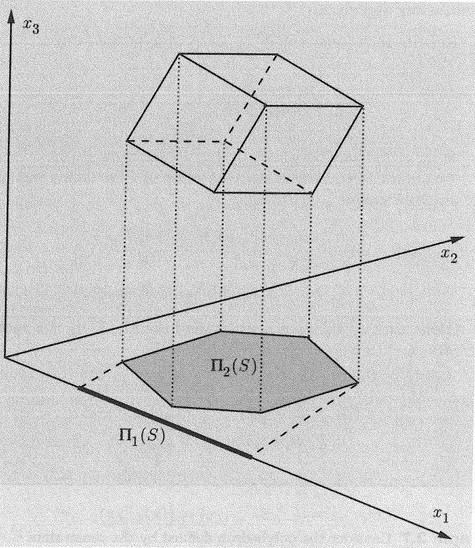

>Figure 2.17: The projections $\Pi_{1}(S)$ and $\Pi_{2}(S)$ of a rotated three-dimensional cube.

Note that $S$ is nonempty if and only if $\Pi_{k}(S)$ is nonempty. An equivalent definition is

$$
\Pi_{k}(S)=\left\{\left(x_{1}, \ldots, x_{k}\right) \mid \text { there exist } x_{k+1}, \ldots, x_{n} \text { s.t. }\left(x_{1}, \ldots, x_{n}\right) \in S\right\} .
$$

Suppose now that we wish to decide whether a given polyhedron $P \subset \Re^{n}$ is nonempty. If we can somehow eliminate the variable $x_{n}$ and construct the set $\Pi_{n-1}(P) \subset \Re^{n-1}$, we can instead consider the presumably easier problem of deciding whether $\Pi_{n-1}(P)$ is nonempty. If we keep eliminating variables one by one, we eventually arrive at the set $\Pi_{1}(P)$ that involves a single variable, and whose emptiness is easy to check. The main disadvantage of this method is that while each step reduces the dimension by one, a large number of constraints is usually added. 

----

We now describe the elimination method. We are given a polyhedron $P$ in terms of linear inequality constraints of the form

$$
\sum_{j=1}^{n} a_{i j} x_{j} \geq b_{i}, \quad i=1, \ldots, m .
$$

We wish to eliminate $x_{n}$ and construct the projection $\Pi_{n-1}(P)$. 

**Elimination algorithm:**

Step 1:

Rewrite each constraint $\sum_{j=1}^{n} a_{i j} x_{j} \geq b_{i}$ in the form

$$
a_{i n} x_{n} \geq-\sum_{j=1}^{n-1} a_{i j} x_{j}+b_{i}, \quad i=1, \ldots, m
$$

if $a_{n} \neq 0$, divide both sides by $a_{m}$. By letting $\bar{x}=\left(x_{1}, \ldots, x_{n-1}\right)$, we obtain an equivalent representation of $P$ involving the following constraints:

$$
\begin{aligned}
x_{n} \geq d_{i}+f_{i}^{\prime} \bar{x}, & \text { if } a_{i n}>0, \\
d_{j}+f_{j}^{\prime} \bar{x} \geq x_{n}, & \text { if } a_{j n}<0, \\
0 \geq d_{k}+\mathbf{f}_{k}^{\prime} \bar{x}, & \text { if } a_{k n}=0
\end{aligned}
$$

Here, each $d_{i}, d_{j}, d_{k}$ is a scalar, and each $\mathbf{f}_{i}, \mathbf{f}_{j}, \mathbf{f}_{k}$ is a vector in $\Re^{n-1}$.

Step 2:

Let $Q$ be the polyhedron in $\Re^{n-1}$ defined by the constraints

$$
\begin{array}{rlr}
d_{j}+\mathrm{f}_{j}^{\prime} \overline{\mathrm{x}} \geq d_{i}+\mathrm{f}_{i}^{\prime} \overline{\mathrm{x}}, & & \text { if } a_{i n}>0 \text { and } a_{j n}<0, \\
0 \geq d_{k}+\mathrm{f}_{k}^{\prime} \overline{\mathrm{x}}, & & \text { if } a_{k n}=0 .
\end{array}
$$

-----

**Example:**

Consider the polyhedron defined by the constraints

$$
\begin{aligned}
x_{1}+x_{2} & \geq 1 \\
x_{1}+x_{2}+2 x_{3} & \geq 2 \\
2 x_{1}+3 x_{3} & \geq 3 \\
x_{1}-4 x_{3} & \geq 4 \\
-2 x_{1}+x_{2}-x_{3} & \geq 5 .
\end{aligned}
$$

We rewrite these constraints in the form

$$
\begin{aligned}
0 & \geq 1-x_{1}-x_{2} \\
x_{3} & \geq 1-\left(x_{1} / 2\right)-\left(x_{2} / 2\right) \\
x_{3} & \geq 1-\left(2 x_{1} / 3\right) \\
-1+\left(x_{1} / 4\right) & \geq x_{3} \\
-5-2 x_{1}+x_{2} & \geq x_{3} .
\end{aligned}
$$

Then, the set $Q$ is defined by the constraints

$$
\begin{aligned}
0 & \geq 1-x_{1}-x_{2} \\
-1+x_{1} / 4 & \geq 1-\left(x_{1} / 2\right)-\left(x_{2} / 2\right)\\
-1+x_{1} / 4 & \geq 1-\left(2 x_{1} / 3\right) \\
-5-2 x_{1}+x_{2} & \geq 1-\left(x_{1} / 2\right)-\left(x_{2} / 2\right) \\
-5-2 x_{1}+x_{2} & \geq 1-\left(2 x_{1} / 3\right) .
\end{aligned}
$$

-----

**Theorem:**

The polyhedron $Q$ constructed by the elimination algorithm is equal to the projection $\Pi_{n-1}(P)$ of $P$.

If $\overline{\mathbf{x}} \in \Pi_{n-1}(P)$, there exists some $x_{n}$ such that $\left(\overline{\mathbf{x}}, x_{n}\right) \in P$. In particular, the vector $\mathbf{x}=\left(\overline{\mathbf{x}}, x_{n}\right)$ satisfies Eqs. (2.4)-(2.6), from which it follows immediately that $\overline{\mathbf{x}}$ satisfies Eqs. (2.7)-(2.8), and $\overline{\mathbf{x}} \in Q$. This shows that $\Pi_{n-1}(P) \subset Q$.

We will now prove that $Q \subset \Pi_{n-1}(P)$. Let $\overline{\mathbf{x}} \in Q$. It follows from Eq. (2.7) that

$$
\min _{\left\{j \mid a_{j n}<0\right\}}\left(d_{j}+\mathbf{f}_{j}^{\prime} \overline{\mathbf{x}}\right) \geq \max _{\left\{i \mid a_{i n}>0\right\}}\left(d_{i}+\mathbf{f}_{i}^{\prime} \overline{\mathbf{x}}\right)
$$

Let $x_{n}$ be any number between the two sides of the above inequality. It then follows that $\left(\overline{\mathbf{x}}, x_{n}\right)$ satisfies Eqs. (2.4)-(2.6) and, therefore, belongs to the polyhedron $P$.

----

Notice that for any vector $\mathbf{x}=\left(x_{1}, \ldots, x_{n}\right)$, we have

$$
\pi_{n-2}\left(\pi_{n-1}(\mathbf{x})\right)=\left(x_{1}, \ldots, x_{n-2}\right)=\pi_{n-2}(\mathbf{x}) .
$$

Accordingly, for any polyhedron $P$, we also have

$$
\Pi_{n-2}\left(\Pi_{n-1}(P)\right)=\Pi_{n-2}(P)
$$

By generalizing this observation, we see that if we apply the elimination algorithm $k$ times, we end up with the set $\Pi_{n-k}(P)$; if we apply it $n-1$ times, we end up with $\Pi_{1}(P)$. Unfortunately, each application of the elimination algorithm can increase the number of constraints substantially, leading to a polyhedron $\Pi_{1}(P)$ described by a very large number of constraints. Of course, since $\Pi_{1}(P)$ is one-dimensional, almost all of these constraints will be redundant, but this is of no help: in order to decide which ones are redundant, we must, in general, enumerate them.

The elimination algorithm has an important theoretical consequence: since the projection $\Pi_{k}(P)$ can be generated by repeated application of the elimination algorithm, and since the elimination algorithm always produces a polyhedron, it follows that a projection $\Pi_{k}(P)$ of a polyhedron is also a polyhedron. This fact might be considered obvious, but a proof simpler than the one we gave is not apparent. We now restate it in somewhat different language. 

-----

**Corollary:**

Let $P \subset \Re^{n+k}$ be a polyhedron. Then, the set

$$
\left\{x \in \Re^{n} \mid \text { there exists } y \in \Re^{k} \text { such that }(x, y) \in P\right\}
$$

is also a polyhedron.

----

A variation of Corollary $2.4$ states that the image of a polyhedron under a linear mapping is also a polyhedron.

**Corollary:**

Let $P \subset \Re^{n}$ be a polyhedron and let $\mathbf{A}$ be an $m \times n$ matrix. Then, the set $Q=\{A x \mid x \in P\}$ is also a polyhedron.

Proof:

We have $Q=\left\{\mathbf{y} \in \Re^{m} \mid\right.$ there exists $\mathbf{x} \in \Re^{n}$ such that $\mathbf{A x}=$ $\mathbf{y}, \mathbf{x} \in P\}$. Therefore, $Q$ is the projection of the polyhedron $\{(\mathbf{x}, \mathbf{y}) \in$ $\left.\Re^{n+m} \mid \mathbf{A x}=\mathbf{y}, \mathbf{x} \in P\right\}$ onto the $\mathbf{y}$ coordinates.

----

**Corollary:**

The convex hull of a finite number of vectors is a polyhedron.

Proof:

The convex hull

$$
\left\{\sum_{i=1}^{k} \lambda_{i} \mathrm{x}^{i} \mid \sum_{i=1}^{k} \lambda_{i}=1, \lambda_{i} \geq 0\right\}
$$

of a finite number of vectors $\mathrm{x}^{1}, \ldots, \mathrm{x}^{k}$ is the image of the polyhedron

$$
\left\{\left(\lambda_{1}, \ldots, \lambda_{k}\right) \mid \sum_{i=1}^{k} \lambda_{i}=1, \lambda_{i} \geq 0\right\}
$$

under the linear mapping that maps $\left(\lambda_{1}, \ldots, \lambda_{k}\right)$ to $\sum_{i=1}^{k} \lambda_{i} x^{i}$ and is, therefore, a polyhedron.

----

We finally indicate how the elimination algorithm can be used to solve linear programming problems. Consider the problem of minimizing $\mathbf{c}^{\prime} \mathbf{x}$ subject to $\mathbf{x}$ belonging to a polyhedron $P$. We define a new variable $x_{0}$ and introduce the constraint $x_{0}=\mathbf{c}^{\prime} \mathbf{x}$. If we use the elimination algorithm $n$ times to eliminate the variables $x_{1}, \ldots, x_{n}$, we are left with the set

$$
Q=\left\{x_{0} \mid \text { there exists } \mathbf{x} \in P \text { such that } x_{0}=\mathbf{c}^{\prime} \mathbf{x}\right\},
$$

and the optimal cost is equal to the smallest element of $Q$. An optimal solution $\mathrm{x}$ can be recovered by backtracking (Exercise 2.21). 

## Convex Function 凸函数

### 定义

A function $f: \Re^n \mapsto \Re$ is called **convex** if for every $\mathbf{x}, \mathbf{y} \in \Re^n$ and every $\lambda \in[0,1]$, we have

$$
f(\lambda \mathbf{x}+(1-\lambda) \mathbf{y}) \leq \lambda f(\mathbf{x})+(1-\lambda) f(\mathbf{y})
$$

Note that if $\mathbf{x}$ and $\mathbf{y}$ are vectors in $\Re^n$ and if $\lambda$ ranges in $[0,1]$, then points of the form $\lambda \mathbf{x}+(1-\lambda) \mathbf{y}$ belong to the line segment joining $\mathbf{x}$ and $\mathbf{y}$. The definition of a convex function refers to the values of $f$, as its argument traces this segment. If $f$ were linear, the inequality of the definition would hold with equality. The inequality therefore means that when we restrict attention to such a segment, the graph of the function lies no higher than the graph of a corresponding linear function; see Figure 1.1 (a).

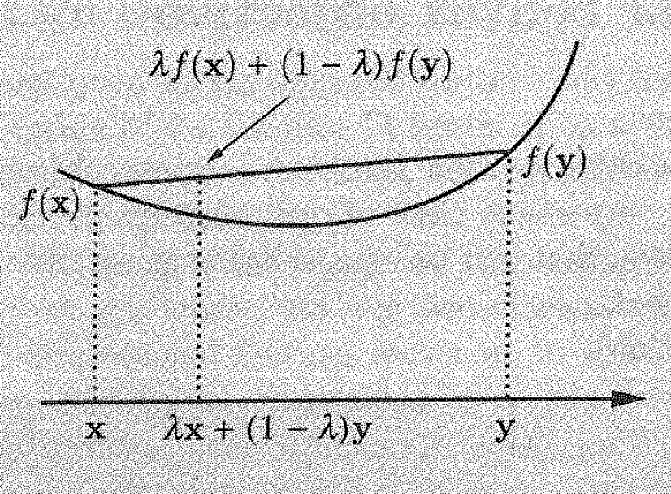

> Illustration of the definition of a convex function

----

A function $f: \Re^n \mapsto \Re$ is called **concave** if for every $\mathbf{x}, \mathbf{y} \in \Re^n$ and every $\lambda \in[0,1]$, we have

$$
f(\lambda \mathbf{x}+(1-\lambda) \mathbf{y}) \geq \lambda f(\mathbf{x})+(1-\lambda) f(\mathbf{y})
$$

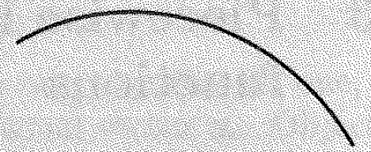

> A concave function

---

We say that a vector $\mathbf{x}$ is a **local minimum** of $f$ if $f(\mathbf{x}) \leq f(\mathbf{y})$ for all $\mathbf{y}$ in the vicinity of $\mathbf{x}$. We also say that $\mathbf{x}$ is a **global minimum** if $f(\mathbf{x}) \leq f(\mathbf{y})$ for all $\mathbf{y}$. A convex function cannot have local minima that fail to be global minima (see Figure 1.1), and this property is of great help in designing efficient optimization algorithms.

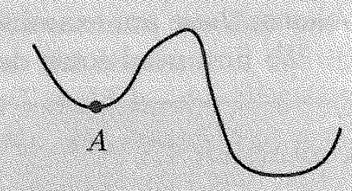

> A function that is neither convex or concave; note that $A$ is local, but not global, minimum

---

#### 几个凸函数的最大值函数仍是凸函数

Let $f_1, \ldots, f_m: \Re^n \mapsto \Re$ be convex functions. Then, the function $f$ defined by $f(x)=\max _{i=1, \ldots, m} f_i(\mathbf{x})$ is also convex.

Proof:

Let $\mathbf{x}, \mathbf{y} \in \Re^n$ and let $\lambda \in[0,1]$. We have

$$
\begin{aligned}
f(\lambda \mathbf{x}+(1-\lambda) \mathbf{y}) & =\max _{i=1, \ldots, m} f_i(\lambda \mathbf{x}+(1-\lambda) \mathbf{y}) \\
& \leq \max _{i=1, \ldots, m}\left(\lambda f_i(\mathbf{x})+(1-\lambda) f_i(\mathbf{y})\right) \\
& \leq \max _{i=1, \ldots, m} \lambda f_i(\mathbf{x})+\max _{i=1, \ldots, m}(1-\lambda) f_i(\mathbf{y}) \\
& =\lambda f(\mathbf{x})+(1-\lambda) f(\mathbf{y})
\end{aligned}
$$

### Piecewise Linear Convex Function

Let $\mathbf{c}_1, \ldots, \mathbf{c}_m$ be vectors in $\Re^n$, let $d_1, \ldots, d_m$ be scalars, and consider the function $f: \Re^n \mapsto \Re$ defined by

$$
f(\mathbf{x})=\max _{i=1, \ldots, m}\left(\mathbf{c}_i^{\prime} \mathbf{x}+d_i\right)
$$

Such a function is convex, as a consequence of the “几个凸函数的最大值函数仍是凸函数”.

A function of the form $\max _{i=1, \ldots, m}\left(\mathbf{c}_i^{\prime} \mathbf{x}+d_i\right)$ is called a piecewise linear convex function. A simple example is the absolute value function defined by $f(x)=|x|=\max \{x,-x\}$. 

As illustrated in Figure 1.2 (b), a piecewise linear convex function can be used to approximate a general convex tunction.

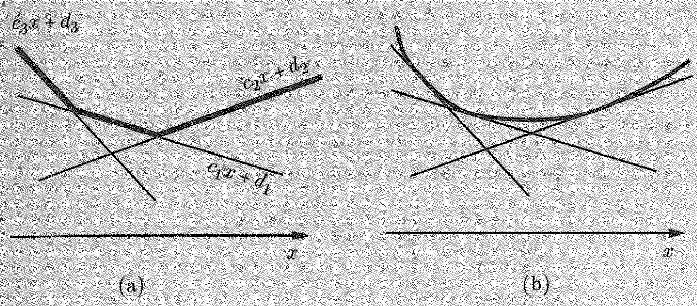

>Figure 1.2: (a) A piecewise linear convex function of a single variable. (b) An approximation of a convex function by a piecewise linear convex function.

# The Geometry of Linear Programming

The main results of this chapter state that a nonempty polyhedron has at least one corner point if and only if it does not contain a line, and if this is the case, the search for optimal solutions to linear programming problems can be restricted to corner points. These results are proved for the most general case of linear programming problems using geometric arguments. The same results will also be proved in the next chapter, for the case of standard form problems, as a corollary of our development of the simplex method.

## Graphical Representation and Solution

### 引例

Consider the problem

$$
\begin{aligned}
\operatorname{minimize} \quad & -x_1-x_2 \\
\text { subject to } \quad & x_1+2 x_2 \leq 3 \\
& 2 x_1+x_2 \leq 3 \\
& x_1, x_2 \geq 0
\end{aligned}
$$

The feasible set is the shaded region in Figure 1.3. 

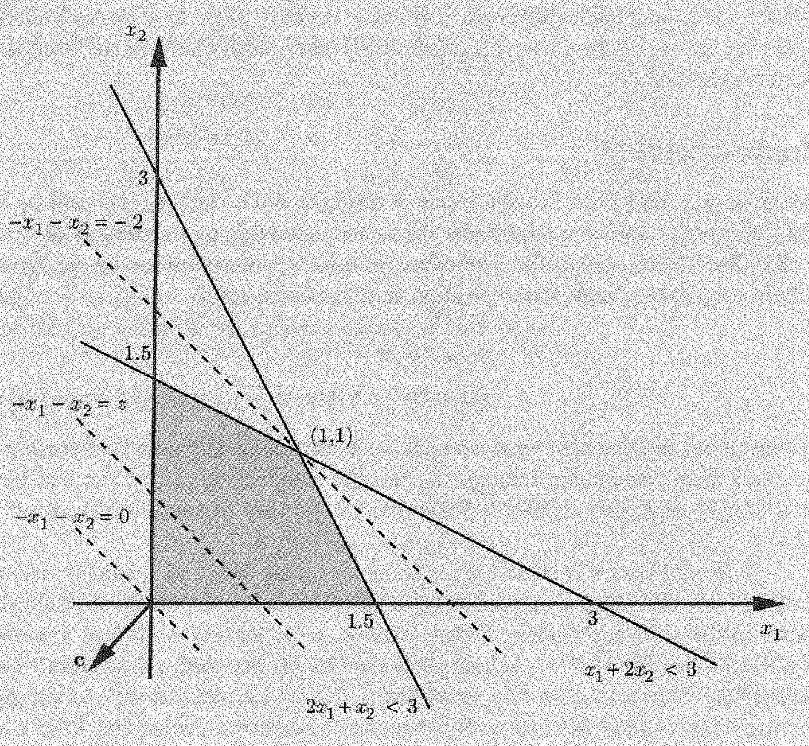

In order to find an optimal solution, we proceed as follows. For any given scalar $z$, we consider the set of all points whose cost $\mathbf{c}^{\prime} \mathbf{x}$ is equal to $z$; this is the line described by the equation $-x_1-x_2=z$. Note that this line is perpendicular to the vector $c=(-1,-1)$. 

>故我们之后常用向量 $c$ 在公式中.

Different values of $z$ lead to different lines, all of them parallel to each other. In particular, increasing $z$ corresponds to moving the line $z=-x_1-x_2$ along the direction of the vector $\mathbf{c}$. Since we are interested in minimizing $z$, we would like to move the line as much as possible in the direction of - $\mathbf{c}$, as long as we do not leave the feasible region. The best we can do is $z=-2$ (see Figure 1.3), and the vector $\mathbf{x}=(1,1)$ is an optimal solution. Note that this is a corner of the feasible set.

For a problem in three dimensions, the same approach can be used except that the set of points with the same value of $\mathbf{c}^{\prime} \mathbf{x}$ is a plane, instead of a line. This plane is again perpendicular to the vector $\mathbf{c}$, and the objective is to slide this plane as much as possible in the direction of $-\mathbf{c}$, as long as we do not leave the feasible set.

----

例:

Suppose that the feasible set is the unit cube, described by the constraints $0 \leq x_i \leq 1, i=1,2,3$, and that $\mathbf{c}=(-1,-1,-1)$. Then, the vector $\mathbf{x}=(1,1,1)$ is an optimal solution. Once more, the optimal solution happens to be a corner of the feasible set (Figure 1.4).

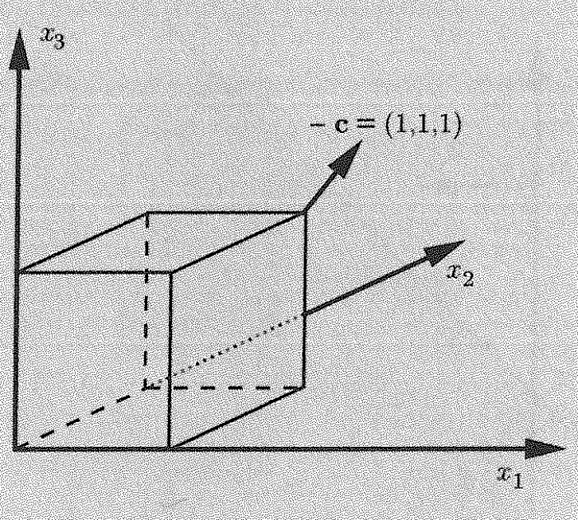

----

In both of the preceding examples, the feasible set is bounded (does not extend to infinity), and the problem has a unique optimal solution. This is not always the case and we have some additional possibilities that are illustrated by the example that follows.

例:

Consider the feasible set in $\Re^2$ defined by the constraints

$$
\begin{array}{r}
-x_1+x_2 \leq 1 \\
x_1 \geq 0 \\
x_2 \geq 0
\end{array}
$$

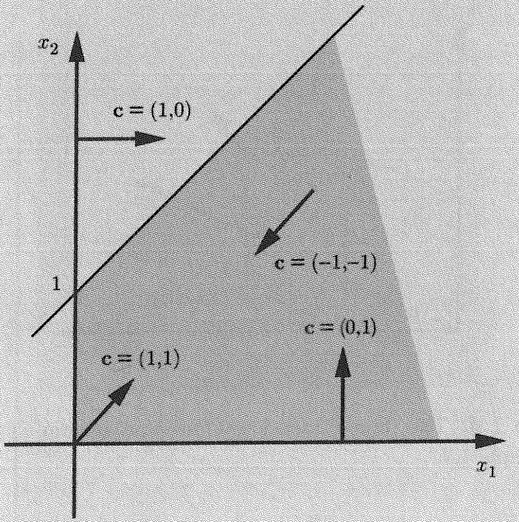

>Figure 1.5: The feasible set in Example 1.8. For each choice of $\mathbf{c}$, an optimal solution is obtained by moving as much as possible in the direction of $-\mathbf{c}$.

则
1. For the cost vector $\mathbf{c}=(1,1)$, it is clear that $\mathbf{x}=(0,0)$ is the unique optimal solution.
2. For the cost vector $\mathbf{c}=(1,0)$, there are multiple optimal solutions, namely, every vector $\mathbf{x}$ of the form $\mathbf{x}=\left(0, x_2\right)$, with $0 \leq x_2 \leq 1$, is optimal. Note that the set of optimal solutions is bounded.
3. For the cost vector $\mathbf{c}=(0,1)$, there are multiple optimal solutions, namely, every vector $\mathbf{x}$ of the form $\mathbf{x}=\left(x_1, 0\right)$, with $x_1 \geq 0$, is optimal. In this case, the set of optimal solutions is unbounded (contains vectors of arbitrarily large magnitude).
4. Consider the cost vector $\mathbf{c}=(-1,-1)$. For any feasible solution $\left(x_1, x_2\right)$, we can always produce another feasible solution with less cost, by increasing the value of $x_1$. Therefore, no feasible solution is optimal. Furthermore, by considering vectors $\left(x_1, x_2\right)$ with ever increasing values of $x_1$ and $x_2$, we can obtain a sequence of feasible solutions whose cost converges to $-\infty$. We therefore say that the optimal cost is $-\infty$.
5. If we impose an additional constraint of the form $x_1+x_2 \leq-2$, it is evident that no feasible solution exists.

### 规律

>不等式约束成为等式约束的意思是: 诸如 $x_1 + x_2 \leq 10$ 这样的不等式取到等, 即 $x_1+x_2=10$

>如果是有限区域，“绿点”中存在有界最优解 (无论什么线性目标函数)

>如果是有限个约束条件，“绿点” 个数有限

总结低维多面体模型共有规律: 每个“绿点” 都是该点所有起作用约束 (不等式成为等式的约束)构成的线性方程组的唯一解

而这里的“绿点”即是“Extreme Points”.

### 有解性

To summarize the insights obtained from Example 1.8, we have the following possibilities:
1. There exists a unique optimal solution.
2. There exist multiple optimal solutions; in this case, the set of optimal solutions can be either bounded or unbounded.
3. The optimal cost is $-\infty$, and no feasible solution is optimal.
4. The feasible set is empty.

In principle, there is an additional possibility: an optimal solution does not exist even though the problem is feasible and the optimal cost is not $-\infty$; this is the case, for example, in the problem of minimizing $1 / x$ subject to $x>0$ (for every feasible solution, there exists another with less cost, but the optimal cost is not $-\infty)$. We will see later in this book that this possibility never arises in linear programming.

------

一般线性规划问题的解可以分成四种情况
1. 有唯一 (有界)最优解
2. 有无穷多个 (有界)最优解
3. 有无界的解
4. 无可行解

有无穷多个 (有界)最优解的例子.

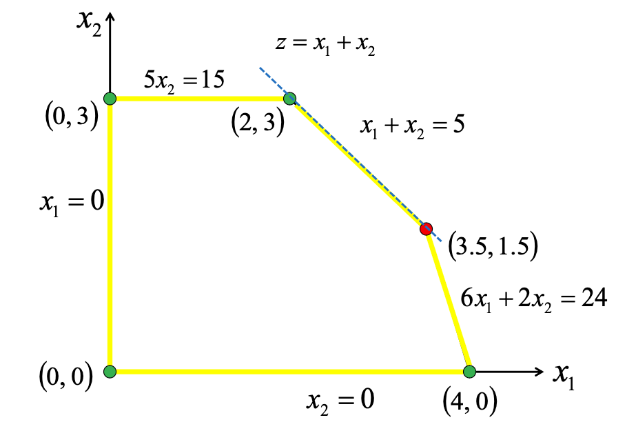

有无界解的例子

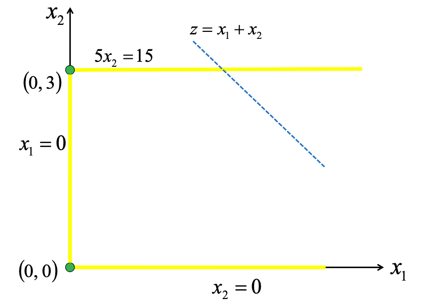

无可行解的例子

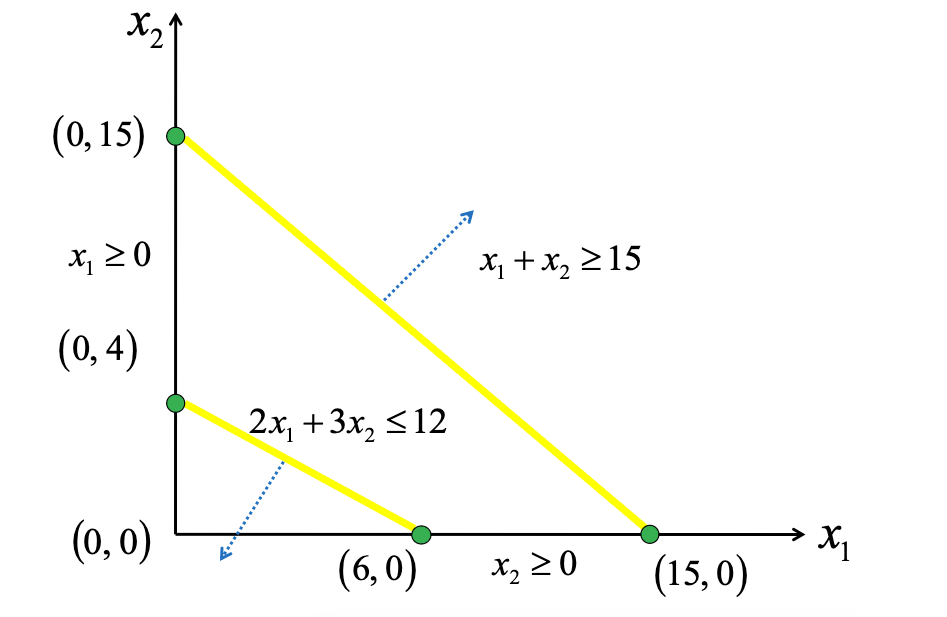

### Visualizing Standard Form Problems

We now discuss a method that allows us to visualize standard form problems even if the dimension $n$ of the vector $\mathbf{x}$ is greater than three. The reason for wishing to do so is that when $n \leq 3$, the feasible set of a standard form problem does not have much variety and does not provide enough insight into the general case. (In contrast, if the feasible set is described by constraints of the form $\mathbf{A x} \geq \mathbf{b}$, enough variety is obtained even if $\mathbf{x}$ has dimension three.)

Suppose that we have a standard form problem, and that the matrix $\mathbf{A}$ has dimensions $m \times n$. In particular, the decision vector $\mathbf{x}$ is of dimension $n$ and we have $m$ equality constraints. We assume that $m \leq n$ and that the constraints $\mathbf{A} \mathbf{x}=\mathbf{b}$ force $\mathbf{x}$ to lie on an $(n-m)$ -dimensional set. (Intuitively, each constraint removes one of the "degrees of freedom" of $\mathbf{x}$.) If we "stand" on that $(n-m)$ -dimensional set and ignore the $m$ dimensions orthogonal to it, the feasible set is only constrained by the linear inequality constraints $x_i \geq 0, i=1, \ldots, n$. In particular, if $n-m=2$, the feasible set can be drawn as a two-dimensional set defined by $n$ linear inequality constraints.

To illustrate this approach, consider the feasible set in $\Re^3$ defined by the constraints $x_1+x_2+x_3=1$ and $x_1, x_2, x_3 \geq 0$ [Figure 1.6 (a)], and note that $n=3$ and $m=1$. If we stand on the plane defined by the constraint $x_1+x_2+x_3=1$, then the feasible set has the appearance of a triangle in two-dimensional space. Furthermore, each edge of the triangle corresponds to one of the constraints $x_1, x_2, x_3 \geq 0$; see Figure 1.6 (b).

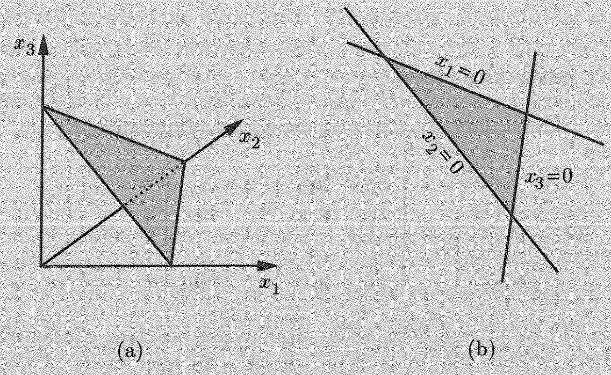

>Figure 1.6: (a) An $n$ -dimensional view of the feasible set. $(\mathrm{b})$ An $(n-m)$ -dimensional view of the same set.

## Extreme Points

We observed in Section $1.4$ that an optimal solution to a linear programming problem tends to occur at a "corner" of the polyhedron over which we are optimizing. In this section, we suggest three different ways of defining the concept of a "corner" and then show that all three definitions are equivalent.

### 定义

#### 几何定义: Extreme Points

Our first definition defines an extreme point of a polyhedron as a point that cannot be expressed as a convex combination of two other elements of the polyhedron, and is illustrated in Figure 2.4. 

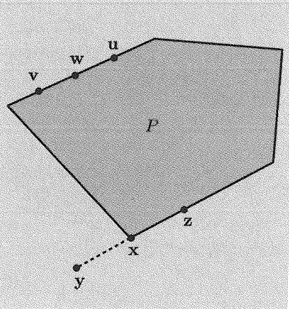

>Figure 2.4: The vector $w$ is not an extreme point because it is a convex combination of $v$ and $u$. The vector $x$ is an extreme point: if $\mathbf{x}=\lambda \mathbf{y}+(1-\lambda) \mathbf{z}$ and $\lambda \in[0,1]$, then either $\mathbf{y} \notin P$, or $\mathbf{z} \notin P$, or $\mathbf{x}=\mathbf{y}$, or $\mathbf{x}=\mathbf{z}$.

**Definition:**

Let $P$ be a polyhedron. A vector $\mathrm{x} \in P$ is an **extreme point** of $P$ if we cannot find two vectors $\mathrm{y}, \mathrm{z} \in P$, both different from $\mathrm{x}$, and a scalar $\lambda \in[0,1]$, such that 

$$
\mathrm{x}=\lambda \mathrm{y}+(1-\lambda) \mathrm{z}
$$

----

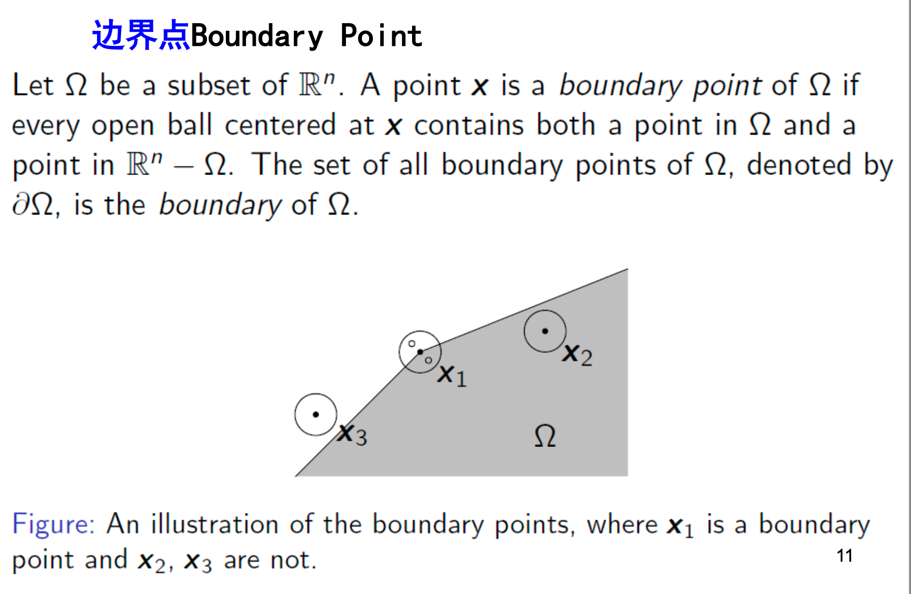

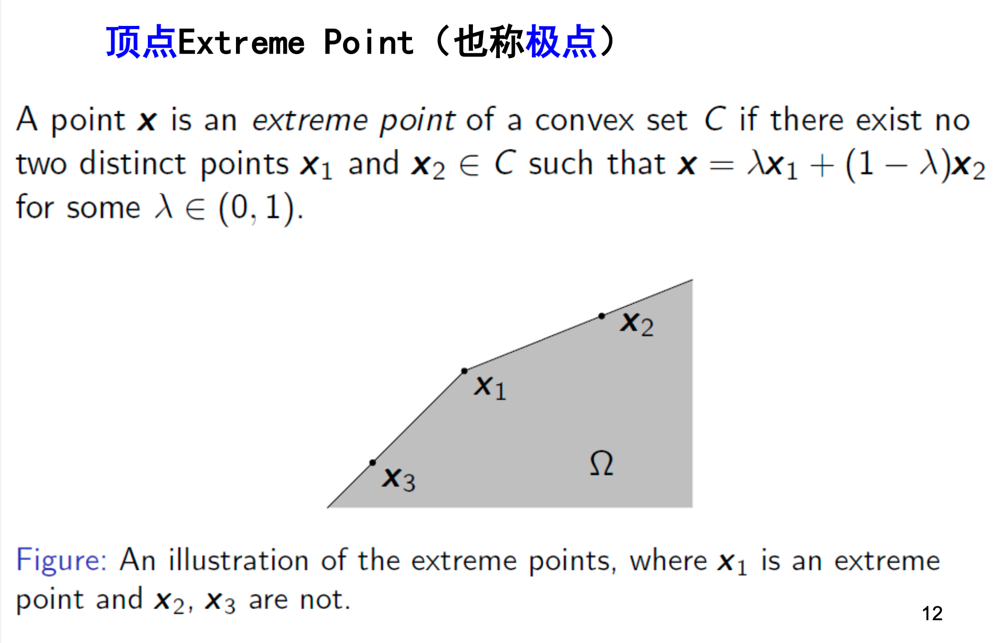

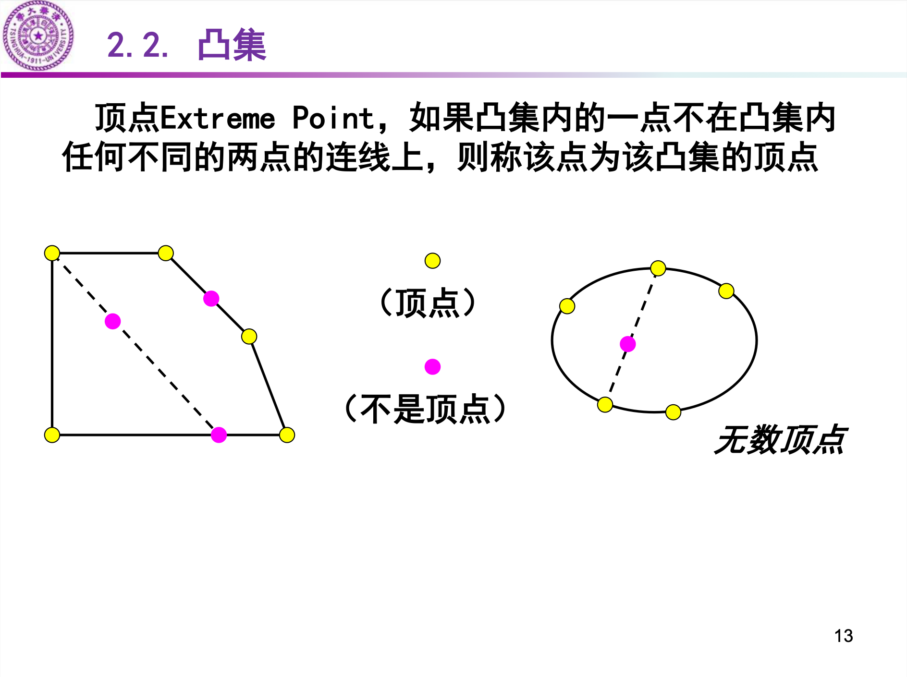

#### 几何定义: Vertex

An alternative geometric definition defines a **vertex** of a polyhedron $P$ as the unique optimal solution to some linear programming problem with feasible set $P$.

Let $P$ be a polyhedron. A vector $\mathrm{x} \in P$ is a **vertex** of $P$ if there exists some $\mathbf{c}$ such that $\mathbf{c}^{\prime} \mathrm{x}<\mathrm{c}^{\prime} y$ for all $\mathrm{y}$ satisfying $\mathrm{y} \in P$ and $\mathrm{y} \neq \mathrm{x}$.

In other words, $\mathrm{x}$ is a vertex of $P$ if and only if $P$ is on one side of a hyperplane (the hyperplane $\left\{\mathbf{y} \mid \mathbf{c}^{\prime} \mathbf{y}=\mathbf{c}^{\prime} \mathbf{x}\right\}$ ) which meets $P$ only at the point x; see Figure $2.5$.

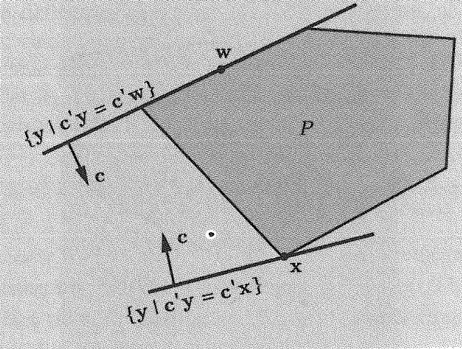

>Figure 2.5: The line at the bottom touches $P$ at a single point and $\mathbf{x}$ is a vertex. On the other hand, $w$ is not a vertex because there is no hyperplane that meets $P$ only at $w$.

# 线性规划的代数观点

## Basic Feasible Solutions

### 线性方程组的基本解 Basic Solution

为了解线性规划问题的解的特性, 首先回忆线性方程组的基本解 Basic Solution.

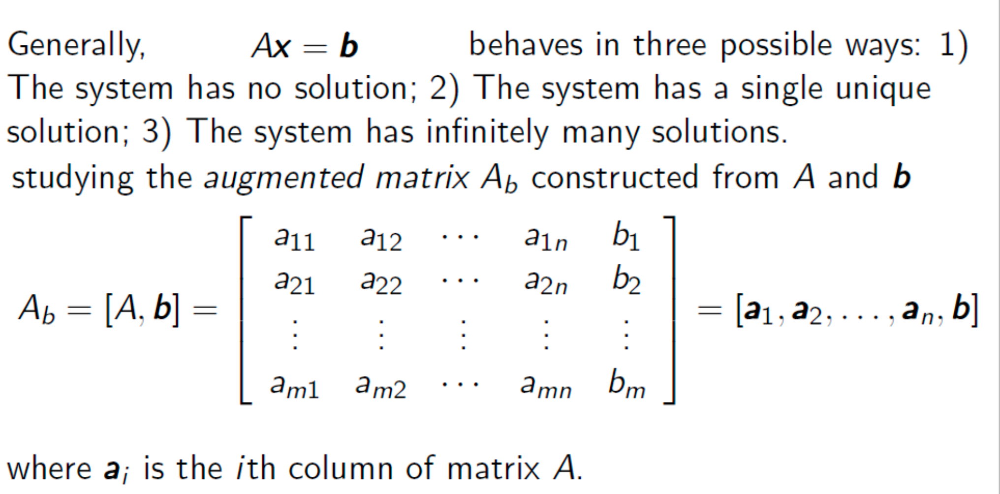

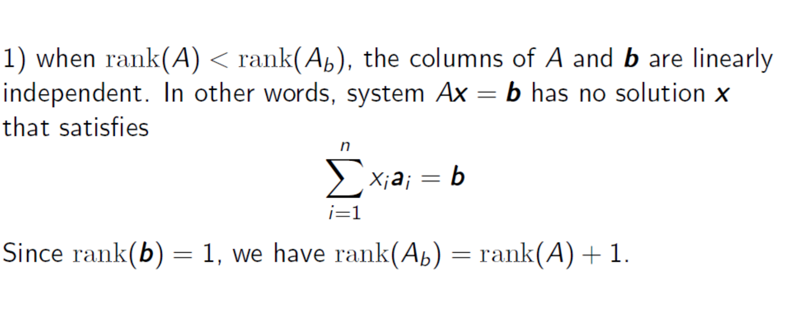

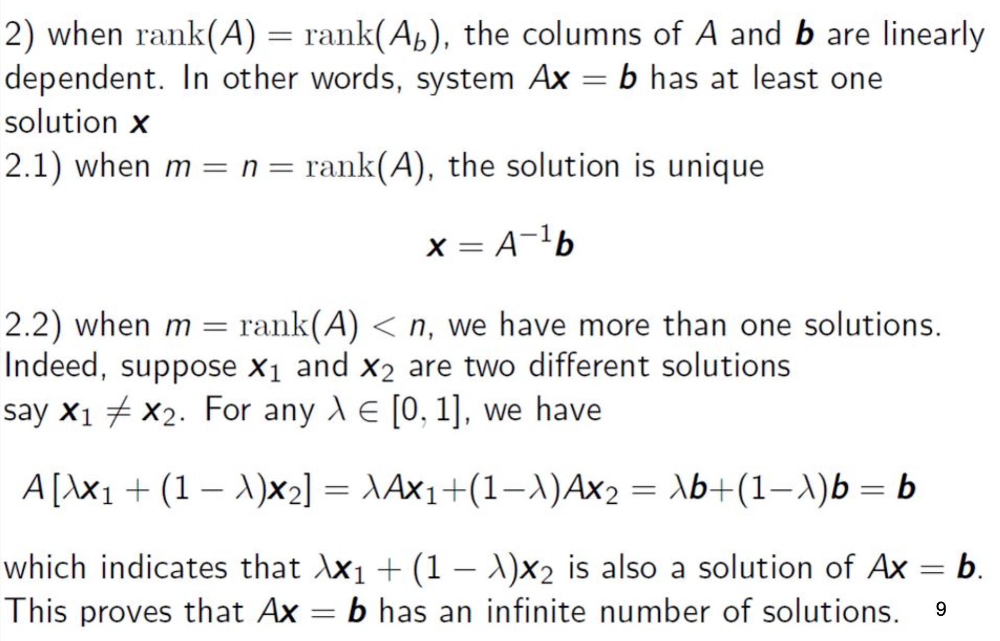

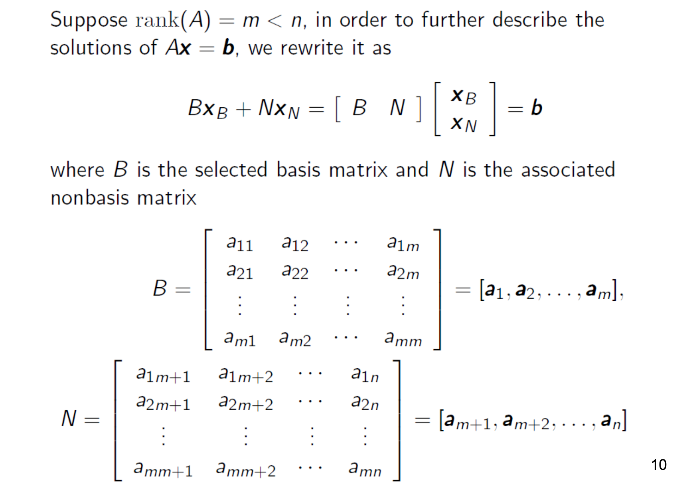

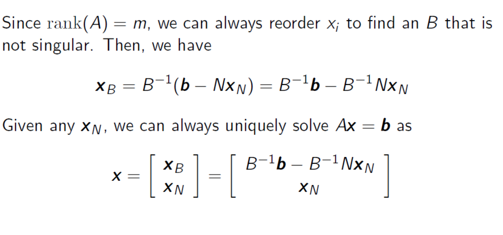

### Extreme Points 的 General 数学描述

在几何层面, 我们这样定义 Extreme Points:

点 $\mathbf{x}$ 属于凸集 $\Omega$, 如果不存在两个不同的点 $\mathbf{x}_1, \mathbf{x}_2 \in \Omega$ 和实数 $\lambda \in[0,1]$, 使得点

$$
\mathbf{x}=\lambda \mathbf{x}_1+(1-\lambda) \mathbf{x}_2
$$

则点 $\mathbf{x}$ 为凸集 $\Omega$ 的极点 (Extreme Point).

#### 视角: Linear Independent 的 Constraints

The two geometric definitions that we have given so far are not easy to work with from an algorithmic point of view. We would like to have a definition that relies on a representation of a polyhedron in terms of linear constraints and which reduces to an algebraic test. In order to provide such a definition, we need some more terminology.

Consider a polyhedron $P \subset \Re^{n}$ defined in terms of the linear equality and inequality constraints

$$
\begin{array}{ll}
\mathbf{a}_{i}^{\prime} \mathrm{x} \geq b_{i}, & i \in M_{1}, \\
\mathbf{a}_{i}^{\prime} \mathrm{x} \leq b_{i}, & i \in M_{2}, \\
\mathbf{a}_{i}^{\prime} \mathrm{x}=b_{i}, & i \in M_{3},
\end{array}
$$

where $M_{1}, M_{2}$, and $M_{3}$ are finite index sets, each $\mathbf{a}_{i}$ is a vector in $\Re^{n}$, and each $b_{i}$ is a scalar. The definition that follows is illustrated in Figure 2.6.

If a vector $\mathrm{x}^{*}$ satisfies $\mathrm{a}_{i}^{\prime} \mathrm{x}^{*}=b_{i}$ for some $i$ in $M_{1}, M_{2}$, or $M_{3}$, we say that the corresponding constraint is **active** or **binding** at $\mathrm{x}^{*}$.

>Figure 2.6: Let $P=\left\{\left(x_{1}, x_{2}, x_{3}\right) \mid x_{1}+x_{2}+x_{3}=1, x_{1}, x_{2}, x_{3} \geq\right.0\}$. There are three constraints that are active at each one of the points $A, B, C$ and $D$. There are only two constraints that are active at point $E$, namely $x_{1}+x_{2}+x_{3}=1$ and $x_{2}=0$.

>注意这是一个斜面, C 点在 $x_2$ 轴上!

----

If there are $n$ constraints that are active at a vector $\mathbf{x}^{*}$, then $\mathbf{x}^{*}$ satisfies a certain system of $n$ linear equations in $n$ unknowns. This system has a unique solution if and only if these $n$ equations are "linearly independent." The result that follows gives a precise meaning to this statement, together with a slight generalization.

>这里的 $n$ unknowns 指的是空间的维度

**Theorem:**

Let $\mathrm{x}^{*}$ be an element of $\Re^{n}$ and let $I=\left\{i \mid \mathrm{a}_{i}^{\prime} \mathrm{x}^{*}=b_{i}\right\}$ be the set of indices of constraints that are active at $\mathrm{x}^{*}$. Then, the following are equivalent:
- There exist $n$ vectors in the set $\left\{\mathbf{a}_i \mid i \in I\right\}$, which are linearly independent.
- The span of the vectors $a_{i}, i \in I$, is all of $\Re^{n}$, that is, every element of $\Re^{n}$ can be expressed as a linear combination of the vectors $a_{i}, i \in I$.
- The system of equations $\mathbf{a}_i^{\prime} \mathbf{x}=b_i, i \in I$, has a unique solution.

Proof:

Suppose that the vectors $\mathbf{a}_{i}, i \in I$, span $\Re^{n}$. Then, the span of these vectors has dimension $n$. $n$ of these vectors form a basis of $\Re^{n}$, and are therefore linearly independent. Conversely, suppose that $n$ of the vectors $\mathbf{a}_{i}, i \in I$, are linearly independent. Then, the subspace spanned by these $n$ vectors is $n$ -dimensional and must be equal to $\Re^{n}$. Hence, every element of $\Re^{n}$ is a linear combination of the vectors $\mathbf{a}_{i}, i \in I$. This establishes the equivalence of (a) and (b).

If the system of equations $\mathbf{a}_{i}^{\prime} \mathbf{x}=b_{i}, i \in I$, has multiple solutions, say $\mathbf{x}^{1}$ and $\mathbf{x}^{2}$, then the nonzero vector $\mathbf{d}=\mathbf{x}^{1}-\mathbf{x}^{2}$ satisfies $\mathbf{a}_{i}^{\prime} \mathbf{d}=0$ for all $i \in I$. Since $\mathrm{d}$ is orthogonal to every vector $\mathbf{a}_{i}, i \in I, \mathrm{~d}$ is not a iinear combination of these vectors and it follows that the vectors $\mathbf{a}_{i}, i \in I$, do not span $\Re^{n}$. Conversely, if the vectors $\mathbf{a}_{i}, i \in I_{i}^{r}$, do not span $\Re^{n}$, choose a nonzero vector $\mathrm{d}$ which is orthogonal to the subspace spanned by these vectors. If $\mathbf{x}$ satisfies $\mathbf{a}_{i}^{\prime} \mathbf{x}=b_{i}$ for all $i \in I$, we also have $\mathbf{a}_{i}^{\prime}(\mathbf{x}+\mathbf{d})=b_{i}$ for all $i \in I$, thus obtaining multiple solutions. We have therefore established that (b) and (c) are equivalent.

----

With a slight abuse of language, we will often say that certain constraints are **linearly independent**, meaning that the corresponding vectors $\mathbf{a}_{i}$ are linearly independent. 

----

We are now ready to provide an algebraic definition of a corner point, as a feasible solution at which there are $n$ linearly independent active constraints. Note that since we are interested in a feasible solution, all equality constraints must be active. This suggests the following way of looking for corner points: first impose the equality constraints and then require that enough additional constraints be active, so that we get a total of $n$ linearly independent active constraints. Once we have $n$ linearly independent active constraints, a unique vector $\mathrm{x}^{*}$ is determined (Theorem 2.2). However, this procedure has no guarantee of leading to a feasible vector $\mathrm{x}^{*}$, because some of the inactive constraints could be violated; in the latter case we say that we have a basic (but not basic feasible) solution.

**Definition:**

Consider a polyhedron $P$ defined by linear equality and inequality constraints, and let $\mathbf{x}^{*}$ be an element of $\Re^{n}$.
1. The vector $\mathrm{x}^{*}$ is a **basic solution** if:
	1. All equality constraints are active;
	2. Out of the constraints that are active at $\mathrm{x}^{*}$, there are $n$ of them that are linearly independent.
2. If $\mathrm{x}^{*}$ is a basic solution that satisfies all of the constraints, we say that it is a **basic feasible solution**.

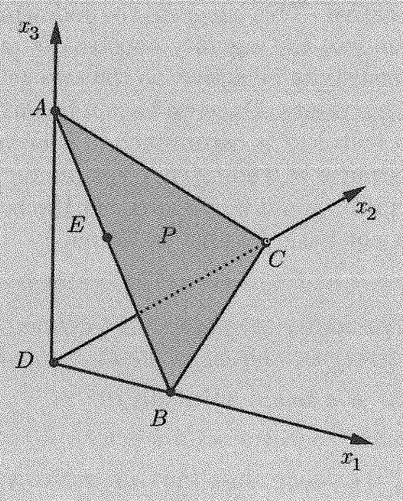

In reference to Figure 2.6, we note that points $A, B$, and $C$ are basic feasible solutions. Point $D$ is not a basic solution because it fails to satisfy the equality constraint. Point $E$ is feasible, but not basic. If the equality constraint $x_{1}+x_{2}+x_{3}=1$ were to be replaced by the constraints $x_{1}+x_{2}+x_{3} \leq 1$ and $x_{1}+x_{2}+x_{3} \geq 1$, then $D$ would be a basic solution, according to our definition. This shows that whether a point is a basic solution or not may depend on the way that a polyhedron is represented. 

> $E$ 不 basic 是因为这是 $R^3$, 而 $E$ 只有两个 constraint

>这里 D 变成 basic solution 是因为 $x_{1}+x_{2}+x_{3}=1$ 不再是一个等式了, 而变成了两个不等式的组合. 由于 $P=\left\{\left(x_{1}, x_{2}, x_{3}\right) \mid x_{1}+x_{2}+x_{3}=1, x_{1}, x_{2}, x_{3} \geq\right.0\}$, 故没有 equality constraint 了, 则 $D$ 也就满足了.

Definition $2.9$ is also illustrated in Figure 2.7.

>Figure 2.7: The points $A, B, C, D, E, F$ are all basic solutions because at each one of them, there are two linearly independent constraints that are active. Points $C, D, E, F$ are basic feasible solutions.

-----

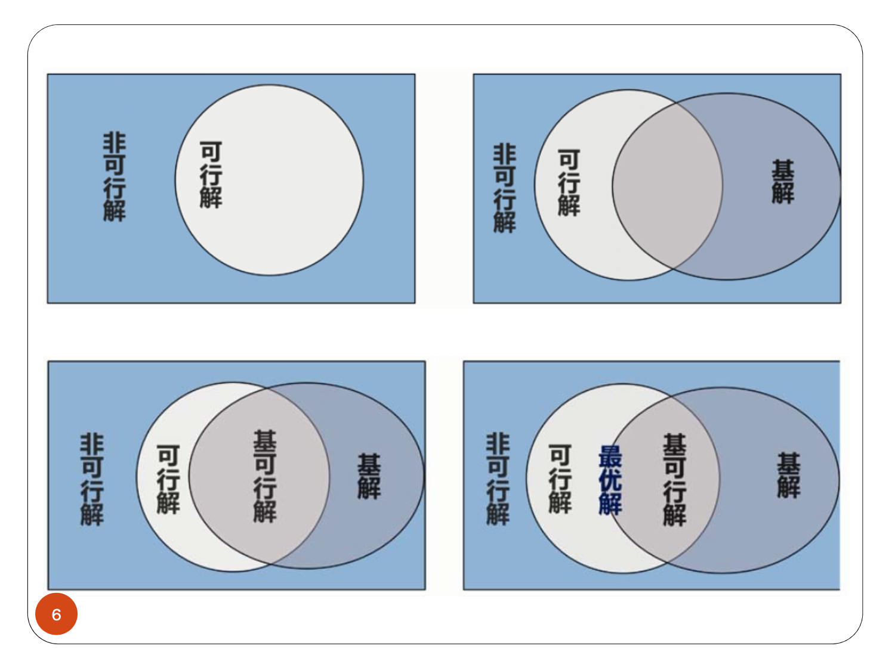

-----

Note that if the number $m$ of constraints used to define a polyhedron $P \subset \Re^{n}$ is less than $n$, the number of active constraints at any given point must also be less than $n$, and there are no basic or basic feasible solutions.

----

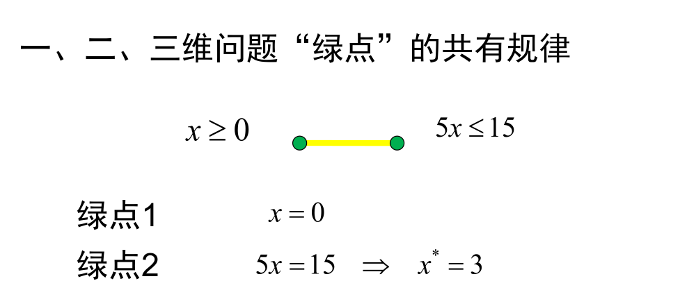

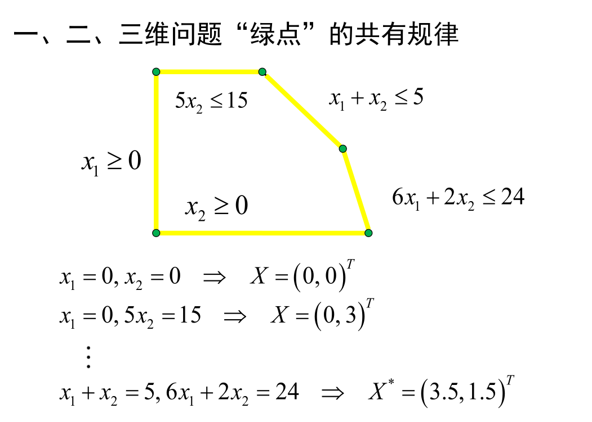

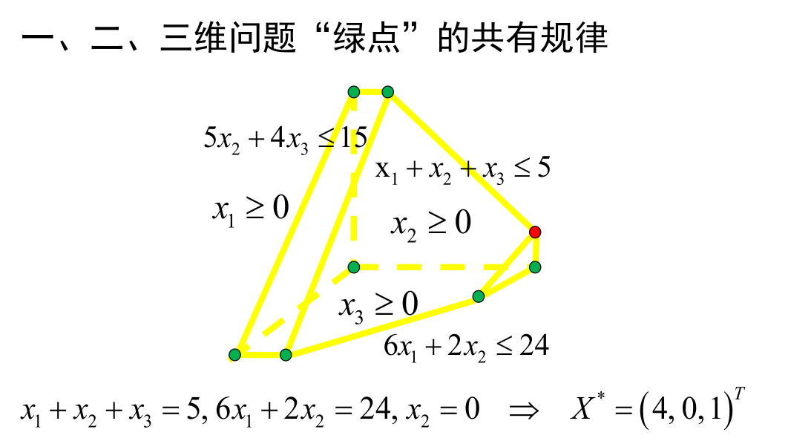

我们发现: 每个“绿点”都是该点所有**起作用约束**（不等式成为等式的约束）**构成的线性方程组的唯一解**

如:

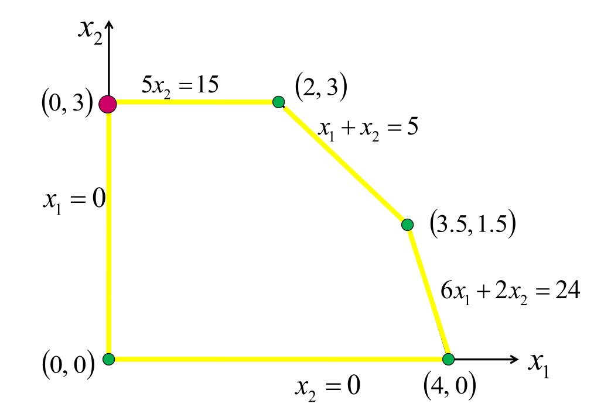

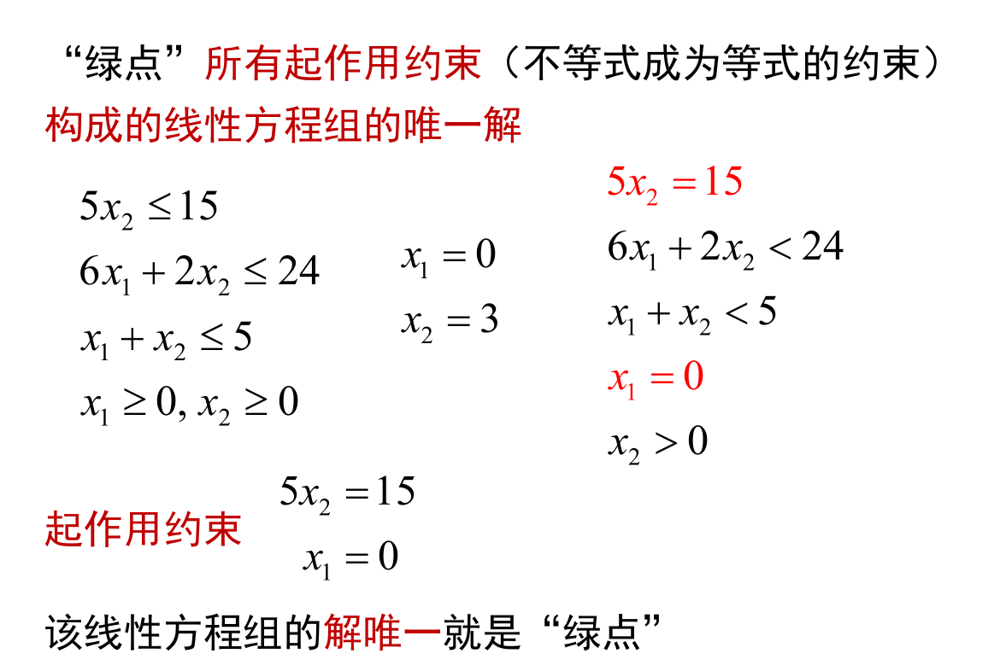

-----

问: 为什么 “绿点”中有最优解?

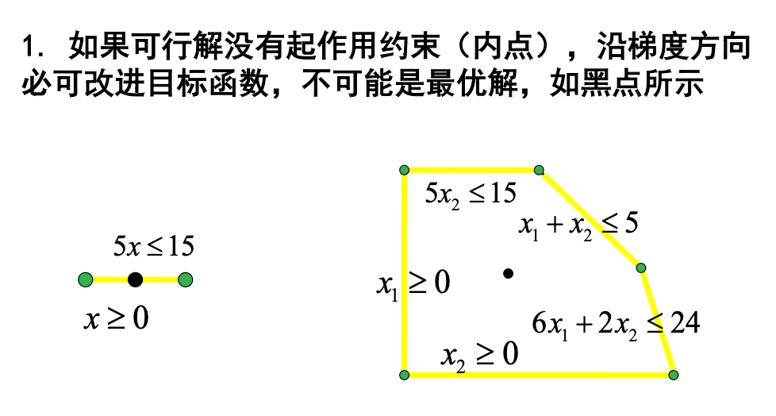

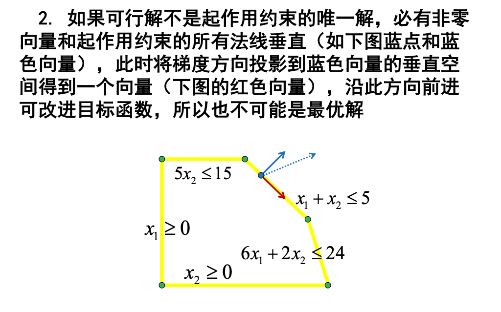

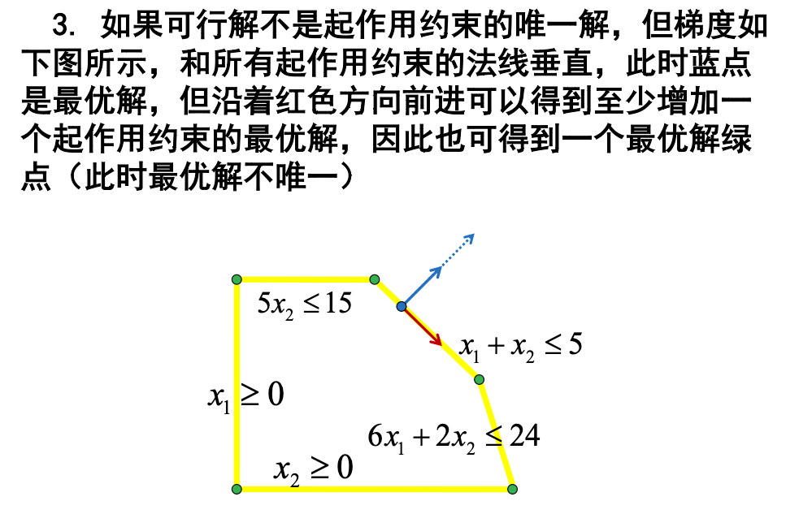

-----

**Adjacent Basic Solutions**

Two distinct basic solutions to a set of linear constraints in $\Re^{n}$ are said to be adjacent if we can find $n-1$ linearly independent constraints that are active at both of them. In reference to Figure 2.7, $D$ and $E$ are adjacent to $B$; also, $A$ and $C$ are adjacent to $D$. If two adjacent basic solutions are also feasible, then the line segment that joins them is called an **edge** of the feasible set.

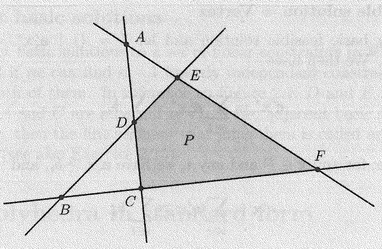

#### 视角: 从矩阵的角度分析

用另一种方式阐述:

Let $\mathbf{a}_i$ be the $i$ th column of $A$, so that

$$
A \mathbf{x}=\mathbf{b} \Longleftrightarrow \sum_{i=1}^n x_i \mathbf{a}_i=\mathbf{b}
$$

Then,

A solution $\mathbf{x}$ of $A \mathbf{x}=\mathbf{b}$ is called a **basic solution** if the vectors $\left\{\mathbf{a}_i: x_i \neq 0\right\}$ are linearly independent.

(That is, columns of $A$ corresponding to non-zero variables $x_i$ are linearly independent.)

A basic solution satisfying $\mathbf{x} \geqslant \mathbf{0}$ is called a **basic feasible solution (BFS)**.

### 几何定义与代数定义等价

We have given so far three different definitions that are meant to capture the same concept; two of them are geometric (extreme point, vertex) and the third is algebraic (basic feasible solution). Fortunately, all three definitions are equivalent as we prove next and, for this reason, the three terms can be used interchangeably.

**Theorem:**

Let $P$ be a nonempty polyhedron and let $\mathbf{x}^{*} \in P$. Then, the following are equivalent:
1. $\mathrm{x}^{*}$ is a vertex;
2. $\mathrm{x}^{*}$ is an extreme point;
3. $\mathrm{x}^{*}$ is a basic feasible solution. 

Proof:

For the purposes of this proof and without loss of generality, we assume that $P$ is represented in terms of constraints of the form $\mathbf{a}_{i}^{\prime} \mathbf{x} \geq b_{i}$ and $\mathbf{a}_{i}^{\prime} \mathbf{x}=b_{i}$.

Vertex $\Rightarrow$ Extreme point

Suppose that $\mathbf{x}^{*} \in P$ is a vertex. Then, by Definition 2.7, there exists some $\mathbf{c} \in \Re^{n}$ such that $\mathbf{c}^{\prime} \mathbf{x}^{*}<\mathbf{c}^{\prime} \mathbf{y}$ for every y satisfying $\mathbf{y} \in P$ and $\mathrm{y} \neq \mathrm{x}^{*}$. If $\mathrm{y} \in P, \mathrm{z} \in P, \mathrm{y} \neq \mathrm{x}^{*}, \mathrm{z} \neq \mathrm{x}^{*}$, and $0 \leq \lambda \leq 1$, then $\mathbf{c}^{\prime} \mathbf{x}^{*}<\mathbf{c}^{\prime} \mathbf{y}$ and $\mathbf{c}^{\prime} \mathbf{x}^{*}<\mathbf{c}^{\prime} \mathbf{z}$, which implies that $\mathbf{c}^{\prime} \mathbf{x}^{*}<\mathbf{c}^{\prime}(\lambda \mathbf{y}+(1-\lambda) \mathbf{z})$ and, therefore, $\mathbf{x}^{*} \neq \lambda \mathbf{y}+(1-\lambda) \mathrm{z}$. Thus, $\mathrm{x}^{*}$ cannot be expressed as a convex combination of two other elements of $P$ and is, therefore, an extreme point (cf. Definition 2.6).

Extreme point $\Rightarrow$ Basic feasible solution

Suppose that $\mathrm{x}^{*} \in P$ is not a basic feasible solution. We will show that $\mathrm{x}^{*}$ is not an extreme point of $P$. Let $I=\left\{i \mid \mathbf{a}_{i}^{\prime} \mathbf{x}^{*}=b_{i}\right\}$. Since $\mathbf{x}^{*}$ is not a basic feasible solution, there do not exist $n$ linearly independent vectors in the family $\mathbf{a}_{i}, i \in I$. Thus, the vectors $\mathbf{a}_{i}, i \in I$, lie in a proper subspace of $\Re^{n}$, and there exists some nonzero vector $\mathrm{d} \in \Re^{n}$ such that $\mathbf{a}_{i}^{\prime} \mathbf{d}=0$, for all $i \in I$. Let $\epsilon$ be a small positive number and consider the vectors $\mathbf{y}=\mathbf{x}^{*}+\epsilon \mathbf{d}$ and $\mathbf{z}=\mathbf{x}^{*}-\epsilon \mathbf{d}$. Notice that $\mathbf{a}_{i}^{\prime} \mathbf{y}=\mathbf{a}_{i}^{\prime} \mathbf{x}^{*}=b_{i}$, for $i \in I$. Furthermore, for $i \notin I$, we have $\mathbf{a}_{i}^{\prime} \mathbf{x}^{*}>b_{i}$ and, provided that $\epsilon$ is small, we will also have $\mathbf{a}_{i}^{\prime} \mathbf{y}>b_{i}$. (It suffices to choose $\epsilon$ so that $\epsilon\left|\mathbf{a}_{i}^{\prime} \mathbf{d}\right|<\mathbf{a}_{i}^{\prime} \mathbf{x}^{*}-b_{i}$ for all $i \notin I$.) Thus, when $\epsilon$ is small enough, $\mathbf{y} \in P$ and, by a similar argument, $\mathbf{z} \in P$. We finally notice that $\mathbf{x}^{*}=(\mathbf{y}+\mathbf{z}) / 2$, which implies that $\mathbf{x}^{*}$ is not an extreme point. 

Basic feasible solution $\Rightarrow$ Vertex

Let $\mathbf{x}^{*}$ be a basic feasible solution and let $I=\left\{i \mid \mathbf{a}_{i}^{\prime} \mathbf{x}^{*}=b_{i}\right\}$. Let $\mathbf{c}=\sum_{i \in I} \mathbf{a}_{i}$. We then have

$$
\mathbf{c}^{\prime} \mathbf{x}^{*}=\sum_{i \in I} \mathbf{a}_{i}^{\prime} \mathbf{x}^{*}=\sum_{i \in I} b_{i}
$$

Furthermore, for any $\mathbf{x} \in P$ and any $i$, we have $\mathbf{a}_{i}^{\prime} \mathbf{x} \geq b_{i}$, and

$$
\mathbf{c}^{\prime} \mathbf{x}=\sum_{i \in I} \mathbf{a}_{i}^{\prime} \mathbf{x} \geq \sum_{i \in I} b_{i}
$$

This shows that $\mathbf{x}^{*}$ is an optimal solution to the problem of minimizing $\mathbf{c}^{\prime} \mathbf{x}$ over the set $P$. Furthermore, equality holds in (2.2) if and only if $\mathbf{a}_{i}^{\prime} \mathbf{x}=b_{i}$ for all $i \in I$. Since $\mathrm{x}^{*}$ is a basic feasible solution, there are $n$ linearly independent constraints that are active at $\mathbf{x}^{*}$, and $\mathbf{x}^{*}$ is the unique solution to the system of equations $\mathbf{a}_{i}^{\prime} \mathbf{x}=b_{i}, i \in I$ (Theorem 2.2). It follows that $\mathbf{x}^{*}$ is the unique minimizer of $\mathbf{c}^{\prime} \mathbf{x}$ over the set $P$ and, therefore, $\mathbf{x}^{*}$ is a vertex of $P$.

----

Since a vector is a basic feasible solution if and only if it is an extreme point, and since the definition of an extreme point does not refer to any particular representation of a polyhedron, we conclude that the property of being a basic feasible solution is also independent of the representation used. (This is in contrast to the definition of a basic solution, which is representation dependent, as pointed out in the discussion that followed Definition 2.9.)

### 性质: Basic Feasible Solution 有限

We finally note the following important fact.

**Corollary:**

Given a finite number of linear inequality constraints, there can only be a finite number of basic or basic feasible solutions.

Proof:

Consider a system of $m$ linear inequality constraints imposed on a vector $\mathbf{x} \in \Re^{n}$. At any basic solution, there are $n$ linearly independent active constraints. Since any $n$ linearly independent active constraints define a unique point, it follows that different basic solutions correspond to different sets of $n$ linearly independent active constraints. Therefore, the number of basic solutions is bounded above by the number of ways that we can choose $n$ constraints out of a total of $m$, which is finite.

----

Although the number of basic and, therefore, basic feasible solutions is guaranteed to be finite, it can be very large. For example, the unit cube $\left\{\mathrm{x} \in \Re^{n} \mid 0 \leq x_{i} \leq 1, i=1, \ldots, n\right\}$ is defined in terms of $2 n$ constraints, but has $2^{n}$ basic feasible solutions. 

## Polyhedra in Standard Form

The definition of a basic solution refers to general polyhedra. We will now specialize to polyhedra in standard form. The definitions and the results in this section are central to the development of the simplex method in the next chapter.

Let $P=\left\{\mathbf{x} \in \Re^{n} \mid \mathbf{A x}=\mathbf{b}, \mathbf{x} \geq 0\right\}$ be a polyhedron in standard form, and let the dimensions of $\mathbf{A}$ be $m \times n$, where $m$ is the number of equality constraints. In most of our discussion of standard form problems, we will make the assumption that the $m$ rows of the matrix $\mathbf{A}$ are linearly independent. (Since the rows are $n$ -dimensional, this requires that $m \leq n$.) At the end of this section, we show that when $P$ is nonempty, linearly dependent rows of $\mathbf{A}$ correspond to redundant constraints that can be discarded; therefore, our linear independence assumption can be made without loss of generality.

Recall that at any basic solution, there must be $n$ linearly independent constraints that are active. Furthermore, every basic solution must satisfy the equality constraints $\mathbf{A x}=\mathbf{b}$, which provides us with $m$ active constraints; these are linearly independent because of our assumption on the rows of $\mathbf{A}$. In order to obtain a total of $n$ active constraints, we need to choose $n-m$ of the variables $x_{i}$ and set them to zero, which makes the corresponding nonnegativity constraints $x_{i} \geq 0$ active. However, for the resulting set of $n$ active constraints to be linearly independent, the choice of these $n-m$ variables is not entirely arbitrary, as shown by the following result.

-----

**Theorem:**

Consider the constraints $\mathrm{Ax}=\mathrm{b}$ and $\mathrm{x} \geq 0$ and assume that the $m \times n$ matrix $\mathbf{A}$ has linearly independent rows. $A$ vector $\mathrm{x} \in \Re^{n}$ is a **basic solution** if and only if we have $\mathrm{Ax}=\mathbf{b}$, and there exist indices $B(1), \ldots, B(m)$ such that:
1. The columns $\mathbf{A}_{B(1)}, \ldots, \mathbf{A}_{B(m)}$ are linearly independent;
2. If $i \neq B(1), \ldots, B(m)$, then $x_{i}=0$.

Proof:

Consider some $\mathbf{x} \in \Re^{n}$ and suppose that there are indices $B(1), \ldots$, $B(m)$ that satisfy (a) and (b) in the statement of the theorem. The active constraints $x_{i}=0, i \neq B(1), \ldots, B(m)$, and $\mathbf{A x}=\mathbf{b}$ imply that

$$
\sum_{i=1}^{m} \mathbf{A}_{B(i)} x_{B(i)}=\sum_{i=1}^{n} \mathbf{A}_{i} x_{i}=\mathbf{A x}=\mathbf{b}
$$

Since the columns $\mathbf{A}_{B(i)}, i=1, \ldots, m$, are linearly independent, $x_{B(1)}, \ldots$, $x_{B(m)}$ are uniquely determined. Thus, the system of equations formed by the active constraints has a unique solution. According to Extreme Points 的性质, there are $n$ linearly independent active constraints, and this implies that $\mathrm{x}$ is a basic solution.

For the converse, we assume that $x$ is a basic solution and we will show that conditions (a) and (b) in the statement of the theorem are satisfied. Let $x_{B(1)}, \ldots, x_{B(k)}$ be the components of $\mathbf{x}$ that are nonzero. Since $\mathbf{x}$ is a basic solution, the system of equations formed by the active constraints $\sum_{i=1}^{n} \mathbf{A}_{i} x_{i}=\mathbf{b}$ and $x_{i}=0, i \neq B(1), \ldots, B(k)$, have a unique solution (cf. Theorem 2.2); 

Equivalently, the equation $\sum_{i=1}^{k} \mathbf{A}_{B(i)} x_{B(i)}=\mathbf{b}$ has a unique solution. It follows that the columns $\mathbf{A}_{B(1)}, \ldots, \mathbf{A}_{B(k)}$ are linearly independent. 

>If they were not, we could find scalars $\lambda_{1}, \ldots, \lambda_{k}$, not all of them zero, such that $\sum_{i=1}^{k} \mathbf{A}_{B(i)} \lambda_{i}=0$. This would imply that $\sum_{i=1}^{k} \mathbf{A}_{B(i)}\left(x_{B(i)}+\lambda_{i}\right)=\mathbf{b}$, contradicting the uniqueness of the solution.

We have shown that the columns $\mathbf{A}_{B(1)}, \ldots, \mathbf{A}_{B(k)}$ are linearly independent and this implies that $k \leq m$. Since $A$ has $m$ linearly independent rows, it also has $m$ linearly independent columns, which $\operatorname{span} \Re^{m}$. It follows [cf. Theorem 1.3 (b) in Section 1.5] that we can find $m-k$ additional columns $\mathbf{A}_{B(k+1)}, \ldots, \mathbf{A}_{B(m)}$ so that the columns $\mathbf{A}_{B(i)}, i=1, \ldots, m$, are linearly independent. In addition, if $i \neq B(1), \ldots, B(m)$, then $i \neq B(1), \ldots, B(k)$ (because $k \leq m$ ), and $x_{i}=0$. Therefore, both conditions (a) and (b) in the statement of the theorem are satisfied.

----


### Procedure for Constructing Basic Solutions

In view of Theorem 2.4, all basic solutions to a standard form polyhedron can be constructed according to the following procedure.

1. Choose $m$ linearly independent columns $A_{B(1)}, \ldots, A_{B(m)}$.
2. Let $x_{i}=0$ for all $i \neq B(1), \ldots, B(m)$.
3. Solve the system of $m$ equations $A \mathrm{x}=\mathrm{b}$ for the unknowns $x_{B(1)}$, $\ldots, x_{B(m)}$

### Basis Variables and Basis Matrix

If a basic solution constructed according to this procedure is nonnegative, then it is feasible, and it is a basic feasible solution. Conversely, since every basic feasible solution is a basic solution, it can be obtained from this procedure. 

If $\mathbf{x}$ is a basic solution, the variables $x_{B(1)}, \ldots, x_{B(m)}$ are called **basic variables**; the remaining variables are called **nonbasic**. The columns $\mathbf{A}_{B(1)}, \ldots, \mathbf{A}_{B(m)}$ are called the **basic columns** and, since they are linearly independent, they form a basis of $\Re^{m}$. 

We will sometimes talk about two bases being *distinct* or *different*; our convention is that distinct bases involve different sets $\{B(1), \ldots, B(m)\}$ of basic indices; if two bases involve the same set of indices in a different order, they will be viewed as one and the same basis.

----

By arranging the $m$ basic columns next to each other, we obtain an $m \times m$ matrix $\mathbf{B}$, called a **basis matrix**. (Note that this matrix is invertible because the basic columns are required to be linearly independent.) We can similarly define a vector $\mathbf{x}_{B}$ with the values of the basic variables. 

Thus,

$$
\mathbf{B}=\left[\begin{array}{cccc}
\mid & \mid & & \mid \\
\mathbf{A}_{B(1)} & \mathbf{A}_{B(2)} & \cdots & \mathbf{A}_{B(m)} \\
\mid & \mid & & \mid
\end{array}\right], \quad \mathbf{x}_{B}=\left[\begin{array}{c}
x_{B(1)} \\
\vdots \\
x_{B(m)}
\end{array}\right]
$$

The basic variables are determined by solving the equation $\mathrm{Bx}_{B}=\mathbf{b}$ whose unique solution is given by

$$
\mathrm{x}_{B}=\mathrm{B}^{-1} \mathrm{~b}
$$

-----


------

例:

Let the constraint $\mathbf{A x}=\mathrm{b}$ be of the form

$$
\left[\begin{array}{lllllll}
1 & 1 & 2 & 1 & 0 & 0 & 0 \\
0 & 1 & 6 & 0 & 1 & 0 & 0 \\
1 & 0 & 0 & 0 & 0 & 1 & 0 \\
0 & 1 & 0 & 0 & 0 & 0 & 1
\end{array}\right] \mathbf{x}=\left[\begin{array}{r}
8 \\
12 \\
4 \\
6
\end{array}\right]
$$

Let us choose $\mathbf{A}_{4}, \mathbf{A}_{5}, \mathbf{A}_{6}, \mathbf{A}_{7}$ as our basic columns. Note that they are linearly independent and the corresponding basis matrix is the identity. 

We then obtain the basic solution $\mathrm{x}=(0,0,0,8,12,4,6)$ which is nonnegative and, therefore, is a basic feasible solution. 

Another basis is obtained by choosing the columns $\mathbf{A}_{3}, \mathbf{A}_{5}, \mathbf{A}_{6}, \mathbf{A}_{7}$ (note that they are linearly independent). The corresponding basic solution is $\mathbf{x}=(0,0,4,0,-12,4,6)$, which is not feasible because $x_{5}=$ $-12<0$.

Suppose now that there was an eighth column $\mathbf{A}_{8}$, identical to $\mathbf{A}_{7}$. Then, the two sets of columns $\left\{\mathbf{A}_{3}, \mathbf{A}_{5}, \mathbf{A}_{6}, \mathbf{A}_{7}\right\}$ and $\left\{\mathbf{A}_{3}, \mathbf{A}_{5}, \mathbf{A}_{6}, \mathbf{A}_{8}\right\}$ coincide. On the other hand the corresponding sets of basic indices, which are $\{3,5,6,7\}$ and $\{3,5,6,8\}$, are different and we have two different bases, according to our conventions.

----

For an intuitive view of basic solutions, recall our interpretation of the constraint $\mathbf{A x}=\mathbf{b}$, or $\sum_{i=1}^{n} \mathbf{A}_{i} x_{i}=\mathbf{b}$, as a requirement to synthesize the vector $\mathbf{b} \in \Re^{m}$ using the resource vectors $\mathbf{A}_{i}$ (Section 1.1). In a basic solution, we use only $m$ of the resource vectors, those associated with the basic variables. Furthermore, in a basic feasible solution, this is accomplished using a nonnegative amount of each basic vector; see Figure $2.8$. 


>Figure 2.8: Consider a standard form problem with $n=4$ and $m=2$, and let the vectors $\mathbf{b}, \mathbf{A}_{1}, \ldots, \mathbf{A}_{4}$ be as shown. The vectors $\mathbf{A}_{1}, \mathbf{A}_{2}$ form a basis; the corresponding basic solution is infeasible because a negative value of $x_{2}$ is needed to synthesize $\mathbf{b}$ from $\mathbf{A}_{1}$, $\mathbf{A}_{2}$. The vectors $\mathbf{A}_{1}, \mathbf{A}_{3}$ form another basis; the corresponding basic solution is feasible. Finally, the vectors $\mathbf{A}_{1}, \mathbf{A}_{4}$ do not form a basis because they are linearly dependent.

-----


-----


在这三个顶点中, 很容易判断其中谁是最优解.

----

例:

某线性规划问题的约束条件为：

$$
\begin{aligned}
-2 x_1+2 x_2+x_3&=4 \\
3 x_1+x_2+x_4&=6 \\
x_j \geq 0, j=1,2,3,4
\end{aligned}
$$

问变量 $x_2, x_4$ 所对应的列向量 $\mathbf{P}_2, \mathbf{P}_4$ 是否构成可行基阵? 若是, 写出 $\mathbf{B}, \mathbf{N}$, 并求出 $\mathrm{B}$ 对应的基本可行解。

解:

将该标准型线性规划问题化为矩阵形式:

$$
\left(\begin{array}{rrrr}
-2 & 2 & 1 & 0 \\
3 & 1 & 0 & 1
\end{array}\right) \vec{x}=\left(\begin{array}{l}
4 \\
6
\end{array}\right)
$$

而 $\mathbf{P}_2, \mathbf{P}_4$ 线性无关, 有:
$$
\mathbf{B}=[\mathbf{P}_2, \mathbf{P}_4]=\left(\begin{array}{ll}
2 & 0 \\
1 & 1
\end{array}\right)
$$
且
$$
\mathbf{N}=[\mathbf{P}_1, \mathbf{P}_3]=\left(\begin{array}{cc}
-2 & 1 \\
3 & 0
\end{array}\right)
$$
而
$$
\mathbf{B}^{-1} \vec{b}=\left(\begin{array}{cc}
\frac{1}{2} & 0 \\
-\frac{1}{2} & 1
\end{array}\right)\left(\begin{array}{l}
4 \\
6
\end{array}\right)=\left(\begin{array}{l}
2 \\
4
\end{array}\right)>0
$$
故 $\mathbf{P}_2, \mathbf{P}_4$ 构成可行基阵.

>注: 不能直接因为 $\mathbf{P}_2, \mathbf{P}_4$ 线性无关就觉得它们可以构成, 而一定要这里解出来发现最后大于 0 之后才可以!

而 $\mathbf{B}$ 对应的基本可行解为:
$$
\left(\begin{array}{llll}
0 & 2 & 0 & 4
\end{array}\right)^{\top}
$$

#### Correspondence of Bases and Basic Solutions

We now elaborate on the correspondence between basic solutions and bases. Different basic solutions must correspond to different bases, because a basis uniquely determines a basic solution. However, two different bases may lead to the same basic solution. (For an extreme example, if we have $\mathbf{b}=\mathbf{0}$, then every basis matrix leads to the same basic solution, namely, the zero vector.) This phenomenon has some important algorithmic implications, and is closely related to degeneracy, which is the subject of the next section.

#### Adjacent Basic Solutions and Adjacent Bases

Recall that two distinct basic solutions are said to be adjacent if there are $n-1$ linearly independent constraints that are active at both of them. For standard form problems, we also say that two bases are **adjacent** if they share all but one basic column. Then, it is not hard to check that adjacent basic solutions can always be obtained from two adjacent bases. Conversely, if two adjacent bases lead to distinct basic solutions, then the latter are adjacent.

In reference to Example 2.1, the bases $\left\{\mathbf{A}_{4}, \mathbf{A}_{5}, \mathbf{A}_{6}, \mathbf{A}_{7}\right\}$ and $\left\{\mathbf{A}_{3}, \mathbf{A}_{5}, \mathbf{A}_{6}, \mathbf{A}_{7}\right\}$ are adjacent because all but one columns are the same. The corresponding basic solutions $\mathbf{x}=(0,0,0,8,12,4,6)$ and $\mathbf{x}=(0,0,4,0,-12,4,6)$ are adjacent: we have $n=7$ and a total of six common linearly independent active constraints; these are $x_{1} \geq 0, x_{2} \geq 0$, and the four equality constraints.

#### The Full Row Rank Assumption on A

We close this section by showing that the full row rank assumption on the matrix $\mathbb{A}$ results in no loss of generality.

**Theorem:**

Let $P=\{\mathrm{x} \mid \mathbf{A x}=\mathbf{b}, \mathrm{x} \geq \mathbf{0}\}$ be a nonempty polyhedron, where $\mathrm{A}$ is a matrix of dimensions $m \times n$, with rows $\mathrm{a}_{1}^{\prime}, \ldots, \mathrm{a}_{m}^{\prime}$. Suppose that $\operatorname{rank}(\mathrm{A})=k<m$ and that the rows $\mathrm{a}_{i_{1}}^{\prime}, \ldots, \mathrm{a}_{i_{k}}^{\prime}$ are linearly independent. Consider the polyhedron

$$
Q=\left\{x \mid a_{i_{1}}^{\prime} \mathrm{x}=b_{i_{1}}, \ldots, \mathrm{a}_{i_{k}}^{\prime} \mathrm{x}=b_{i_{k}}, \mathrm{x} \geq 0\right\}
$$

Then $Q=P$.

Proof:

We provide the proof for the case where $i_{1}=1, \ldots, i_{k}=k$, that is, the first $k$ rows of $\mathbf{A}$ are linearly independent. The general case can be reduced to this one by rearranging the rows of $\mathbf{A}$.

Clearly $P \subset Q$ since any element of $P$ automatically satisfies the constraints defining $Q$. We will now show that $Q \subset P$.

Since $\operatorname{rank}(\mathbf{A})=k$, the row space of $\mathbf{A}$ has dimension $k$ and the rows $\mathbf{a}_{1}^{\prime}, \ldots, \mathbf{a}_{k}^{\prime}$ form a basis of the row space. Therefore, every row $\mathbf{a}_{i}^{\prime}$ of $\mathbf{A}$ can be expressed in the form $\mathbf{a}_{i}^{\prime}=\sum_{j=1}^{k} \lambda_{i j} \mathbf{a}_{j}^{\prime}$, for some scalars $\lambda_{i j}$. Let $\mathbf{x}$ be an element of $P$ and note that

$$
b_{i}=\mathbf{a}_{i}^{\prime} \mathbf{x}=\sum_{j=1}^{k} \lambda_{i j} \mathbf{a}_{j}^{\prime} \mathbf{x}=\sum_{j=1}^{k} \lambda_{i j} b_{j}, \quad i=1, \ldots, m
$$

Consider now an element $y$ of $Q$. We will show that it belongs to $P$. Indeed, for any $i$,

$$
\mathbf{a}_{i}^{\prime} \mathbf{y}=\sum_{j=1}^{k} \lambda_{i j} \mathbf{a}_{j}^{\prime} \mathbf{y}=\sum_{j=1}^{k} \lambda_{i j} b_{j}=b_{i}
$$

which estabiishes that $\mathbf{y} \in P$ and $Q \subset P$.

----

Notice that the polyhedron $Q$ in Theorem $2.5$ is in standard form; namely, $Q=\{\mathbf{x} \mid \mathbf{D x}=\mathbf{f}, \mathbf{x} \geq \mathbf{0}\}$ where $\mathbf{D}$ is a $k \times n$ submatrix of $\mathbf{A}$, with rank equal to $k$, and $\mathbf{f}$ is a $k$ -dimensional subvector of $\mathbf{b}$. We conclude that as long as the feasible set is nonempty, a linear programming proilem in standard form can be redeced to an equivalent standard form problem (with the same feasible set) in which the equality constraints are linearly independent. 

### 线性规划问题的基本定理

线性规划问题的基本定理:
1. 一个标准模型的线性规划问题若有可行解, 则至少存在一个基本可行解
2. 一个标准模型的线性规划问题若有有限的最优目标值, 这一定存在一个基本可行解是最优解.


#### Existence of Extreme Points

We obtain in this section necessary and sufficient conditions for a polyhedron to have at least one extreme point. 

We first observe that not every polyhedron has this property. For example, if $n>1$, a halfspace in $\Re^{n}$ is a polyhedron without extreme points. Also, as argued in Section $2.2$ (cf. the discussion after Definition 2.9), if the matrix $\mathbf{A}$ has fewer than $n$ rows, then the polyhedron $\left\{\mathbf{x} \in \Re^{n} \mid \mathbf{A x} \geq \mathbf{b}\right\}$ does not have a basic feasible solution. 

>注意要和上边讨论的 Standard Form 的 Polyhedra 区分开

----

It turns out that the existence of an extreme point depends on whether a polyhedron contains an infinite line or not; see Figure 2.13. 


>Figure 2.13: The polyhedron $P$ contains a line and does not have an extreme point, while $Q$ does not contain a line and has extreme points.

----

We need the following definition.

**Definition:**

A polyhedron $P \subset \Re^{n}$ **contains a line** if there exists a vector $\mathrm{x} \in P$ and a nonzero vector $\mathrm{d} \in \Re^{n}$ such that $\mathrm{x}+\lambda \mathrm{d} \in P$ for all scalars $\lambda$.

-----

Suppose that the polyhedron $P=\left\{x \in \Re^{n} \mid \mathrm{a}_{i}^{\prime} \mathrm{x} \geq b_{i}, i=1, \ldots, m\right\}$ is nonempty. Then, the following are equivalent:
1. The polyhedron $P$ has at least one extreme point.
2. The polyhedron $P$ does not contain a line.
3. There exist $n$ vectors out of the family $\mathrm{a}_{1}, \ldots, \mathbf{a}_{m}$, which are linearly independent.

Proof:

We first prove that if $P$ does not contain a line, then it has a basic feasible solution and, therefore, an extreme point. A geometric interpretation of this proof is provided in Figure $2.14$.


>Figure 2.14: Starting from an arbitrary point of a polyhedron, we choose a direction along which all currently active constraints remain active. We then move along that direction until a new constraint is about to be violated. At that point, the number of linearly independent active constraints has increased by at least one. We repeat this procedure until we end up with $n$ linearly independent active constraints, at which point we have a basic feasible solution.

Let $\mathbf{x}$ be an element of $P$ and let $I=\left\{i \mid \mathbf{a}_{i}^{\prime} \mathbf{x}=b_{i}\right\}$. If $n$ of the vectors $\mathbf{a}_{i}, i \in I$, corresponding to the active constraints are linearly independent, then $\mathrm{x}$ is, by definition, a basic feasible solution and, therefore, a basic feasible solution exists. If this is not the case, then all of the vectors $\mathbf{a}_{i}$, $i \in I$, lie in a proper subspace of $\Re^{n}$ and there exists a nonzero vector $\mathrm{d} \in \Re^{n}$ such that $\mathbf{a}_{i}^{\prime} \mathbf{d}=0$, for every $i \in I$. Let us consider the line consisting of all points of the form $\mathbf{y}=\mathbf{x}+\lambda \mathrm{d}$, where $\lambda$ is an arbitrary scalar. For $i \in I$, we have $\mathbf{a}_{i}^{\prime} \mathbf{y}=\mathbf{a}_{i}^{\prime} \mathbf{x}+\lambda \mathbf{a}_{i}^{\prime} \mathbf{d}=\mathbf{a}_{i}^{\prime} \mathbf{x}=b_{i}$. Thus, those constraints that were active at $\mathrm{x}$ remain active at all points on the line. However, since the polyhedron is assumed to contain no lines, it follows that as we vary $\lambda$, some constraint will be eventually violated. At the point where some constraint is about to be violated, a new constraint must become active, and we conclude that there exists some $\lambda^{*}$ and some $j \notin I$ such that $\mathbf{a}_{j}^{\prime}\left(\mathbf{x}+\lambda^{*} \mathbf{d}\right)=b_{j}$.

We claim that $\mathbf{a}_{j}$ is not a linear combination of the vectors $\mathbf{a}_{i}, i \in I$. Indeed, we have $\mathbf{a}_{j}^{\prime} \mathbf{x} \neq b_{j}$ (because $\left.j \notin I\right)$ and $\mathbf{a}_{j}^{\prime}\left(\mathbf{x}+\lambda^{*} \mathbf{d}\right)=b_{j}$ (by the definition of $\lambda^{*}$ ). Thus, $\mathbf{a}_{j}^{\prime} \mathbf{d} \neq 0$. On the other hand, $\mathbf{a}_{i}^{\prime} \mathbf{d}=0$ for every $i \in I$ (by the definition of $\mathbf{d}$ ) and therefore, $\boldsymbol{d}$ is orthogonal to any linear combination of the vectors $\mathbf{a}_{i}, i \in I$. Since $\mathbf{d}$ is not orthogonal to $\mathbf{a}_{j}$, we conclude that $\mathbf{a}_{j}$ is a not a linear combination of the vectors $\mathbf{a}_{i}, i \in I$. Thus, by moving from $\mathrm{x}$ to $\mathrm{x}+\lambda^{*} \mathrm{~d}$, the number of linearly independent active constraints has been increased by at least one. By repeating the same argument, as many times as needed, we eventually end up with a point at which there are $n$ linearly independent active constraints. Such a point is, by definition, a basic solution; it is also feasible since we have stayed within the feasible set.

(a) $\Rightarrow$ (c)

If $P$ has an extreme point $\mathrm{x}$, then $\mathrm{x}$ is also a basic feasible solution (cf. Theorem 2.3), and there exist $n$ constraints that are active at $\mathbf{x}$, with the corresponding vectors $\mathbf{a}_{i}$ being linearly independent.

(c) $\Rightarrow$ (b)

Suppose that $n$ of the vectors $a_{i}$ are linearly independent and, without loss of generality, let us assume that $\mathbf{a}_{1}, \ldots, \mathbf{a}_{n}$ are linearly independent. Suppose that $P$ contains a line $\mathbf{x}+\lambda \mathbf{d}$, where $\mathbf{d}$ is a nonzero vector. We then have $\mathbf{a}_{i}^{\prime}(\mathbf{x}+\lambda \mathbf{d}) \geq b_{i}$ for all $i$ and all $\lambda$. We conclude that $\mathbf{a}_{i}^{\prime} \mathbf{d}=0$ for all $i$. (If $\mathbf{a}_{i}^{\prime} \mathbf{d}<0$, we can violate the constraint by picking $\lambda$ very large; $a$ symmetric argument applies if $\mathbf{a}_{i}^{\prime} \mathbf{d}>0$.) Since the vectors $\mathbf{a}_{i}, i=1, \ldots, n$, are linearly independent, this implies that $d=0$. This is a contradiction and establishes that $P$ does not contain a line.

-----

Notice that a bounded polyhedron does not contain a line. Similarly, the pesitive orthant $\{x \mid x \geq 0\}$ does not contain a line. Since a polyhedron in standard form is contained in the positive orthant, it does not contain a line either. These observations establish the following important corollary of Theorem $2.6$.

**Corollary:**

Every nonempty bounded polyhedron and every nonempty polyhedron in standard form has at least one basic feasible solution.

----


#### Optimality of Extreme Points

Having established the conditions for the existence of extreme points, we will now confirm the intuition developed in Chapter 1: as long as a linear programming problem has an optimal solution and as long as the feasible set has at least one extreme point, we can always find an optimal solution within the set of extreme points of the feasible set. Later in this section, we prove a somewhat stronger result, at the expense of a more complicated proof.

----

**Theorem:**

Consider the linear programming problem of minimizing $c^{\prime} \mathbf{x}$ over a polyhedron $P$. Suppose that $P$ has at least one extreme point and that there exists an optimal solution. Then, there exists an optimal solution which is an extreme point of $P$.

Proof:

(See Figure $2.15$ for an illustration.) 


>Figure 2.15: Illustration of the proof of Theorem 2.7. Here, $Q$ is the set of optimal solutions and an extreme point $\mathbf{x}^{*}$ of $Q$ is also an extreme point of $P$. 

Let $Q$ be the set of all optimal solutions, which we have assumed to be nonempty. Let $P$ be of the form $P=\left\{\mathbf{x} \in \Re^{n} \mid \mathbf{A x} \geq \mathbf{b}\right\}$ and let $v$ be the optimal value of the cost $\mathbf{c}^{\prime} \mathbf{x}$. Then, $Q=\left\{\mathbf{x} \in \Re^{n} \mid \mathbf{A x} \geq \mathbf{b}, \mathbf{c}^{\prime} \mathbf{x}=v\right\}$, which is also a polyhedron. Since $Q \subset P$, and since $P$ contains no lines (cf. Theorem 2.6), $Q$ contains no lines either. Therefore, $Q$ has an extreme point.

Let $\mathbf{x}^{*}$ be an extreme point of $Q$. We will show that $\mathbf{x}^{*}$ is also an extreme point of $P$. Suppose, in order to derive a contradiction, that $\mathbf{x}^{*}$ is not an extreme point of $P$. Then, there exist $\mathbf{y} \in P, \mathbf{z} \in P$, such that $\mathbf{y} \neq \mathbf{x}^{*}, \mathbf{z} \neq \mathbf{x}^{*}$, and some $\lambda \in[0,1]$ such that $\mathbf{x}^{*}=\lambda \mathbf{y}+(1-\lambda) \mathbf{z}$. It follows that $v=\mathbf{c}^{\prime} \mathbf{x}^{*}=\lambda \mathbf{c}^{\prime} \mathbf{y}+(1-\lambda) \mathbf{c}^{\prime} \mathbf{z}$. Furthermore, since $v$ is the optimal cost, $\mathbf{c}^{\prime} \mathbf{y} \geq v$ and $\mathbf{c}^{\prime} \mathbf{z} \geq v$. This implies that $\mathbf{c}^{\prime} \mathbf{y}=\mathbf{c}^{\prime} \mathbf{z}=v$ and therefore $\mathbf{z} \in Q$ and $\mathbf{y} \in Q$. But this contradicts the fact that $\mathbf{x}^{*}$ is an extreme point of $Q$. The contradiction establishes that $\mathrm{x}^{*}$ is an extreme point of $P$. In addition, since $x^{*}$ belongs to $Q$, it is optimal.

-----

The above theorem applies to polyhedra in standard form, as well as to bounded polyhedra, since they do not contain a line.

----

**为什么“绿点”中有最优解 ?**


---

Our next result is stronger than Theorem 2.7. It shows that the existence of an optimal solution can be taken for granted, as long as the optimal cost is finite.

**Theorem:**

Consider the linear programming problem of minimizing $\mathbf{c}^{\prime} x$ over a polyhedron $P$. Suppose that $P$ has at least one extreme point. Then, either the optimal cost is equal to $-\infty$, or there exists an extreme point which is optimal.

Proof:

The proof is essentially a repetition of the proof of Theorem 2.6. The difference is that as we move towards a basic feasible solution, we will also make sure that the costs do not increase. We will use the following terminology: an element $\mathbf{x}$ of $P$ has rank $k$ if we can find $k$, but not more than $k$, linearly independent constraints that are active at $\mathbf{x}$.

Let us assume that the optimal cost is finite. Let $P=\left\{\mathbf{x} \in \Re^{n} \mid\right.$ $\mathbf{A} \mathbf{x} \geq \mathbf{b}\}$ and consider some $\mathbf{x} \in P$ of rank $k<n$. We will show that there exists some $\mathbf{y} \in P$ which has greater rank and satisfies $\mathbf{c}^{\prime} \mathbf{y} \leq \mathbf{c}^{\prime} \mathbf{x}$. Let $I=\left\{i \mid \mathbf{a}_{i}^{\prime} \mathbf{x}=b_{i}\right\}$, where $\mathbf{a}_{i}^{\prime}$ is the $i$ th row of $\mathbf{A}$. Since $k<n$, the vectors $\mathbf{a}_{i}, i \in I$, lie in a proper subspace of $\Re^{n}$, and we can choose some nonzero $\mathrm{d} \in \Re^{n}$ orthogonal to every $\mathbf{a}_{i}, i \in I$. Furthermore, by possibly taking the negative of $\mathbf{d}$, we can assume that $\mathbf{c}^{\prime} \mathbf{d} \leq \mathbf{0}$.

Suppose that $\mathbf{c}^{\prime} \mathbf{d}<0$. Let us consider the half-line $\mathbf{y}=\mathbf{x}+\lambda \mathbf{d}$, where $\lambda$ is a positive scalar. As in the proof of Theorem 2.6, all points on this half-line satisfy the relations $\mathbf{a}_{i}^{\prime} \mathbf{y}=b_{i}, i \in I$. If the entire halfline were contained in $P$, the optimal cost would be $-\infty$, which we have assumed not to be the case. Therefore, the half-line eventually exits $P$. When this is about to happen, we have some $\lambda^{*}>0$ and $j \notin I$ such that $\mathbf{a}_{j}^{\prime}\left (\mathbf{x}+\lambda^{*} \mathbf{d}\right)=b_{j}$. We let $\mathbf{y}=\mathbf{x}+\lambda^{*} \mathbf{d}$ and note that $\mathbf{c}^{\prime} \mathbf{y}<\mathbf{c}^{\prime} \mathbf{x}$. As in the proof of Theorem 2.6, $\mathbf{a}_{j}$ is linearly independent from $\mathbf{a}_{i}, i \in I$, and the rank of $\mathbf{y}$ is at least $k+1$. Suppose now that $\mathbf{c}^{\prime} \mathbf{d}=0$. We consider the line $\mathbf{y}=\mathbf{x}+\lambda \mathbf{d}$, where $\lambda$ is an arbitrary scalar. Since $P$ contains no lines, the line must eventually exit $P$ and when that is about to happen, we are again at a vector $\mathbf{y}$ of rank greater than that of $\mathbf{x}$. Furthermore, since $\mathbf{c}^{\prime} \mathbf{d}=0$, we have $\mathbf{c}^{\prime} \mathbf{y}=\mathbf{c}^{\prime} \mathbf{x}$.

In either case, we have found a new point $\mathbf{y}$ such that $\mathbf{c}^{\prime} \mathbf{y} \leq \mathbf{c}^{\prime} \mathbf{x}$, and whose rank is greater than that of $\mathbf{x}$. By repeating this process as many times as needed, we end up with a vector $\mathrm{w}$ of rank $n$ (thus, $w$ is a basic feasible solution) such that $\mathbf{c}^{\prime} \mathbf{w} \leq \mathbf{c}^{\prime} \mathbf{x}$.

Let $\mathbf{w}^{1}, \ldots, \mathbf{w}^{r}$ be the basic feasible solutions in $P$ and let $\mathbf{w}^{*}$ be a basic feasible solution such that $\mathbf{c}^{\prime} \mathbf{w}^{*} \leq \mathbf{c}^{\prime} \mathbf{w}^{i}$ for all $i$. We have already shown that for every $\mathrm{x}$ there exists some $i$ such that $\mathbf{c}^{\prime} \mathbf{w}^{i} \leq \mathbf{c}^{\prime} \mathbf{x}$. It follows that $\mathbf{c}^{\prime} \mathbf{w}^{*} \leq \mathbf{c}^{\prime} \mathbf{x}$ for all $\mathbf{x} \in P$, and the basic feasible solution $\mathbf{w}^{*}$ is optimal.

-----

For a general linear programming problem, if the feasible set has no extreme points, then Theorem $2.8$ does not apply directly. On the other hand, any linear programming problem can be transformed into an equivalent problem in standard form to which Theorem $2.8$ does apply. This establishes the following corollary.

**Corollary:**

Consider the linear programming problem of minimizing $\mathbf{c}^{\prime} \mathbf{x}$ over a nonempty polyhedron. Then, either the optimal cost is equal to $-\infty$ or there exists an optimal solution.

The result in Corollary $2.3$ should be contrasted with what may happen in optimization problems with a nonlinear cost function. For example, in the problem of minimizing $1 / x$ subject to $x \geq 1$, the optimal cost is not $-\infty$, but an optimal solution does not exist.

----


#### 利用线性规划基本定理求解问题


## Degeneracy

### 定义

According to our definition, at a basic solution, we must have $n$ linearly independent active constraints. This allows for the possibility that the number of active constraints is greater than $n$. (Of course, in $n$ dimensions, no more than $n$ of them can be linearly independent.) In this case, we say that we have a **degenerate** basic solution. In other words, at a degenerate basic solution, the number of active constraints is greater than the minimum necessary.

**Definition:**

A basic solution $\mathrm{x} \in \Re^{n}$ is said to be **degenerate** if more than $n$ of the constraints are active at $x$.

-----

In two dimensions, a degenerate basic solution is at the intersection of three or more lines; in three dimensions, a degenerate basic solution is at the intersection of four or more planes; see Figure $2.9$ for an illustration. 


>Figure 2.9: The points $A$ and $C$ are degenerate basic feasible solutions. The points $B$ and $E$ are nondegenerate basic feasible solutions. The point $D$ is a degenerate basic solution.

It turns out that the presence of degeneracy can strongly affect the behavior of linear programming algorithms and for this reason, we will now develop some more intuition.

----

Example:

Consider the polyhedron $P$ defined by the constraints

$$
\begin{aligned}
x_{1}+x_{2}+2 x_{3} & \leq 8 \\
x_{2}+6 x_{3} & \leq 12 \\
x_{1} & \leq 4 \\
x_{2} & \leq 6 \\
x_{1}, x_{2}, x_{3} & \geq 0 .
\end{aligned}
$$

The vector $\mathrm{x}=(2,6,0)$ is a nondegenerate basic feasible solution, because there are exactly three active and linearly independent constraints, namely, $x_{1}+x_{2}+$ $2 x_{3} \leq 8, x_{2} \leq 6$, and $x_{3} \geq 0$. The vector $\mathrm{x}=(4,0,2)$ is a degenerate basic feasible solution, because there are four active constraints, three of them linearly independent, namely, $x_{1}+x_{2}+2 x_{3} \leq 8, x_{2}+6 x_{3} \leq 12, x_{1} \leq 4$, and $x_{2} \geq 0$. 

### Degeneracy in Standard Form Polyhedra

At a basic solution of a polyhedron in standard form, the $m$ equality constraints are always active. Therefore, having more than $n$ active constraints is the same as having more than $n-m$ variables at zero level. This leads us to the next definition which is a special case of Definition $2.10$.

**Definition:**

Consider the standard form polyhedron $P=\{x \in\Re^{n} \mid \mathbf{A x}=\mathbf{b}, \mathbf{x} \geq \mathbf{0}\}$, and let $\mathrm{x}$ be a basic solution. Let $m$ be the number of rows of $\mathrm{A}$. The vector $\mathrm{x}$ is a degenerate basic solution if more than $n-m$ of the components of $\mathrm{x}$ are zero.

----

Example:

还是考虑上边的 Polyhedra

Consider the polyhedron $P$ defined by the constraints

$$
\begin{aligned}
x_{1}+x_{2}+2 x_{3} & \leq 8 \\
x_{2}+6 x_{3} & \leq 12 \\
x_{1} & \leq 4 \\
x_{2} & \leq 6 \\
x_{1}, x_{2}, x_{3} & \geq 0 .
\end{aligned}
$$

By introducing the slack variables $x_{4}, \ldots, x_{7}$, we can transform it into the standard form $P=\left\{\mathbf{x}=\left(x_{1}, \ldots, x_{7}\right) \mid \mathbf{A x}=\mathbf{b}, \mathbf{x} \geq 0\right\}$, where

$$
\mathbf{A}=\left[\begin{array}{lllllll}
1 & 1 & 2 & 1 & 0 & 0 & 0 \\
0 & 1 & 6 & 0 & 1 & 0 & 0 \\
1 & 0 & 0 & 0 & 0 & 1 & 0 \\
0 & 1 & 0 & 0 & 0 & 0 & 1
\end{array}\right], \quad \mathbf{b}=\left[\begin{array}{r}
8 \\
12 \\
4 \\
6
\end{array}\right]
$$

Consider the basis consisting of the linearly independent columns $\mathbf{A}_{1}, \mathbf{A}_{2}, \mathbf{A}_{3}$, $A_7$. To calculate the corresponding basic solution, we first set the nonbasic variables $x_{4}, x_{5}$, and $x_{6}$ to zero, and then solve the system $\mathbf{A x}=\mathbf{b}$ for the remaining variables, to obtain $\mathrm{x}=(4,0,2,0,0,0,6)$. This is a degenerate basic feasible solution, because we have a total of four variables that are zero, whereas $n-m=7-4=3$. 

Thus, while we initially set only the three nonbasic variables to zero, the solution to the system $A \mathbf{x}=\mathrm{b}$ turned out to satisfy one more of the constraints (namely, the constraint $x_{2} \geq 0$ ) with equality. Consider now the basis consisting of the linearly independent columns $\mathbf{A}_{1}, \mathbf{A}_{3}, \mathbf{A}_{4}$, and $\mathbf{A}_{7}$. The corresponding basic feasible solution is again $\mathrm{x}=(4,0,2,0,0,0,6)$.

----

The preceding example suggests that we can think of degeneracy in the following terms. We pick a basic solution by picking $n$ linearly independent constraints to be satisfied with equality, and we realize that certain other constraints are also satisfied with equality. If the entries of $\mathbf{A}$ or $\mathbf{b}$ were chosen at random, this would almost never happen. 

Also, Figure $2.10$ illustrates that if the coefficients of the active constraints are slightly perturbed, degeneracy can disappear (cf. Exercise 2.18). In practical problems, however, the entries of $\mathbf{A}$ and $\mathbf{b}$ often have a special (nonrandom) structure, and degeneracy is more common than the preceding argument would seem to suggest.


>Figure 2.10: Small changes in the constraining inequalities can remove degeneracy.

----

In order to visualize degeneracy in standard form polyhedra, we assume that $n-m=2$ and we draw the feasible set as a subset of the two-dimensional set defined by the equality constraints $\mathbf{A x}=\mathbf{b}$; see Figure 2.11.


>Figure 2.11: An $(n-m)$ -dimensional illustration of degeneracy. Here, $n=6$ and $m=4$. The basic feasible solution $A$ is nondegenerate and the basic variables are $x_{1}, x_{2}, x_{3}, x_{6}$. The basic feasible solution $B$ is degenerate. We can choose $x_{1}, x_{6}$ as the nonbasic variables. Other possibilities are to choose $x_{1}, x_{5}$, or to choose $x_{5}, x_{6}$. Thus, there are three possible bases, for the same basic feasible solution $B$.

At a nondegenerate basic solution, exactly $n-m$ of the constraints $x_{i} \geq 0$ are active; the corresponding variables are nonbasic. In the case of a degenerate basic solution, more than $n-m$ of the constraints $x_{i} \geq 0$ are active, and there are usually several ways of choosing which $n-m$ variables to call nonbasic; in that case, there are several bases corresponding to that same basic solution. (This discussion refers to the typical case. However, there are examples of degenerate basic solutions to which there corresponds only one basis.)

### Degeneracy is not a purely geometric property

We close this section by pointing out that degeneracy of basic feasible solutions is not, in general, a geometric (representation independent) property, but rather it may depend on the particular representation of a polyhedron. To illustrate this point, consider the standard form polyhedron (cf. Figure 2.12)

>Figure 2.12: An example of degeneracy in a standard form problem. 

$$
P=\left\{\left(x_{1}, x_{2}, x_{3}\right) \mid x_{1}-x_{2}=0, x_{1}+x_{2}+2 x_{3}=2, x_{1}, x_{2}, x_{3} \geq 0\right\}
$$

We have $n=3, m=2$ and $n-m=1$. The vector $(1,1,0)$ is nondegenerate because only one variable is zero. The vector $(0,0,1)$ is degenerate because two variables are zero. However, the same polyhedron can also be described in the (nonstandard) form

$$
P=\left\{\left(x_{1}, x_{2}, x_{3}\right) \mid x_{1}-x_{2}=0, x_{1}+x_{2}+2 x_{3}=2, x_{1} \geq 0, x_{3} \geq 0\right\} .
$$

The vector $(0,0,1)$ is now a nondegenerate basic feasible solution, because there are only three active constraints.

-----

For another example, consider a nondegenerate basic feasible solution $\mathbf{x}^{*}$ of a standard form polyhedron $P=\{\mathbf{x} \mid \mathbf{A} \mathbf{x}=\mathbf{b}, \mathbf{x} \geq 0\}$, where $\mathbf{A}$. is of dimensions $m \times n$. In particular, exactly $n-m$ of the variables $x_{i}^{*}$ are equal to zero. Let us now represent $P$ in the form $P=\{\mathbf{x} \mid \mathbf{A x} \geq\mathbf{b},-\mathbf{A x} \geq-\mathbf{b}, \mathbf{x} \geq 0\}$. Then, at the basic feasible solution $\mathrm{x}^{*}$, we have $n-m$ variables set to zero and an additional $2 m$ inequality constraints are satisfied with equality. We therefore have $n+m$ active constraints and $\mathrm{x}^{*}$ is degenerate. Hence, under the second representation, every basic feasible solution is degenerate.

We have established that a degenerate basic feasible solution under one representation could be nondegenerate under another representation. Still, it can be shown that if a basic feasible solution is degenerate under one particular standard form representation, then it is degenerate under every standard form representation of the same polyhedron (Exercise 2.19).

---


# The Simplex Method 单纯形法

单纯形法: 在顶点集搜索最优解的有效算法


## 步骤

### 如何计算选定进基变量后的顶点


### 如何选择进基变量使目标函数改进


>这里“基变量对非基变量的函数关系”主要针对的就是 $x_2$ 和 $x_3$ 的关系.


### 如何判断已经找到最优顶点


>是确定“出基变量”.


#### 退化情况


---


### 如何确定初始顶点


## 逆矩阵迭代单纯形法


----


### 为什么叫单纯形算法


>[optimization - Why is it called the "Simplex" Algorithm/Method? - Operations Research Stack Exchange](https://or.stackexchange.com/questions/7831/why-is-it-called-the-simplex-algorithm-method)

# 线性规划对偶理论

## 对偶性与对偶算法

## 对偶问题及其主要性质

这里的最优性条件可以参考单纯形算法的矩阵形式加以理解:

因为根据单纯形法, 最优条件下非基变量的检验数要小于 0, 也即

$$
\sigma_j=c_j-C_B^T \hat{P}_j=c_j-C_B^T B^{-1} P_j \leq 0
$$

即为:

$$
C_B^T B^{-1} P_{j(i)} \geq c_{j(i)}
$$

>这里令 $Y_B^T=C_B^T B^{-1}$ 是一个记号.

### 标准形式线性规划原问题与对偶问题

### 一般形式线性规划问题与对偶问题

### 标准线性规划问题的对偶性质

### 互补松弛定理

### 示例

----

## 影子价格

## 对偶单纯形法

> [【用人话讲单纯形法】五、对偶单纯形法与对偶问题 - 哔哩哔哩](https://www.bilibili.com/read/cv5735069/)


# 线性规划其他问题

## 灵敏度分析

## 参数线性规划

## 计算复杂性

## 线性规划问题求解顺序

## 典型的线性规划问题

# 混合整数线性规划

## 数学模型

### 举例

#### 投资问题

#### 背包问题

#### 旅行商问题

> $x_{ij}$ 还是 0-1 形式! 最终优化的目标是找出 $x_{ij}$ 哪些是 0, 哪些是 1.


### 整数线性规划的松弛问题

## 割平面法

割平面法: 通过增加半平面约束来逐步缩小定义域.

### 示例

>为什么不改变? 因为这里是整数规划, 不仅是要在可行域 (即满足所有约束的区域)中, 还要是整数点. 如果没有把整数点“割”出去, 则满足要求.

>从左边到右边的式子应该是用单纯形法推得的. 复习完单纯形法验证下. #TODO

### 一般形式

### 割平面法与对偶单纯形法

----

例:

## 分枝定界法

分枝定界法可解混合整数规划.

### 示例

>这张 slides 包含两步. 首先在上张 slides 的“左右分枝”中选择了目标函数值更大的的右侧, 其次又上下进行分枝.

---


### 基本思想

## 0-1 变量的作用

### 统一“二选一”的约束条件

----

-----

>最后一个 $\sum_{i=1}^p y_i=p-q$ 相当于是“起作用的约束个数”.

### 用 0-1 变量处理固定费用

### 其他问题

