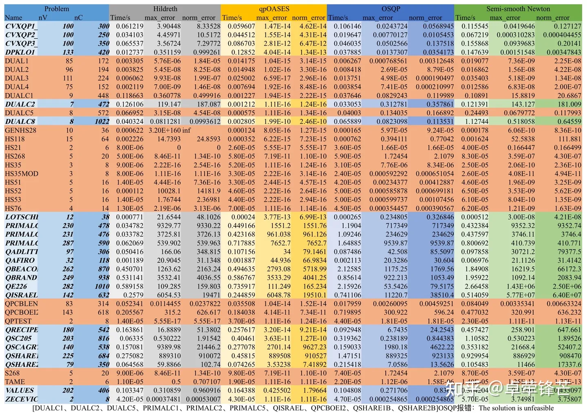
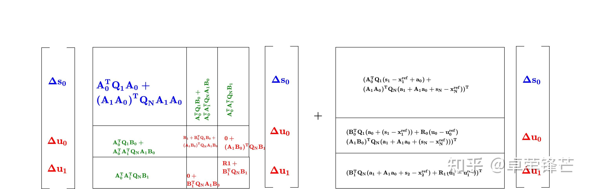
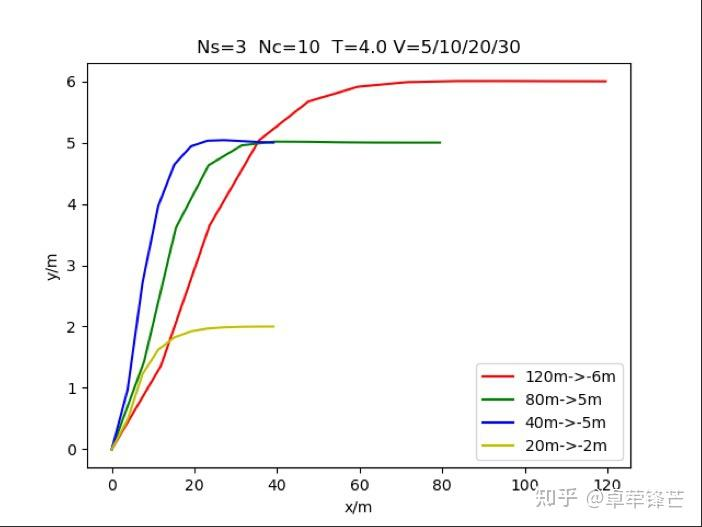
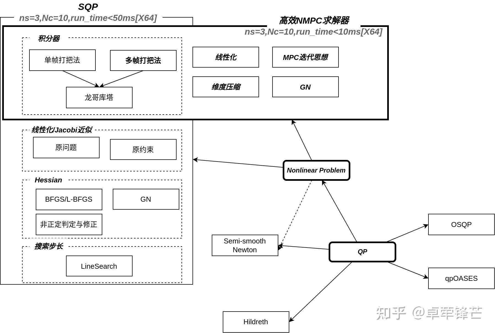
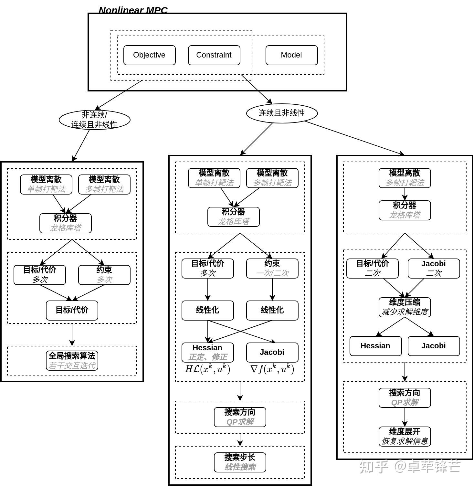
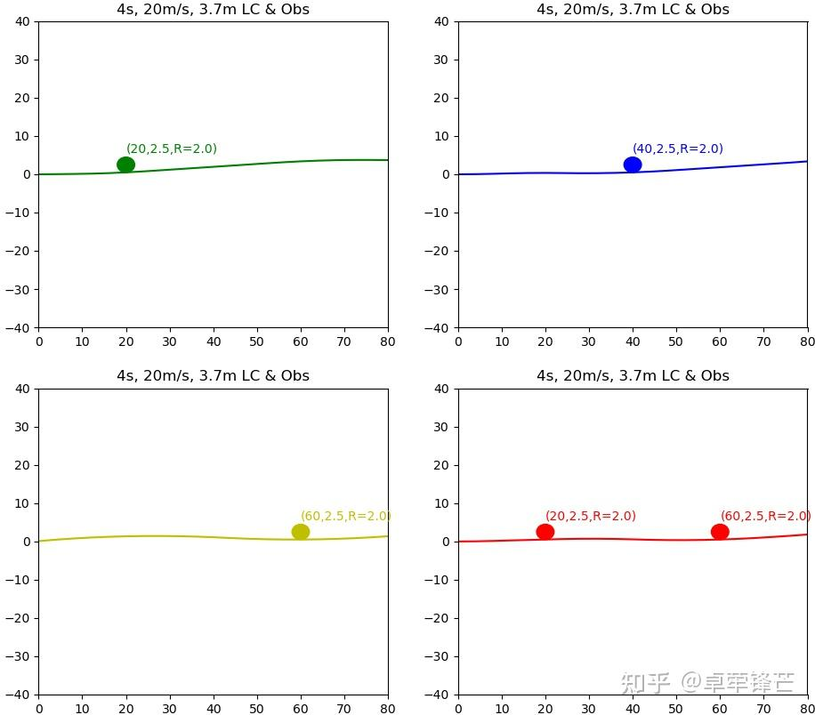
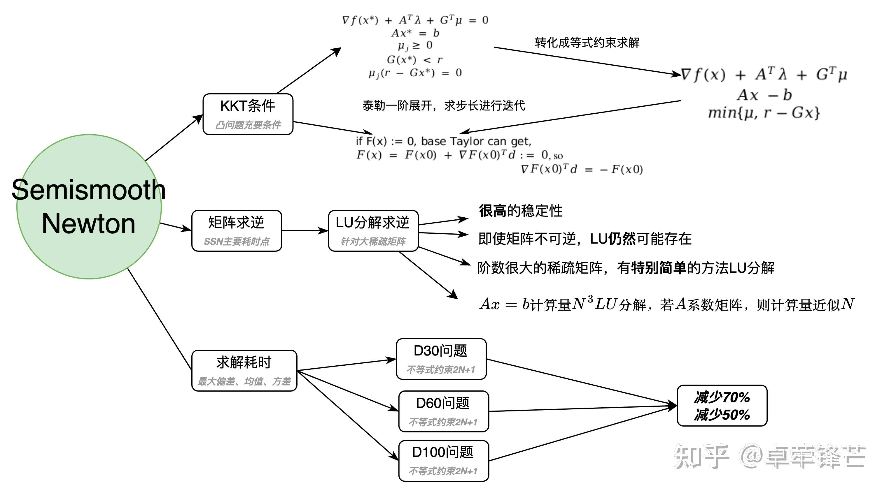
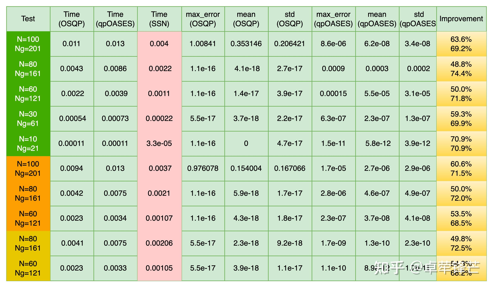

### 关于 QP 算法和 NMPC 求解器 (SQP)的研究

>关于Quadratic Programming(QP)算法和NMPC求解器(SQP)的研究 - 卓荦锋芒的文章 - 知乎 https://zhuanlan.zhihu.com/p/464676135

近期准备对 QP、SQP 进行深入总结和结尾，在对理论整理、测试和验证的过程中，想到之前的工作和事，不由的想发表几点想法。

一、QP问题分为好多种

1.无约束QP

2.等式约束QP

3.线性不等式约束

4.二次不等式约束QCQP

5.其他（整数或二值类型）

合理的选择问题转化形式，很重要。

二、不同类型的 QP 问题，耗时也不同

在QP优化求解中，最头疼的应该就是无解和耗时。之前也有提过优化算法分为问题转化和问题求解，两者决定了最终的耗时。

之前在MPC项目里，使用了MPC的变形——增量MPC。根据线性系统的特性，通过对线性模型的两个时刻相减就可以得到增量模型。它带来的好处是可以通过限制增量值来约束原求解问题的变化率，从而减少相应的不等式约束的数量，达到减少耗时的目的。如果有过对QP耗时分析的话，就会明白减少约束数量对减少QP耗时的影响之大。

三、优化耗时的权衡

QP求解耗时主要有两个——矩阵逆运算和约束，上述优化了后者，但是增量MPC的模型相对于原模型会增加，从而导致矩阵逆运算耗时的增加。

四、QCQP 的应用

当前大多数开源库都不支持二次约束二次规划（QCQP）的问题求解，这不代表它没有用途，在使用优化算法求解绕障轨迹时可能会用到。Eigen的扩展库有提供部分场景的偏导求解方法，可以用于QCQP的求解。

五、个人能写出比开源更优秀的 QP求解库？

在晋升第一次被问到时，我也曾质疑过自己的选择，不过自己还是坚持下来。后来从写QP求解，到耗时对比，再到扩展QP求解库，还是很感动自己能坚持下来。

最后，还想说一点：术业有专攻，当下的osqp很流行，但是它肯定不是万能的，它的耗时优势大部分来源于qpoases。对于稀疏问题（规划常见）的求解，它的耗时不一定是最少的。

对 osqp 和 qpOASES 的耗时对比如下图

说明:

1.把原测试集中的所有不等式约束，统一转化成Gx≤r。

2.耗时使用ctime计时。

3.osqp库使用的是Eigen-osqp。

4.测试结果表明osqp计算是快，但是精度一般，并且，并不是osqp在所有用例中都快于qpOASES。

5.测试集覆盖Hessian不正定的情况，实际上在规划控制中，大部分场景都是保证Hessian是正定的（除了非线性规划）。

6.后面有时间的话，构造或找些规控特定的测试集，进行针对性的耗时评估。

2022-02-23 补充自己写的两种算法和主流的两种算法的计算结果。

早在2019年就开始研究 nonlinear MPC，当时分了两条路线：一条是使用开源库，快速验证；另一条是自己研究求解过程。

对于第一条线，迫于大环境方案和开发进度，自己一个人断断续续搞了一年多，最终在低速场景、低硬件平台上跑起来了。当时，在仿真环境中完成初步调参，实车上再进行微调，在相同路径的情况下，NMPC输出的曲率相对于Lattice完美平滑；在初始位置存在横向和角度偏差时，NMPC所允许的偏差远远大于Lattic（>67º和>1.8m，低速＜3m/s）。

第二条线，由于需要自己摸索，相对坎坷。至今虽搞清楚整个计算流程，使用开源QP或自己写的QP进行测试，发现泛化能力极差。虽然可能与权重，参数相关，但是自己对细节的处理，肯定不如开源库，比如非正定Hessian处理、偏导计算、积分操作、Objection的设定等等。一开始决定各个击破，就先从偏导开始，准备使用专业的积分偏导库——casadi。先对比积分和偏导的结果，发现自己写的和casadi结果一模一样，但是casadi的耗时却是自己写的10倍以上，官方提示生成c代码的话，可以提高4-10倍速度。在使用casadi的c++接口，实现代码生成时，要么编译提示该功能函数不支持代码生成，要么提示该继承类没有该代码生成函数！！！搞了近一周，搞得头疼。真是从入门到放弃！！

决定暂停这条路线了！

为了工作和生计，专心POMDP的决策开发了。

——2022-03-11

关于osqp精度的问题，在github上问了开发团队，综合来看，我的建议是开发初期不考虑耗时的情况下，先使用qpOASES验证算法开发和性能，后续再迁移到osqp。

——2022-03-25

相对于凸优化，Nonlinear Problem 求解可算是复杂的多，面也广的多。总结下来，自己也算是掌握了好几种方法：¹半光滑牛顿法，²一般 SQP 算法，³随机分形搜索。实际上主流求解非线性问题的方法就两个：SQP 和内点法（初步了解半光滑牛顿法和内点法是一类）。

对于第三种算法：随机分形搜索算法，当时研究和开发它的初衷是替换RRT*或A*，用于无引导线下的规划算法，他本质属于全局优化算法，可以解决优化问题，不论是QP问题，还是非线性问题。实测中，只要迭代足够，最终收敛于最优值。后来想想，它也可以解决多障碍物绕障的问题。由于时间有限，和C++标准库的随机函数有限，就不再专心优化了。

在SQP上，自己摸索和补充了好多，终究实现了全流程。在应用于路径规划时，发现耗时和收敛性都达不到预期，一开始以为偏导的近似存在偏差，可能影响收敛结果。于是苦心研究Eigen的偏导工具，放在SQP求解中没发现性能提升！出于严谨性，对Eigen工具和近似求解进行实例对比，发现结果一模一样，当维数增加到10以上时，eigen工具的耗时更少，除此之外，没啥进展。

后来又抽时间查阅众多论文，发现NMPC就是NLP的一个子集，不能用泛式求解方法求解NMPC问题。对于NMPC问题，还不算是高度非线性，不能就简的使用近期求解，除了Hessian矩阵必须近似外，其他过程均需要手动求解，只有这样才能保证实时性和可靠性。

接下来就是潜心研究和验证了，等这块完成，就彻底放弃路径规划的研究，专心决策算法开发了，否则会感觉一件执意很久的事没有善尾。

——2022-04-05

更高效的 NMPC (Nonlinear MPC)求解，今天终于有眉目啦，通过不断的推导和尝试，其中的核心求解部分终于对的上了！接下来就是补全整个求解过程了。功夫不服有心人。

——2022-04-15

如果说QP求解是控制算法专属，那么SQP求解就是规划算法的专属。从2019年开始就认定优化算法是自动驾驶规划算法的最优解，后来又在项目里验证了其的优越性，从此就开始对其的求解原理进行研究，希望手写一套可行的求解器。

由于这部分内容能找到的且有用的资料很少，导致这个过程充满曲折和漫长。

重要阶段一：非光滑牛顿法算法。这个算法适合非线性求解，但是Hessian矩阵不稳定，总会出现NaN。该算法可以降维解决QP问题。

重要阶段二：正规的SQP算法。期间搞明白了SQP算法的思想和流程，最大的收获有Hessian正定的判定和解决、线性搜索确定步长保证递减性、验证二次约束的可行性、研究和应用了Eigen库的偏导求解……。在应用该算法解决路径规划时，发现Single-shooting+Runge-kutta的方式收敛差，Multiple-shoot+Runge-kutta的方式计算量大且权重难调。

重要阶段三：一般的SQP求解器，其偏导和Hessian矩阵均是近似的，这虽可以泛化它的应用场景，但可能导致它不收敛或收敛的慢。对于路径规划问题，一般可以转化成NMPC的问题，NMPC虽然也是非线性问题（Nonlinear Problem），但是由于其objective的特殊性，可以类比MPC进行求解，该方式可以减少不必要的近似求解。在x64平台，预测时域10，控制时域10，模型维度3，控制维度1，qpOASES的最大迭代20，sqp最大迭代20，的前提下，得到稳定求解结果，耗时只需要9~10ms，如果使用osqp耗时还会减少。

下面给出一些结果吧（没调参，只验证说明收敛性）。

——2022-04-27

大概在2017-2019年期间做自动驾驶的控制算法开发，从纵向控制做到横向控制，期间积累了一套自己的算法，和一套解决实际问题的思路和方法，总体来说，对控制算法的开发还是相对游刃有余的。后来转规划算法，自我感觉选了一个对的方向，但是一直堵塞于求解器开发—一套白盒规划算法，不依赖于外部求解器。该问题直到清明节期间才彻底解决，在和开源求解器的结果相同的前提下，耗时也接近。

后来又转决策算法的开发，至此，该文章接近完结，下面也附上基于自己理解的总结吧。

——2022-05-30

再做一些必要的对比补充吧。

**耗时**：至强cpu：W2191B，耗时9ms~10ms；笔记本cpu：1195g7和10210u，耗时3ms~5ms。

**精度**：和开源求解库**ACADO（nmpc代码生成）**的结果一致或者相同。

**对比**：通过ACADO代码生成工具得到的代码是C代码，不方便维护和进一步扩展开发，并且生成的头文件代码存在小问题。

**可优化点**：Eigen矩阵的拼接和更换osqp求解器。其实，好多开源项目的计算，都会大量使用STL存储数据和循环计算，我是感觉灵活使用Eigen可以大大提高算法效率。

——2022-09-29

在写另一篇文章时，发现最近两三年的权威论文（ACC、CDC、Ford 等）都在使用 NMPC+CBF (Control Barrier Functions)的算法解决障碍物的避障轨迹规划。CBF 以约束的形式被添加到 NMPC 里，具体细节和形式可自行 ieee 搜索，值得一提的是 CBF 包含二次项，最终的 NMPC 的约束会有三类：控制量的约束、状态的约束和状态的非线性约束（二次只是其特例）。

1、控制量的约束，最为简单。需要注意的细节是，在SQP中的QP的求解量是原控制量的增量，施加约束时需要做一个简单的加减法。

2、状态的约束，稍微复杂一点。非线性模型经过泰勒一阶展开，再进行前向滚动递推后，状态的增量与控制量的增量有一个线性关系，再把状态的增量转化成状态。最终，状态的约束先转化成状态增量的约束，然后转化成与控制量的增量相关的约束。

3、关于状态和控制量的非线性约束，最为复杂。其思路也很清晰，首先非线性约束需要泰勒一阶展开，问题转化成增量的约束，然后就变成2中的过程了。该约束相对于2多一步偏导的计算，这个偏导就是非线性约束到控制量之间的链式偏导的一环。描述的很复杂，公式求解上就是矩阵的一个乘法运算。

根据应用场景的需求，NMPC需要扩展到二次约束，这是该文章之前未提及的。从近几年的权威期刊的论文方向来看，NMPC及其衍生算法应该是规划控制的最优解，除此之外，该算法同样可以应用在机器人等领域。

——2022-10-20

对于多障碍物避让或交互规划可参考另一文档【[卓荦锋芒：Global/ Interactive规划算法:CHOMP](https://zhuanlan.zhihu.com/p/575342422)】

——2022-10-23

根据这几天的研究和测试发现，在追求极致耗时的工程应用方向，还没有找到一个免费的开源NLP求解库，可以很好的解决NMPC的避障问题。除此之外，基于凸优化的避障算法开发的门槛很高，不局限于NMPC算法。针对上述的两个结论，补充下自己的看法。

第一，显而易见，普通MPC和Frenet-QP都不能实现定量的避障，所以无法泛化到复杂场景。上面也有提到NMPC的优势：NMPC的模型可以是非线性的，可以减少模型的过度简化带来的失真；约束对象可以是控制量和状态量，约束形式可以是非线性的，比如，正余弦、正余切、平方和，乘积等，有了这些优势，可以很容易添加状态边界约束和障碍物约束。对于约束，还可以细分点约束（Point Constraints）和线约束（Path Constraints），点约束就是约束某个特定范围，线约束可以理解成连续约束，比如，x*y*heading*theta<1.0。NMPC-CBF会使用到点约束和线约束，对于这么多的约束形式和类型，一般的开源库的代码生成工具很难做到面面俱到。

第二，主要影响QP收敛的因素是约束。普通QP问题的约束对象只能是控制量，所以其约束出现互相干涉的可能性很小。对于NMPC而言，其应用场景越复杂，约束越多且复杂，出现干涉的可能性越大。举个限制Vy和Ay例子：v*sin(heading)和v*dot(heading)，前者是状态量的线约束，后者是控制量的约束（速度v是常量），且包含车辆动力学模型，若车辆模型存在错误可能导致无解。最恐怖的是，若权重、参考值、初始值等没有配置好的话，会出现换个速度v值就无解的情况。这就是挑战与机遇并存吧。

——2022-10-25

根据周末的开发，在完成NMPC-CBF之前，使用NMPC+二次约束的形式实现换道避让（单/多障碍物），感觉效果还行。

自车信息：T=4s,V=20m/s,Y=3.7,|Vy|<1.5m/s,|Ay|<1.5m/s2；

障碍物信息：形状为半径R=2m的圆，分别验证三个位置；验证2个圆形障碍物；

计算信息：模型维度3，离散20点；

平台：Ubuntu20.04 + i7-1195G7@2.90GHz×8 + 16GB；

耗时：平均7ms， 最大<10ms。

--2023-01-05

前几天在研究DDP/iLQG时，忽然发现基于时域的NMPC+多个二次约束，在拥堵/城市场景下，很适合动态障碍物的轨迹规划。

参阅近两年的论文，发现还有两个主流可行的方向：DDP/iLQR/iLQG和基于Differential Flatness（微分平坦）的循环样条优化[ICRA]。这两类算法虽然可行，但考究其求解耗时及求解稳定性的话，还是不如NMPC的。从最近的论文及经验来看，NMPC应该是轨迹规划的最优解。

--2023-03-15

还是有很多人看这个文章的，那我也更新下吧。

几乎所有的planning算法都趋向于QP优化求解，所以决定深入研究下与这块相关的开源求解器。当下有很多QP的开源求解器，相对主流的也就两个： qpOASES和OSQP。OSQP的性能优势与稀疏问题强耦合，在很多文献里OSQP的性能并没有qpOASES好，并且qpOASES还并未针对稀疏问题进行优化，除此之外，还有商用的案例，总体而言，qpOASES的性能天花板更高，适合扩展和维护。就开源代码而言，qpOASES的代码更干净和纯粹；就算法类型而言，Active Set要比内点法更快。综上，如果时间充裕会深入研究和优化qpOASES。

qpOASES在求解搜索方向时，使用了Cholesky分解进行矩阵求逆，Eigen也提供了该分解方法，并且指出该分解的速度和精度都是最高的。该库使用c语言实现了该分解，并没有调用第三方库，出于好奇就决定对比其与Eigen的性能。得到如下结论：

Hessian的尺寸10×10，Eigen的单次耗时是C的2~3倍，Eigen的100次耗时和C接近。

Hessian的尺寸50×50，Eigen的单次耗时和C接近，Eigen的100次耗时是C的1/2~1/3。

Hessian的尺寸100×100，Eigen的单次耗时是C的1/2~1/3，Eigen的100次耗时是C的1/2~1/3。

Eigen能在高维度矩阵的计算占优势，即使C计算已经足够精简了。通过对比观察生成的可行性文件，发现Eigen会多占用将近20k的空间。

––2023-04-04

今天就更新点整体上的理解吧，

1、求解器分为两类：接口丰富的和Embedded。前者偏向于新手、开源库、快速实现和调试，后者偏向于有经验、商业库、追求极致耗时。Embedded库的耗时可以降低60%，甚至更多。

2、构建NMPC问题时，如果使用了维度压缩，即Hessian不是稀疏矩阵，首选qpOASES，因为它求解耗时稳定、精度高、可以使用对偶解加快求解。面对一个限制横向距离、限制横向加速度的换道规划问题，限制20次QP迭代，osqp的整体耗时是qpOASES的2倍多！（即使不使用对偶解，也比osqp快；qpOASES优化了设置，Osqp-Eigen默认设置）

3、鉴于近期的测试，后续研究的基准就是qpOASES了。针对偏规划的想法，比如Frenet–NMPC等，更新至另一文章了。

--2023-08-13

这块近期也没有什么进展，就总结下Nonlinear Problem的另一个解法-半光滑牛顿法（Semismooth Newton）

Semismooth Newton是研究非线性问题求解器的第一阶段的产物，它虽然是非线性问题的求解器，但是也可以作为QP问题的求解器，早在2021年就拿它和OSQP、qpOASES做过对比。

补充说明：

- 对比使用的QP问题是临时构造的，并不是普遍认同的测试集；
- Test列中N为Hessian矩阵的维度，默认为对角线矩阵；Ng为2N+1个约束，其中2N是对U的上下界约束，1为线性约束；
- OSQP和qpOASES都是默认设置；
- 测试结果表明，Semismooth Newton有超预期优势，但不排除和测试用例有关；
- 对于这个结果，当时也没有更深入研究，后续也没有使用公认测试集再测试，毕竟属于第一阶段的产物，也算是昙花一现。

