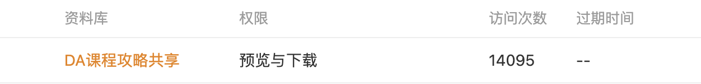

# 清华大学自动化系课程攻略共享计划

## 1. 项目介绍

项目主页以及文档[在此](https://open-da.github.io/OpenDA-Wiki/)，受[清华大学计算机系相关项目](https://github.com/PKUanonym/REKCARC-TSC-UHT)启发，创立了本项目。

本项目继承了清华云盘版的“DA课程攻略共享”，该项目受到很多同学的使用和好评，但是由于清华云盘的有效期和不便维护等原因（目前云盘已失效），遂将本项目迁移到 Github并进行了大量的更新，在学习资料的基础上进一步建立了文档和讨论区，便于同学们使用和交流。

  

如果您觉得该项目对您在DA的学习发展有帮助，不妨点点Star并推荐给您身边的同学！

## 2. 如何下载

如果想使用 Github 进行资料下载，网络条件好的同学可以直接 `git clone`下载；网络条件有限可以使用[DownGit网站](https://tool.mkblog.cn/downgit/#/home)下载，只需将Github上的文件夹链接复制到DownGit中即可。使用 `DownGit` 网站的优势是可以只下载某个文件夹，而不必把整个项目完全下载到本地。当然为了方便大家使用，项目组已将DownGit的下载外链放在了每个课程的文档中，可以直接点击下载。

如果你是清华大学学生，可以使用Tsinghua Git 直接 `git clone`下载。

## 3. 如何贡献

如果你有更新、更全面的资料想要贡献，欢迎提交 Pull Request。如果你有其他问题，欢迎提交 Issue。来自 DAer 的关注、维护和贡献，才是让这个项目继续存在的动力！

### 3.1.Github提交PR

对于课程和教师的评价可写在 [OpenDAwiki](https://open-da.github.io/OpenDA-Wiki/) 对应课程的评论区，也欢迎你在评论区提供学习经验，我们会及时整合到项目文档中来。

由于本项目体积很大，故可以采用在 Github Web 端直接上传的方式，具体操作如下：

1. 首先Fork本项目，点击右上角的Fork按键即可。
2. 然后在你Fork后的仓库中上传文件：
   1. 上传文件到已有文件夹：打开对应文件夹，点击绿色Download按钮旁的upload，上传你的文件。
   2. 上传文件到新文件夹：打开任意文件夹，点击绿色Download按钮旁的upload，**把浏览器地址栏中文件夹名称改为你想要新建的文件夹名称，然后回车**，上传你的文件。 
3. 提交 PR：上传完文件到个人仓库之后，点击 `Pull Request` 即可。请留意一下项目的文件组织。

### 3.2.Github提交Issue

也可以直接附加在 [Issue](https://github.com/Open-DA/OpenDA/issues/new) 中，由维护者进行添加。

### 3.3.邮件贡献

如果希望匿名贡献，可以email至此[邮箱](mailto:winstongu20@gmail.com).

## 致谢

感谢参与到本项目的贡献者：[希文](https://gao-jiawei.com/), [pengc02](https://github.com/pengc02),[bluecat](https://bluecat-de.github.io/)...或许还有屏幕前的DAers。

感谢以下项目为我们提供了参考和灵感，也欢迎大家前往学习：

- [清华大学计算机系课程攻略](https://github.com/PKUanonym/REKCARC-TSC-UHT)
- [浙江大学课程攻略共享计划](https://github.com/QSCTech/zju-icicles)
- [哈工大（深圳）自动化课程攻略共享计划](https://github.com/HITSZ-OpenAuto)
- [清华大学软件学院互助文档](https://ssast-readme.github.io/)
- [“你校”课程点评](https://yourschool.cc/thucourse/courses)
- [“你校”新生手册](https://yourschool.cc/thubook/)
- [北大CS自学指南](https://csdiy.wiki/)
- [自动化系毕业生手册](https://dagrad.site/)

## 5. 须知

在维护和使用资料的同时，我们需要尊重贡献者的知识产权，同时也要保证资料的使用合理合规，具体如下：

### 5.1. 许可

由项目维护组成员编写部分的许可如下：

[(Creative Commons BY-SA 4.0) 知识共享署名 - 相同方式共享 4.0 国际许可协议](https://creativecommons.org/licenses/by-nc-sa/4.0/deed.zh)

其他部分的版权归属于其各自的作者，贡献前请确保该资料的使用已经过原作者许可。

资料仅供参考，请自己判断其适用性。

如果你认为我们项目中的文件存在侵权内容，请在 [Issue](https://github.com/Open-DA/OpenDA/issues/new) 中指出，我们会第一时间进行处理。

### 5.2. 清华大学学生纪律处分管理规定实施细则

第六章　学术不端、违反学习纪律的行为与处分

* 第二十一条 有下列违反课程学习纪律情形之一的，给予警告以上、留校察看以下处分：
  * （一）课程作业抄袭严重的；
  * （二）实验报告抄袭严重或者篡改实验数据的；
  * （三）期中、期末课程论文抄袭严重的；
  * （四）在课程学习过程中严重弄虚作假的其他情形。